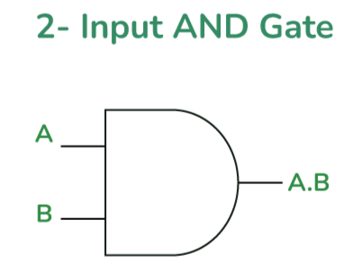
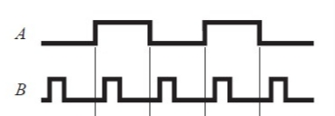

# **AND Gate**

* **Overview**

The AND gate is one of the fundamental digital logic gates used in digital electronics. It performs the logical AND operation and produces a HIGH (1) output only when all input signals are HIGH (1). It is widely used in combinational logic circuits, processors, and digital systems.

---

* **Definition**

An AND gate is a digital logic gate that performs the logical AND operation on two or more input signals. It generates a HIGH (1) output only when every input is HIGH (1); otherwise, the output remains LOW (0).

---

* **Purpose**
  - The AND gate is used to check whether all input conditions are TRUE.
  - It produces a HIGH output only when every input is HIGH.
  - It helps digital systems make logical decisions based on multiple input conditions.

---

* **Importance**
  - It is one of the basic building blocks of digital electronics.
  - It is used to design combinational logic circuits.
  - It is essential for implementing Boolean logic in digital systems.
  - It is widely used in processors, control systems, and digital devices.

---

* **Working Principle**
  - The AND gate continuously checks all input signals.
  - If every input is logic HIGH (1), the output becomes HIGH (1).
  - If any input is logic LOW (0), the output becomes LOW (0).

---

* **Circuit Description**
  - The AND gate is an electronic circuit that performs the logical AND operation.
  - It accepts two or more input signals and produces a single output based on the AND logic.

---

* **Circuit Diagram:**

---

* **Truth Table:**

| A | B | Y |
|---|---|---|
| 0 | 0 | 0 |
| 0 | 1 | 0 |
| 1 | 0 | 0 |
| 1 | 1 | 1 |

---

* **Boolean Expression**

The Boolean expression of the AND gate is:

**Y = A.B**

---

* **Input and Output Description**
  - Inputs:- A, B  [2 Inputs]
  - Output:- Y  [1 Output]

  - When A = 0 and B = 0, the output will be Y = 0.
  - When A = 0 and B = 1, the output will be Y = 0.
  - When A = 1 and B = 0, the output will be Y = 0.
  - When A = 1 and B = 1, the output will be Y = 1.

---

* **Working Example**
  - Consider a smart door security system with two conditions:
    - Fingerprint Authentication
    - Door Access Permission
  - The door opens only when both conditions are TRUE (HIGH).
  - If either condition is FALSE (LOW), the door remains locked.

---

* **Applications**

  *The AND gate is used in:*

  - Security Systems.
  - Door Lock Systems.
  - Alarm Systems.
  - Computers and Digital Circuits.
  - Traffic Signal Control Systems.
  - Industrial Automation.
  - Processor Control Logic.
  - Digital Control Systems.

---

* **Advantages**
  - Simple and easy to implement.
  - Fast logical operation.
  - Low hardware complexity.
  - Fundamental building block of digital circuits.
  - Reliable and widely used in digital systems.

---

* **Limitations**
  - Produces a HIGH output only when all inputs are HIGH.
  - Cannot perform arithmetic operations by itself.
  - Cannot store data.
  - Limited to logical decision-making operations.

---

* **Real-World Example**
  - ATM Authentication System.
  - Smart Door Lock.
  - Car Ignition Safety System.
  - Industrial Safety Interlock.
  - Employee Access Control System.

---

* **Key Points**
  - One of the fundamental digital logic gates.
  - Performs the logical AND operation.
  - Output is HIGH only when all inputs are HIGH.
  - Boolean Expression:

    **Y = A.B**

  - Used extensively in digital electronic systems and combinational logic circuits.

---

* **Interview Questions**

**1. What is an AND gate?**

**Answer:**

An AND gate is a digital logic gate that produces a HIGH (1) output only when all of its input signals are HIGH (1).

---

**2. What is the Boolean expression of an AND gate?**

**Answer:**

The Boolean expression of an AND gate is:

**Y = A.B**

---

**3. Draw the truth table of an AND gate.**

**Answer:**

| A | B | Y |
|---|---|---|
| 0 | 0 | 0 |
| 0 | 1 | 0 |
| 1 | 0 | 0 |
| 1 | 1 | 1 |

---

**4. When does an AND gate produce a HIGH output?**

**Answer:**

An AND gate produces a HIGH (1) output only when all input signals are HIGH (1).

---

**5. Mention any four applications of an AND gate.**

**Answer:**

- Security Systems.
- Door Lock Systems.
- Alarm Systems.
- Computers and Digital Circuits.

---

**6. Why is the AND gate called a fundamental logic gate?**

**Answer:**

The AND gate is called a fundamental logic gate because it is one of the basic building blocks used to design combinational logic circuits and complex digital systems.

---

**7. How many inputs and outputs does a basic AND gate have?**

**Answer:**

A basic AND gate has two inputs (A and B) and one output (Y).

---

**8. What will be the output if one input of an AND gate is LOW (0)?**

**Answer:**

If any one input is LOW (0), the output will always be LOW (0), regardless of the other input.

---

* **Quick Revision**
  - Logic Operation → AND
  - Inputs → 2 (A, B)
  - Output → 1 (Y)
  - Boolean Expression → **Y = A.B**
  - HIGH Output → Only when all inputs are HIGH.
  - LOW Output → If any input is LOW.

---

* **Summary**

The AND gate is one of the most fundamental digital logic gates used in digital electronics. It performs the logical AND operation by producing a HIGH (1) output only when all input signals are HIGH (1). Due to its simple operation and reliability, it is widely used in computers, processors, security systems, automation, and combinational logic circuits.

---

* **References**
  - M. Morris Mano – *Digital Design*.
  - Donald D. Givone – *Digital Principles and Design*.
  - R. P. Jain – *Modern Digital Electronics*.
  - Thomas L. Floyd – *Digital Fundamentals*.
  - Neso Academy – Digital Electronics.
  - GeeksforGeeks – Digital Logic.

---

* **Waveform / Timing Diagram:**

