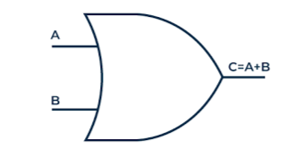

# **OR Gate**

* **Overview**

The OR gate is one of the fundamental digital logic gates used in digital electronics. It performs the logical OR operation and produces a HIGH (1) output when one or more input signals are HIGH (1). It is widely used in combinational logic circuits, control systems, and digital devices.

---

* **Definition**

An OR gate is a digital logic gate that performs the logical OR operation on two or more input signals. It generates a HIGH (1) output if at least one input is HIGH (1); otherwise, the output remains LOW (0).

---

* **Purpose**
  - The OR gate is used to check whether one or more input conditions are TRUE.
  - It produces a HIGH output when at least one input is HIGH.
  - It helps digital systems make logical decisions based on multiple input conditions.

---

* **Importance**
  - It is one of the fundamental building blocks of digital electronics.
  - It is used to design combinational logic circuits.
  - It is essential for implementing Boolean logic in digital systems.
  - It is widely used in processors, control systems, and digital devices.

---

* **Working Principle**
  - The OR gate continuously checks all input signals.
  - If at least one input is logic HIGH (1), the output becomes HIGH (1).
  - The output becomes LOW (0) only when all inputs are logic LOW (0).

---

* **Circuit Description**
  - The OR gate is an electronic circuit that performs the logical OR operation.
  - It accepts two or more input signals and produces a single output based on the OR logic.

---

* **Circuit Diagram:**

---

* **Truth Table:**

| A | B | Y |
|---|---|---|
| 0 | 0 | 0 |
| 0 | 1 | 1 |
| 1 | 0 | 1 |
| 1 | 1 | 1 |

---

* **Boolean Expression**

The Boolean expression of the OR gate is:

**Y = A + B**

---

* **Input and Output Description**
  - Inputs:- A, B  [2 Inputs]
  - Output:- Y  [1 Output]

  - When A = 0 and B = 0, the output will be Y = 0.
  - When A = 0 and B = 1, the output will be Y = 1.
  - When A = 1 and B = 0, the output will be Y = 1.
  - When A = 1 and B = 1, the output will be Y = 1.

---

* **Working Example**
  - Consider a room with two switches connected to an alarm indicator.
    - Switch A
    - Switch B
  - The indicator turns ON if either Switch A or Switch B is turned ON.
  - If both switches are OFF, the indicator remains OFF.

---

* **Applications**

  *The OR gate is used in:*

  - Alarm Systems.
  - Emergency Warning Systems.
  - Security Systems.
  - Traffic Signal Control Systems.
  - Computers and Digital Circuits.
  - Industrial Automation.
  - Processor Control Logic.
  - Decision-Making Circuits.

---

* **Advantages**
  - Simple and easy to implement.
  - Fast logical operation.
  - Low hardware complexity.
  - Fundamental building block of digital circuits.
  - Reliable and widely used in digital systems.

---

* **Limitations**
  - Produces a LOW output only when all inputs are LOW.
  - Cannot perform arithmetic operations by itself.
  - Cannot store data.
  - Limited to logical decision-making operations.

---

* **Real-World Example**
  - Fire Alarm System.
  - Burglar Alarm System.
  - Emergency Stop System.
  - Automatic Door Control.
  - Industrial Monitoring System.

---

* **Key Points**
  - One of the fundamental digital logic gates.
  - Performs the logical OR operation.
  - Output is HIGH when at least one input is HIGH.
  - Boolean Expression:

    **Y = A + B**

  - Used extensively in digital electronic systems and combinational logic circuits.

---

* **Interview Questions**

**1. What is an OR gate?**

**Answer:**

An OR gate is a digital logic gate that produces a HIGH (1) output when at least one of its input signals is HIGH (1).

---

**2. What is the Boolean expression of an OR gate?**

**Answer:**

The Boolean expression of an OR gate is:

**Y = A + B**

---

**3. Draw the truth table of an OR gate.**

**Answer:**

| A | B | Y |
|---|---|---|
| 0 | 0 | 0 |
| 0 | 1 | 1 |
| 1 | 0 | 1 |
| 1 | 1 | 1 |

---

**4. When does an OR gate produce a LOW output?**

**Answer:**

An OR gate produces a LOW (0) output only when all input signals are LOW (0).

---

**5. Mention any four applications of an OR gate.**

**Answer:**

- Alarm Systems.
- Security Systems.
- Traffic Signal Control Systems.
- Computers and Digital Circuits.

---

**6. Why is the OR gate called a fundamental logic gate?**

**Answer:**

The OR gate is called a fundamental logic gate because it is one of the basic building blocks used to design combinational logic circuits and complex digital systems.

---

**7. How many inputs and outputs does a basic OR gate have?**

**Answer:**

A basic OR gate has two inputs (A and B) and one output (Y).

---

**8. What will be the output if both inputs of an OR gate are LOW (0)?**

**Answer:**

If both inputs are LOW (0), the output will be LOW (0).

---

* **Quick Revision**
  - Logic Operation → OR
  - Inputs → 2 (A, B)
  - Output → 1 (Y)
  - Boolean Expression → **Y = A + B**
  - HIGH Output → At least one input is HIGH.
  - LOW Output → Only when all inputs are LOW.

---

* **Summary**

The OR gate is one of the most fundamental digital logic gates used in digital electronics. It performs the logical OR operation by producing a HIGH (1) output when at least one input signal is HIGH (1). Due to its simple operation and reliability, it is widely used in computers, processors, alarm systems, automation, and combinational logic circuits.

---

* **References**
  - M. Morris Mano – *Digital Design*.
  - Donald D. Givone – *Digital Principles and Design*.
  - R. P. Jain – *Modern Digital Electronics*.
  - Thomas L. Floyd – *Digital Fundamentals*.
  - Neso Academy – Digital Electronics.
  - GeeksforGeeks – Digital Logic.

---

* **Waveform / Timing Diagram:**

