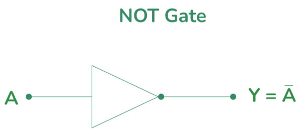

# **NOT Gate**

* **Overview**

The NOT gate is one of the fundamental digital logic gates used in digital electronics. It performs the logical NOT operation by inverting the input signal. It produces the opposite logic level at the output and is widely used in combinational and sequential digital circuits.

---

* **Definition**

A NOT gate is a digital logic gate that performs the logical NOT operation on a single input signal. It generates a HIGH (1) output when the input is LOW (0), and a LOW (0) output when the input is HIGH (1). It is also known as an **Inverter**.

---

* **Purpose**
  - The NOT gate is used to invert or complement an input signal.
  - It produces the opposite logic level at the output.
  - It helps digital systems generate complementary signals for logical operations.

---

* **Importance**
  - It is one of the fundamental building blocks of digital electronics.
  - It is essential for implementing Boolean complement operations.
  - It is widely used in combinational and sequential logic circuits.
  - It is commonly used in processors, controllers, and digital systems.

---

* **Working Principle**
  - The NOT gate accepts only one input signal.
  - If the input is logic HIGH (1), the output becomes logic LOW (0).
  - If the input is logic LOW (0), the output becomes logic HIGH (1).
  - Thus, the output is always the complement of the input.

---

* **Circuit Description**
  - The NOT gate is an electronic circuit that performs the logical NOT operation.
  - It accepts one input signal and produces one output that is the inverse of the input.

---

* **Circuit Diagram:**

---

* **Truth Table:**

| A | Y |
|---|---|
| 0 | 1 |
| 1 | 0 |

---

* **Boolean Expression**

The Boolean expression of the NOT gate is:

**Y = A̅** *(or)* **Y = ¬A**

---

* **Input and Output Description**
  - Input:- A  [1 Input]
  - Output:- Y  [1 Output]

  - When A = 0, the output will be Y = 1.
  - When A = 1, the output will be Y = 0.

---

* **Working Example**
  - Consider an automatic street light system.
    - Input (Light Sensor) = 0 (Dark)
    - Output (Street Light) = 1 (ON)
  - When the sensor detects daylight (Input = 1), the street light turns OFF (Output = 0).
  - Thus, the output is always the opposite of the input.

---

* **Applications**

  *The NOT gate is used in:*

  - Signal Inversion Circuits.
  - Digital Computers.
  - Microprocessors.
  - Memory Circuits.
  - Alarm Systems.
  - Control Systems.
  - Digital Logic Circuits.
  - Automatic Lighting Systems.

---

* **Advantages**
  - Simple and easy to implement.
  - Performs signal inversion quickly.
  - Low hardware complexity.
  - Essential for complement operations.
  - Widely used in digital electronic systems.

---

* **Limitations**
  - Operates on only one input.
  - Cannot perform arithmetic operations by itself.
  - Cannot store data.
  - Limited to signal inversion.

---

* **Real-World Example**
  - Automatic Street Lights.
  - Digital Clock Circuits.
  - Microprocessor Systems.
  - Memory Address Decoding.
  - Industrial Control Systems.

---

* **Key Points**
  - One of the fundamental digital logic gates.
  - Also known as an **Inverter**.
  - Accepts only one input.
  - Output is always the complement of the input.
  - Boolean Expression:

    **Y = A̅**

---

* **Interview Questions**

**1. What is a NOT gate?**

**Answer:**

A NOT gate is a digital logic gate that produces the complement of the input. It generates a HIGH (1) output when the input is LOW (0), and a LOW (0) output when the input is HIGH (1).

---

**2. Why is a NOT gate called an Inverter?**

**Answer:**

Because it inverts or reverses the input logic level, producing the opposite output.

---

**3. What is the Boolean expression of a NOT gate?**

**Answer:**

The Boolean expression of a NOT gate is:

**Y = A̅**

---

**4. Draw the truth table of a NOT gate.**

**Answer:**

| A | Y |
|---|---|
| 0 | 1 |
| 1 | 0 |

---

**5. How many inputs and outputs does a NOT gate have?**

**Answer:**

A NOT gate has one input (A) and one output (Y).

---

**6. Mention four applications of a NOT gate.**

**Answer:**

- Signal Inversion Circuits.
- Microprocessors.
- Memory Circuits.
- Automatic Lighting Systems.

---

**7. What is the output when the input of a NOT gate is HIGH (1)?**

**Answer:**

When the input is HIGH (1), the output becomes LOW (0).

---

**8. What is the output when the input of a NOT gate is LOW (0)?**

**Answer:**

When the input is LOW (0), the output becomes HIGH (1).

---

* **Quick Revision**
  - Logic Operation → NOT
  - Input → 1 (A)
  - Output → 1 (Y)
  - Boolean Expression → **Y = A̅**
  - HIGH Input → LOW Output
  - LOW Input → HIGH Output
  - Also Known As → Inverter

---

* **Summary**

The NOT gate is one of the most fundamental digital logic gates used in digital electronics. It performs the logical NOT operation by inverting the input signal, producing the opposite logic level at the output. Due to its simplicity and importance, it is widely used in computers, processors, memory circuits, automation, and digital logic systems.

---

* **References**
  - M. Morris Mano – *Digital Design*.
  - Donald D. Givone – *Digital Principles and Design*.
  - R. P. Jain – *Modern Digital Electronics*.
  - Thomas L. Floyd – *Digital Fundamentals*.
  - Neso Academy – Digital Electronics.
  - GeeksforGeeks – Digital Logic.

---

* **Waveform / Timing Diagram:**

