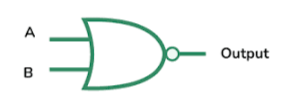

# **NOR Gate**

* **Overview**

The NOR gate is one of the fundamental digital logic gates used in digital electronics. It performs the logical NOR operation, which is the complement of the OR operation. It produces a HIGH (1) output only when all input signals are LOW (0); otherwise, the output remains LOW (0). The NOR gate is known as a **Universal Gate** because any digital logic circuit can be implemented using only NOR gates.

---

* **Definition**

A NOR gate is a digital logic gate that performs the logical NOR operation on two or more input signals. It generates a HIGH (1) output only when every input is LOW (0); otherwise, it produces a LOW (0) output.

---

* **Purpose**
  - The NOR gate is used to perform the complement of the OR operation.
  - It is used to generate inverted OR logic.
  - It helps design complex digital circuits using a single type of logic gate.

---

* **Importance**
  - It is one of the most important logic gates in digital electronics.
  - It is known as a Universal Gate because any logic gate can be implemented using only NOR gates.
  - It reduces hardware complexity in digital circuit design.
  - It is widely used in integrated circuits, processors, and digital systems.

---

* **Working Principle**
  - The NOR gate continuously checks all input signals.
  - If every input is logic LOW (0), the output becomes logic HIGH (1).
  - If any input is logic HIGH (1), the output becomes logic LOW (0).
  - Thus, the output is always the complement of the OR operation.

---

* **Circuit Description**
  - The NOR gate is an electronic circuit that performs the logical NOR operation.
  - It accepts two or more input signals and produces one output that is the inverse of the OR operation.

---

* **Circuit Diagram:**

---

* **Truth Table:**

| A | B | Y |
|---|---|---|
| 0 | 0 | 1 |
| 0 | 1 | 0 |
| 1 | 0 | 0 |
| 1 | 1 | 0 |

---

* **Boolean Expression**

The Boolean expression of the NOR gate is:

**Y = (A + B)̅**

---

* **Input and Output Description**
  - Inputs:- A, B  [2 Inputs]
  - Output:- Y  [1 Output]

  - When A = 0 and B = 0, the output will be Y = 1.
  - When A = 0 and B = 1, the output will be Y = 0.
  - When A = 1 and B = 0, the output will be Y = 0.
  - When A = 1 and B = 1, the output will be Y = 0.

---

* **Working Example**
  - Consider a warning system with two sensors:
    - Sensor A
    - Sensor B
  - The warning indicator turns ON only when both sensors are OFF.
  - If either sensor becomes ON, the warning indicator turns OFF.

---

* **Applications**

  *The NOR gate is used in:*

  - Digital Computers.
  - Memory Circuits.
  - Flip-Flops.
  - Control Systems.
  - Embedded Systems.
  - Industrial Automation.
  - Digital Integrated Circuits.
  - Universal Logic Circuit Design.

---

* **Advantages**
  - Universal gate capable of implementing any logic function.
  - Simple and reliable operation.
  - Reduces the number of different logic gates required.
  - Widely used in integrated circuit design.
  - Low manufacturing cost.

---

* **Limitations**
  - Slightly higher propagation delay in complex circuits.
  - Large circuits may require multiple NOR gates.
  - Power consumption increases with circuit size.
  - Output is inverted, which may require additional stages in some applications.

---

* **Real-World Example**
  - Computer Processors.
  - Memory Chips.
  - Digital Control Systems.
  - Industrial Automation.
  - Embedded Systems.

---

* **Key Points**
  - Performs the logical NOR operation.
  - Output is HIGH only when all inputs are LOW.
  - Complement of the OR gate.
  - Known as a **Universal Gate**.
  - Boolean Expression:

    **Y = (A + B)̅**

---

* **Interview Questions**

**1. What is a NOR gate?**

**Answer:**

A NOR gate is a digital logic gate that produces a HIGH (1) output only when all of its inputs are LOW (0). Otherwise, it produces a LOW (0) output.

---

**2. Why is the NOR gate called a Universal Gate?**

**Answer:**

The NOR gate is called a Universal Gate because all basic logic gates (AND, OR, NOT, NAND, XOR, and XNOR) can be implemented using only NOR gates.

---

**3. What is the Boolean expression of a NOR gate?**

**Answer:**

The Boolean expression of a NOR gate is:

**Y = (A + B)̅**

---

**4. Draw the truth table of a NOR gate.**

**Answer:**

| A | B | Y |
|---|---|---|
| 0 | 0 | 1 |
| 0 | 1 | 0 |
| 1 | 0 | 0 |
| 1 | 1 | 0 |

---

**5. When does a NOR gate produce a HIGH output?**

**Answer:**

A NOR gate produces a HIGH (1) output only when all input signals are LOW (0).

---

**6. Mention four applications of a NOR gate.**

**Answer:**

- Digital Computers.
- Memory Circuits.
- Flip-Flops.
- Control Systems.

---

**7. How many inputs and outputs does a basic NOR gate have?**

**Answer:**

A basic NOR gate has two inputs (A and B) and one output (Y).

---

**8. What is the relationship between an OR gate and a NOR gate?**

**Answer:**

A NOR gate is the complement (inverse) of an OR gate. It performs the OR operation followed by a NOT operation.

---

* **Quick Revision**
  - Logic Operation → NOR
  - Inputs → 2 (A, B)
  - Output → 1 (Y)
  - Boolean Expression → **Y = (A + B)̅**
  - HIGH Output → Only when all inputs are LOW.
  - LOW Output → If any input is HIGH.
  - Also Known As → Universal Gate.

---

* **Summary**

The NOR gate is one of the most important digital logic gates used in digital electronics. It performs the logical NOR operation by producing a HIGH (1) output only when all input signals are LOW (0). Because it can be used to implement any digital logic function, it is known as the **Universal Gate** and is widely used in processors, memory circuits, digital integrated circuits, and embedded systems.

---

* **References**
  - M. Morris Mano – *Digital Design*.
  - Donald D. Givone – *Digital Principles and Design*.
  - R. P. Jain – *Modern Digital Electronics*.
  - Thomas L. Floyd – *Digital Fundamentals*.
  - Neso Academy – Digital Electronics.
  - GeeksforGeeks – Digital Logic.

---

* **Waveform / Timing Diagram:**

