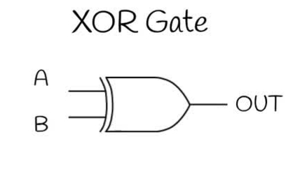

# **XNOR Gate**

* **Overview**

The XNOR (Exclusive NOR) gate is one of the fundamental digital logic gates used in digital electronics. It performs the Exclusive NOR operation and produces a HIGH (1) output only when the input signals are the same. It is widely used in digital comparators, equality check circuits, and error detection systems.

---

* **Definition**

An XNOR gate is a digital logic gate that performs the Exclusive NOR operation on two or more input signals. It generates a HIGH (1) output when the inputs are the same and produces a LOW (0) output when the inputs are different. It is the complement of the XOR gate.

---

* **Purpose**
  - The XNOR gate is used to compare two input signals.
  - It detects whether the inputs are equal.
  - It is used in equality checking and digital comparison circuits.

---

* **Importance**
  - It is an essential logic gate in digital electronics.
  - It is widely used in digital comparators.
  - It plays an important role in equality detection and error checking.
  - It is commonly used in processors and digital systems.

---

* **Working Principle**
  - The XNOR gate continuously compares all input signals.
  - If the inputs are the same, the output becomes logic HIGH (1).
  - If the inputs are different, the output becomes logic LOW (0).

---

* **Circuit Description**
  - The XNOR gate is an electronic circuit that performs the Exclusive NOR operation.
  - It accepts two or more input signals and produces one output based on whether the inputs are equal.

---

* **Circuit Diagram:**

---

* **Truth Table:**

| A | B | Y |
|---|---|---|
| 0 | 0 | 1 |
| 0 | 1 | 0 |
| 1 | 0 | 0 |
| 1 | 1 | 1 |

---

* **Boolean Expression**

The Boolean expression of the XNOR gate is:

**Y = AB + A̅B̅**

---

* **Input and Output Description**
  - Inputs:- A, B  [2 Inputs]
  - Output:- Y  [1 Output]

  - When A = 0 and B = 0, the output will be Y = 1.
  - When A = 0 and B = 1, the output will be Y = 0.
  - When A = 1 and B = 0, the output will be Y = 0.
  - When A = 1 and B = 1, the output will be Y = 1.

---

* **Working Example**
  - Consider a password verification system with two signals:
    - Stored Password Bit
    - Entered Password Bit
  - If both bits are the same, the XNOR gate outputs HIGH (1), indicating a match.
  - If the bits are different, the XNOR gate outputs LOW (0), indicating a mismatch.

---

* **Applications**

  *The XNOR gate is used in:*

  - Digital Comparators.
  - Equality Checking Circuits.
  - Error Detection Systems.
  - Parity Checking Circuits.
  - Data Verification Systems.
  - Digital Communication Systems.
  - Processors.
  - Digital Integrated Circuits.

---

* **Advantages**
  - Efficiently compares two input signals.
  - Ideal for equality detection.
  - Widely used in digital comparison circuits.
  - High-speed logical operation.
  - Reliable and easy to implement.

---

* **Limitations**
  - More complex than basic logic gates.
  - Requires more transistors for implementation.
  - Cannot store data.
  - Limited to comparison and logical operations.

---

* **Real-World Example**
  - Digital Comparator Circuits.
  - Password Verification Systems.
  - Memory Address Comparison.
  - Error Detection Systems.
  - Processor Comparison Logic.

---

* **Key Points**
  - Performs the Exclusive NOR operation.
  - Output is HIGH only when inputs are the same.
  - Output is LOW when inputs are different.
  - Complement of the XOR gate.
  - Boolean Expression:

    **Y = AB + A̅B̅**

---

* **Interview Questions**

**1. What is an XNOR gate?**

**Answer:**

An XNOR gate is a digital logic gate that produces a HIGH (1) output only when its input signals are the same.

---

**2. What is the Boolean expression of an XNOR gate?**

**Answer:**

The Boolean expression of an XNOR gate is:

**Y = AB + A̅B̅**

---

**3. Draw the truth table of an XNOR gate.**

**Answer:**

| A | B | Y |
|---|---|---|
| 0 | 0 | 1 |
| 0 | 1 | 0 |
| 1 | 0 | 0 |
| 1 | 1 | 1 |

---

**4. When does an XNOR gate produce a HIGH output?**

**Answer:**

An XNOR gate produces a HIGH (1) output only when all input signals are the same.

---

**5. Mention four applications of an XNOR gate.**

**Answer:**

- Digital Comparators.
- Equality Checking Circuits.
- Password Verification Systems.
- Error Detection Systems.

---

**6. What is the relationship between XOR and XNOR gates?**

**Answer:**

An XNOR gate is the complement (inverse) of an XOR gate. XOR produces HIGH when inputs are different, whereas XNOR produces HIGH when inputs are the same.

---

**7. How many inputs and outputs does a basic XNOR gate have?**

**Answer:**

A basic XNOR gate has two inputs (A and B) and one output (Y).

---

**8. What is the output when both inputs of an XNOR gate are different?**

**Answer:**

When the inputs are different (01 or 10), the output is LOW (0).

---

* **Quick Revision**
  - Logic Operation → XNOR (Exclusive NOR)
  - Inputs → 2 (A, B)
  - Output → 1 (Y)
  - Boolean Expression → **Y = AB + A̅B̅**
  - HIGH Output → Inputs are the same.
  - LOW Output → Inputs are different.
  - Also Known As → Equality Gate.

---

* **Summary**

The XNOR gate is a fundamental digital logic gate that performs the Exclusive NOR operation. It produces a HIGH (1) output only when the input signals are the same. Due to its ability to compare inputs for equality, it is widely used in digital comparators, password verification systems, error detection circuits, communication systems, and processor design.

---

* **References**
  - M. Morris Mano – *Digital Design*.
  - Donald D. Givone – *Digital Principles and Design*.
  - R. P. Jain – *Modern Digital Electronics*.
  - Thomas L. Floyd – *Digital Fundamentals*.
  - Neso Academy – Digital Electronics.
  - GeeksforGeeks – Digital Logic.

---

* **Waveform / Timing Diagram:**

