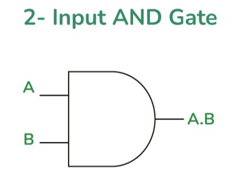
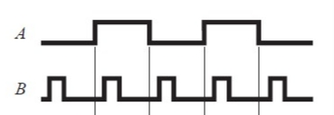

# **AND Gate**

* **What Problem Does It Solve?**
  - The AND gate checks if all conditions are true.
  - If only any one input is TRUE the output will be FALSE.
  - if both inputs are TRUE the output will be TRUE.
  
* **What is the Circuit?**
  - It is an electronic circuit that performs AND operation.
---

* **Where Is It Used?**
  
  *The AND gate will be used in:*
  
  - Security System.
  - Door Bell.
  - Alarm System.
  - Computer And Digital Circuit.
  - Traffic Signal Control System.
    
---

* **Circuit Diagram:**

---

* **Function of Inputs and Outputs:**
  - Inputs:- A,B  [2 inputs]
  - Output:- Y  [1 output]

  - when both inputs A = 0 , B = 0 output wii be y = 0.
  
  - when both inputs A = 1 , B = 1 output wii be y = 1.

  - when both inputs A = 1 , B = 0 output wii be y = 0.

---

* **Truth Table:**

| A | B | Y |
|---|---|---|
| 0 | 0 | 0 |
| 0 | 1 | 0 |
| 1 | 0 | 0 |
| 1 | 1 | 1 |

* **Boolean Equation:**
  The Boolean equation of the AND gate is:
  
**Y = A.B**

---
* **Waveform / Timing Diagram:**

  

