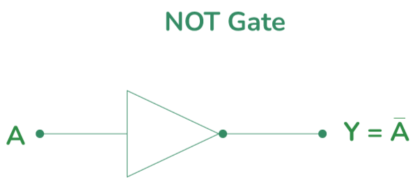

# **NOT Gate**

* **What Problem Does It Solve?**
  - The NOT gate will give an opposite value from output.
  - If the input is TRUE output becomes FALSE.
  - If the input is FALSE output becomes TRUE.
  
* **What is the Circuit?**
  - It is an electronic circuit that performs NOT operation
---

* **Where Is It Used?**
  
  *The NOT gate will be used in:*

  - Alarm System.
  - Computer And Digital Circuit.
  - Signal controll system.
  - Digital electronics.
---

* **Circuit Diagram:**

---

* **Function of Inputs and Outputs:**
  - Inputs:- A  [1 inputs]
  - Output:- Y  [1 output]

  - when both inputs A = 1 , output wii be y = 0.
  
  - when both inputs A = 0 , output wii be y = 1.

---

* **Truth Table:**

| A | Y |
|---|---|
| 0 | 1 |
| 1 | 0 |

* **Boolean Equation:**
  
  The Boolean equation of the NOT gate is:
  
**Y = A**

---
* **Waveform / Timing Diagram:**

  

