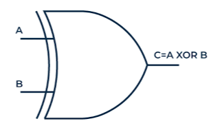

# **XOR Gate**

* **What Problem Does It Solve?**
  - The XOR gate checks if all inputs are different.
  - If only one input is TRUE then the output becomes TRUE.
  - If inputs are same the outpu FALSE.
  
* **What is the Circuit?**
  - It is an electronic circuit that performs XOR operation.
---

* **Where Is It Used?**
  
  *The XOR gate will be used in:*
  
  - Computer And Digital Circuit.
  - Traffic Signal Control System.
  - digital electronics.
  - Error detection. 
---

* **Circuit Diagram:**

---

* **Function of Inputs and Outputs:**
  
  - Inputs:- A,B  [2 inputs]
  
  - Output:- Y  [1 output]

---

* **Truth Table:**

| A | B | Y |
|---|---|---|
| 0 | 0 | 0 |
| 0 | 1 | 1 |
| 1 | 0 | 1 |
| 1 | 1 | 0 |

* **Boolean Equation:**
  The Boolean equation of the XOR gate is:
  
**Y = (A+B)''**

---
* **Waveform / Timing Diagram:**

  

