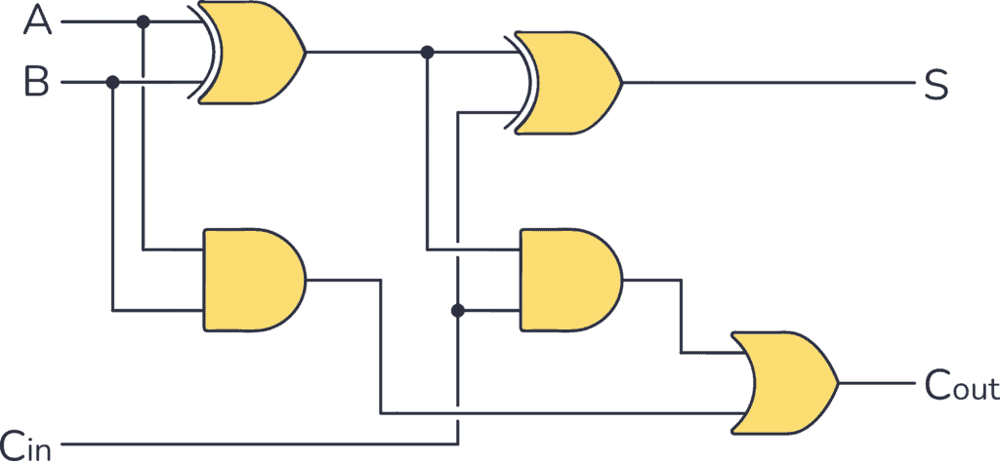

# **Full Adder**

* **Overview**

A Full Adder is a fundamental combinational logic circuit used in digital electronics to add three single-bit binary inputs. It generates two outputs: **Sum (S)** and **Carry (Cout)**. Full Adders are the building blocks of multi-bit binary adders used in processors, ALUs, and digital systems.

---

* **Definition**

A Full Adder is a combinational logic circuit that adds three one-bit binary inputs (**A, B, and Carry-in (Cin)**) and produces two outputs: **Sum (S)** and **Carry-out (Cout)**.

---

* **Purpose**
  - To add three binary bits.
  - To generate both Sum and Carry outputs.
  - To perform multi-bit binary addition.
  - To build arithmetic circuits such as ripple carry adders and ALUs.

---

* **Importance**
  - It is one of the most important arithmetic circuits in digital electronics.
  - It is used to construct multi-bit binary adders.
  - It forms the foundation of Arithmetic Logic Units (ALUs).
  - It is widely used in processors, computers, and VLSI systems.

---

* **Working Principle**
  - A Full Adder accepts three binary inputs: **A**, **B**, and **Carry-in (Cin)**.
  - It adds all three input bits simultaneously.
  - The **Sum (S)** represents the least significant bit (LSB) of the result.
  - The **Carry-out (Cout)** represents the carry generated during the addition.

---

* **Circuit Description**
  - A Full Adder can be implemented using:
    - Two Half Adders.
    - One OR Gate.
  - The first Half Adder adds **A** and **B**.
  - The second Half Adder adds the first Sum with **Cin**.
  - The OR gate combines the carry outputs from both Half Adders to generate **Carry-out**.

---

* **Circuit Diagram:**



---

* **Truth Table:**

genui{"computing_fundamentals_algorithms_learning_block":{"type_id":"HALF_FULL_ADDER_LOGIC"}}

| A | B | Cin | S | Cout |
|---|---|-----|---|------|
| 0 | 0 | 0 | 0 | 0 |
| 0 | 0 | 1 | 1 | 0 |
| 0 | 1 | 0 | 1 | 0 |
| 0 | 1 | 1 | 0 | 1 |
| 1 | 0 | 0 | 1 | 0 |
| 1 | 0 | 1 | 0 | 1 |
| 1 | 1 | 0 | 0 | 1 |
| 1 | 1 | 1 | 1 | 1 |

---

* **Boolean Expression**

**Sum (S):**

**S = A ⊕ B ⊕ Cin**

**Carry (Cout):**

**Cout = AB + ACin + BCin**

---

* **Input and Output Description**
  - Inputs:- A, B, Cin [3 Inputs]
  - Outputs:-
    - Sum (S)
    - Carry-out (Cout)

  - **A** and **B** are the binary numbers to be added.
  - **Cin** is the carry received from the previous stage.
  - **S** represents the sum bit.
  - **Cout** is passed to the next Full Adder during multi-bit addition.

---

* **Working Example**
  - Consider:
    - A = 1
    - B = 1
    - Cin = 0

Binary Addition:

```
   1
 + 1
 + 0
 ----
  10
```

Output:

- **Sum (S) = 0**
- **Carry (Cout) = 1**

---

* **Applications**

  *The Full Adder is used in:*

  - Ripple Carry Adders.
  - Carry Look-Ahead Adders.
  - Arithmetic Logic Units (ALUs).
  - Digital Computers.
  - Microprocessors.
  - Digital Signal Processors (DSPs).
  - FPGA Design.
  - VLSI Systems.

---

* **Advantages**
  - Adds three binary inputs simultaneously.
  - Generates both Sum and Carry outputs.
  - Easy to cascade for multi-bit addition.
  - Essential for arithmetic circuit design.
  - Widely used in digital processors.

---

* **Limitations**
  - Ripple Carry Adders built using Full Adders have propagation delay.
  - Requires more logic gates than a Half Adder.
  - Delay increases as the number of bits increases.

---

* **Real-World Example**
  - Computer Processors.
  - Calculator Circuits.
  - Arithmetic Logic Units (ALUs).
  - FPGA-Based Systems.
  - Digital Signal Processing Hardware.

---

* **Key Points**
  - A Full Adder is a combinational logic circuit.
  - It adds three binary inputs.
  - Inputs: **A, B, Cin**
  - Outputs: **Sum (S), Carry-out (Cout)**
  - Sum Equation:

    **S = A ⊕ B ⊕ Cin**

  - Carry Equation:

    **Cout = AB + ACin + BCin**

---

* **Interview Questions**

**1. What is a Full Adder?**

**Answer:**

A Full Adder is a combinational logic circuit that adds three one-bit binary inputs and produces a Sum and a Carry-out.

---

**2. How many inputs and outputs does a Full Adder have?**

**Answer:**

A Full Adder has **3 inputs (A, B, Cin)** and **2 outputs (Sum and Carry-out).**

---

**3. What is the Boolean expression for the Sum output?**

**Answer:**

**S = A ⊕ B ⊕ Cin**

---

**4. What is the Boolean expression for the Carry output?**

**Answer:**

**Cout = AB + ACin + BCin**

---

**5. What is the difference between a Half Adder and a Full Adder?**

**Answer:**

A Half Adder adds **two** binary inputs and does not have a Carry-in input, whereas a Full Adder adds **three** inputs, including Carry-in.

---

**6. How can a Full Adder be implemented?**

**Answer:**

A Full Adder can be implemented using **two Half Adders and one OR gate**.

---

**7. Mention four applications of a Full Adder.**

**Answer:**

- Arithmetic Logic Units (ALUs).
- Ripple Carry Adders.
- Computer Processors.
- Digital Signal Processors (DSPs).

---

**8. Why is the Carry-out important in a Full Adder?**

**Answer:**

Carry-out is used as the Carry-in for the next Full Adder during multi-bit binary addition.

---

* **Quick Revision**
  - Circuit Type → Combinational Logic
  - Inputs → A, B, Cin
  - Outputs → Sum (S), Carry-out (Cout)
  - Sum Equation → **S = A ⊕ B ⊕ Cin**
  - Carry Equation → **Cout = AB + ACin + BCin**
  - Built Using → Two Half Adders + One OR Gate

---

* **Summary**

A Full Adder is a combinational logic circuit that adds three one-bit binary inputs (**A, B, and Carry-in**) and produces **Sum** and **Carry-out** outputs. It is a key building block of multi-bit adders, Arithmetic Logic Units (ALUs), processors, and digital systems. Compared to a Half Adder, it supports carry input, making it suitable for cascading and performing large binary additions.

---

* **References**
  - M. Morris Mano – *Digital Design*.
  - Donald D. Givone – *Digital Principles and Design*.
  - R. P. Jain – *Modern Digital Electronics*.
  - Thomas L. Floyd – *Digital Fundamentals*.
  - Neso Academy – Digital Electronics.
  - GeeksforGeeks – Digital Logic.

---

* **Waveform / Timing Diagram:**


