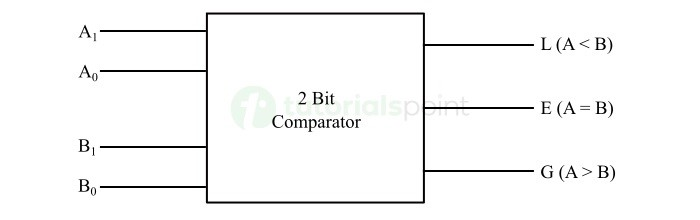

# **2-Bit Comparator**

* **What Problem Does It Solve?**
  - A 2-Bit Comparator is a digital combinational circuit.
  - It compares two 2-bit binary numbers.
  - It determines whether one number is greater than, less than, or equal to the other.
  - It provides comparison results through three output signals.

---

* **Why is it used?**

  *A 2-Bit Comparator is used because:*

  - It compares two binary numbers.
  - It helps in making logical decisions.
  - It is used in arithmetic and control circuits.
  - It is the basic building block for larger comparators.
  - It improves the performance of digital systems.

---

* **Where is it used?**

  *A 2-Bit Comparator is widely used in:*

  - CPUs (Processors).
  - ALU (Arithmetic Logic Unit).
  - Digital calculators.
  - Digital control systems.
  - Memory address comparison.
  - Digital VLSI and RTL design.
  - FPGA and ASIC designs.
  - Data comparison circuits.

---

* **Circuit Diagram:**

---

* **Function of Inputs and Outputs**

  - A1 = Most Significant Bit (MSB) of first number.
  - A0 = Least Significant Bit (LSB) of first number.
  - B1 = Most Significant Bit (MSB) of second number.
  - B0 = Least Significant Bit (LSB) of second number.
  - A>B = HIGH when A is greater than B.
  - A=B = HIGH when A is equal to B.
  - A<B = HIGH when A is less than B.

---

* **Truth Table**

| A1 | A0 | B1 | B0 | A>B | A=B | A<B |
|:--:|:--:|:--:|:--:|:---:|:---:|:---:|
| 0 | 0 | 0 | 0 | 0 | 1 | 0 |
| 0 | 0 | 0 | 1 | 0 | 0 | 1 |
| 0 | 1 | 0 | 0 | 1 | 0 | 0 |
| 0 | 1 | 0 | 1 | 0 | 1 | 0 |
| 1 | 0 | 0 | 0 | 1 | 0 | 0 |
| 1 | 0 | 0 | 1 | 1 | 0 | 0 |
| 1 | 0 | 1 | 0 | 0 | 1 | 0 |
| 1 | 0 | 1 | 1 | 0 | 0 | 1 |
| 1 | 1 | 0 | 0 | 1 | 0 | 0 |
| 1 | 1 | 0 | 1 | 1 | 0 | 0 |
| 1 | 1 | 1 | 0 | 1 | 0 | 0 |
| 1 | 1 | 1 | 1 | 0 | 1 | 0 |

---

* **Boolean Expressions**

- **A>B = A1B1̅ + (A1 ⊙ B1)A0B0̅**
- **A=B = (A1 ⊙ B1)(A0 ⊙ B0)**
- **A<B = A1̅B1 + (A1 ⊙ B1)A0̅B0**

> **Note:** **⊙** represents the **XNOR (Equality)** operation.

---

