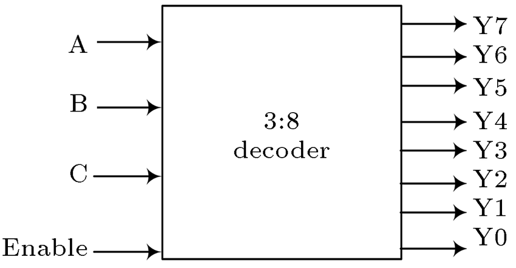

# **3 : 8 Decoder**

* **What Problem Does It Solve?**
  - A 3 : 8 Decoder is a digital combinational circuit.
  - It converts a 3-bit binary input into one of eight output lines.
  - Only one output becomes HIGH (1) for each input combination.
  - It is used to select one output from eight possible outputs.

---

* **Why is it used?**

  *A 3 : 8 Decoder is used because:*

  - It converts binary input into individual output lines.
  - It selects one output from multiple outputs.
  - It simplifies digital circuit design.
  - It is used for address decoding in memory systems.
  - It improves hardware efficiency.

---

* **Where is it used?**

  *A 3 : 8 Decoder is widely used in:*

  - Memory address decoding.
  - CPUs (Processors).
  - ALU (Arithmetic Logic Unit).
  - Data routing circuits.
  - Digital control systems.
  - Digital VLSI and RTL design.
  - FPGA and ASIC designs.
  - Embedded systems.

---

* **Circuit Diagram:**

---

* **Function of Inputs and Outputs**

  - A2 = Most Significant Bit (MSB) input.
  - A1 = Middle input.
  - A0 = Least Significant Bit (LSB) input.
  - Y0 = First output.
  - Y1 = Second output.
  - Y2 = Third output.
  - Y3 = Fourth output.
  - Y4 = Fifth output.
  - Y5 = Sixth output.
  - Y6 = Seventh output.
  - Y7 = Eighth output.

---

* **Truth Table**

| A2 | A1 | A0 | Y0 | Y1 | Y2 | Y3 | Y4 | Y5 | Y6 | Y7 |
|:--:|:--:|:--:|:--:|:--:|:--:|:--:|:--:|:--:|:--:|:--:|
| 0 | 0 | 0 | 1 | 0 | 0 | 0 | 0 | 0 | 0 | 0 | 0 |
| 0 | 0 | 1 | 0 | 1 | 0 | 0 | 0 | 0 | 0 | 0 | 0 |
| 0 | 1 | 0 | 0 | 0 | 1 | 0 | 0 | 0 | 0 | 0 | 0 |
| 0 | 1 | 1 | 0 | 0 | 0 | 1 | 0 | 0 | 0 | 0 | 0 |
| 1 | 0 | 0 | 0 | 0 | 0 | 0 | 1 | 0 | 0 | 0 | 0 |
| 1 | 0 | 1 | 0 | 0 | 0 | 0 | 0 | 1 | 0 | 0 | 0 |
| 1 | 1 | 0 | 0 | 0 | 0 | 0 | 0 | 0 | 1 | 0 | 0 |
| 1 | 1 | 1 | 0 | 0 | 0 | 0 | 0 | 0 | 0 | 1 | 0 |

> **Note:** Only one output is HIGH (1) for each input combination.

---

* **Boolean Expressions**

- **Y0 = A2̅ · A1̅ · A0̅**
- **Y1 = A2̅ · A1̅ · A0**
- **Y2 = A2̅ · A1 · A0̅**
- **Y3 = A2̅ · A1 · A0**
- **Y4 = A2 · A1̅ · A0̅**
- **Y5 = A2 · A1̅ · A0**
- **Y6 = A2 · A1 · A0̅**
- **Y7 = A2 · A1 · A0**

---
* **Waveform / Timing Diagram:**

 
