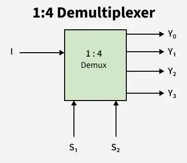

# **1 : 4 Demultiplexer (DEMUX)**

* **What Problem Does It Solve?**
  - A 1 : 4 Demultiplexer (DEMUX) is a digital combinational circuit.
  - It takes one input signal and sends it to one of four outputs.
  - The output is selected using two select lines (S1 and S0).
  - Only one output is active at a time.

---

* **Why is it used?**

  *A 1 : 4 Demultiplexer is used because:*

  - It routes one input signal to one of multiple outputs.
  - It controls the flow of data in digital circuits.
  - It reduces wiring complexity.
  - It simplifies circuit design.
  - It improves hardware efficiency.

---

* **Where is it used?**

  *A 1 : 4 Demultiplexer is widely used in:*

  - Data distribution circuits.
  - Communication systems.
  - Memory address decoding.
  - Digital control systems.
  - Digital VLSI and RTL design.
  - FPGA and ASIC designs.
  - Embedded systems.
  - Data routing applications.

---

* **Circuit Diagram:**

---

* **Function of Inputs and Outputs**

  - D = Data input.
  - S1, S0 = Select lines.
  - Y0 = First output.
  - Y1 = Second output.
  - Y2 = Third output.
  - Y3 = Fourth output.

---

* **Truth Table**

| S1 | S0 | D | Y0 | Y1 | Y2 | Y3 |
|:--:|:--:|:-:|:--:|:--:|:--:|:--:|
| 0 | 0 | 0 | 0 | 0 | 0 | 0 |
| 0 | 0 | 1 | 1 | 0 | 0 | 0 |
| 0 | 1 | 0 | 0 | 0 | 0 | 0 |
| 0 | 1 | 1 | 0 | 1 | 0 | 0 |
| 1 | 0 | 0 | 0 | 0 | 0 | 0 |
| 1 | 0 | 1 | 0 | 0 | 1 | 0 |
| 1 | 1 | 0 | 0 | 0 | 0 | 0 |
| 1 | 1 | 1 | 0 | 0 | 0 | 1 |

---

* **Boolean Expressions**

- **Y0 = D · S1̅ · S0̅**
- **Y1 = D · S1̅ · S0**
- **Y2 = D · S1 · S0̅**
- **Y3 = D · S1 · S0**

---

* **Easy Way to Remember**

- A **1 : 4 DEMUX** has **1 input**, **4 outputs**, and **2 select lines**.
- **S1S0 = 00 → Y0**
- **S1S0 = 01 → Y1**
- **S1S0 = 10 → Y2**
- **S1S0 = 11 → Y3**
- Only **one output** receives the input at a time.

---

* **One-Line Definition (Interview)**

> A 1 : 4 Demultiplexer (DEMUX) is a combinational logic circuit that routes one input signal to one of four outputs based on two select lines.
