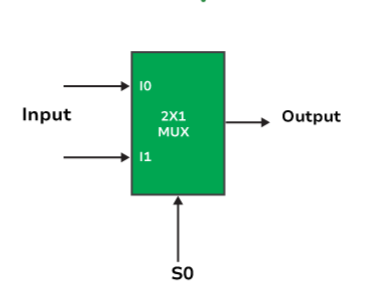

# **2 × 1 Multiplexer (MUX)**

* **What Problem Does It Solve**
  - A 2 × 1 Multiplexer (MUX) is a digital combinational circuit.
  - It selects one input from two input signals.
  - It sends the selected input to a single output.
  - The selection is controlled by one select line (S).

---

* **Why is it used?**

  *A 2 × 1 Multiplexer is used because:*

  - It selects one signal from multiple inputs.
  - It reduces the number of data lines.
  - It controls the flow of data in digital circuits.
  - It simplifies circuit design.
  - It improves hardware efficiency.

---

* **Where is it used?**

  *A 2 × 1 Multiplexer is widely used in:*

   - CPUs (Processors).
   - ALU (Arithmetic Logic Unit).
   - Data routing circuits.
   - Memory systems.
   - Communication systems.
   - Digital VLSI and RTL design.
   - FPGA and ASIC designs.
   - Embedded systems.

---

* **Circuit Diagram:**

---

* **Function of Inputs and Outputs**

  - I0 = First data input.
  - I1 = Second data input.
  - S = Select line (chooses the input).
  - Y = Output.

---

* **Truth Table**

| E | S | Y |
|:-:|:--:|:--:|
| 0 | x | X |
| 1 | 0 | I0 |
| 1 | 1 | I1 |

---

* **Boolean Expression**

- Y = S̅·I0E + S·I1E

---

* **Waveform / Timing Diagram:**

  

