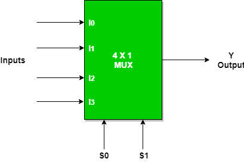

# **4 : 1 Multiplexer (MUX)**

* **What Problem Does It Solve?**
  - A 4 : 1 Multiplexer (MUX) is a digital combinational circuit.
  - It selects one input from four input signals.
  - It forwards the selected input to a single output.
  - The selection is controlled by two select lines (S1 and S0).

---

* **Why is it used?**

  *A 4 : 1 Multiplexer is used because:*

   - It selects one signal from multiple inputs.
   - It controls the flow of data in digital circuits.
   - It reduces the number of data lines.
   - It simplifies hardware design.
   - It improves circuit efficiency.

---

* **Where is it used?**

  *A 4 : 1 Multiplexer is widely used in:*

   - CPUs (Processors).
   - ALU (Arithmetic Logic Unit).
   - Memory systems.
   - Data routing circuits.
   - Communication systems.
   - Digital VLSI and RTL design.
   - FPGA and ASIC designs.
   - Embedded systems.

---

* **Circuit Diagram:**

---

* **Function of Inputs and Outputs**

  - I0 = First data input.
  - I1 = Second data input.
  - I2 = Third data input.
  - I3 = Fourth data input.
  - S1, S0 = Select lines used to choose one input.
  - Y = Output.

---

* **Truth Table**

| E | S1 | S0 | Y |
|:--:|:--:|:--:|:-:|
| 0 | X | X | X |
| 1 | 0 | 0 | I1 |
| 1 | 1 | 0 | I2 |
| 1 | 0 | 1 | I3 |
| 1 | 1 | 1 | I3 |

---

* **Boolean Expression**

- **Y = [E(S1̅S0̅·I0)] + [E(S1̅S0·I1)] + [E(S1S0̅·I2)] + [E(S1S0·I3)]**

---

* **Waveform / Timing Diagram:**

  
