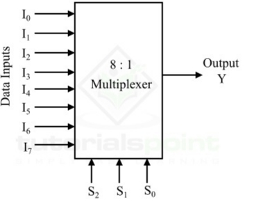

# **8 : 1 Multiplexer (MUX)**

* **What Problem Does It Solve?**
  - An 8 : 1 Multiplexer (MUX) is a digital combinational circuit.
  - It selects one input from eight input signals.
  - It forwards the selected input to a single output.
  - The selection is controlled by three select lines (S2, S1, and S0).

---

* **Why is it used?**

  *An 8 : 1 Multiplexer is used because:*

  - It selects one signal from multiple inputs.
  - It controls the flow of data in digital circuits.
  - It reduces the number of data lines.
  - It simplifies hardware design.
  - It improves circuit efficiency.

---

* **Where is it used?**

  *An 8 : 1 Multiplexer is widely used in:*

  - CPUs (Processors).
  - ALU (Arithmetic Logic Unit).
  - Memory systems.
  - Data routing circuits.
  - Communication systems.
  - Digital VLSI and RTL design.
  - FPGA and ASIC designs.
  - Embedded systems.

---

* **Circuit Diagram:**

---

* **Function of Inputs and Outputs**

  - I0 = First data input.
  - I1 = Second data input.
  - I2 = Third data input.
  - I3 = Fourth data input.
  - I4 = Fifth data input.
  - I5 = Sixth data input.
  - I6 = Seventh data input.
  - I7 = Eighth data input.
  - S2, S1, S0 = Select lines used to choose one input.
  - Y = Output.

---

* **Truth Table**

| E | S2 | S1 | S0 | Y |
|:--:|:--:|:--:|:--:|:--:|
| 0 | x | 0 | x | x |
| 1 | 0 | 0 | 0 | I0 |
| 1 | 1 | 1 | 0 | I1 |
| 1 | 0 | 1 | 0 | I2 |
| 1 | 1 | 0 | 0 | I3 |
| 1 | 0 | 0 | 1 | I4 |
| 1 | 1 | 1 | 1 | I5 |
| 1 | 0 | 1 | 1 | I6 |
| 1 | 1 | 1 | 1 | I7 |

---

* **Boolean Expression**

- **Y = E[S2̅S1̅S0̅·I0 + S2̅S1̅S0·I1 + S2̅S1S0̅·I2 + S2̅S1S0·I3 + S2S1̅S0̅·I4 + S2S1̅S0·I5 + S2S1S0̅·I6 + S2S1S0·I7]**

---

