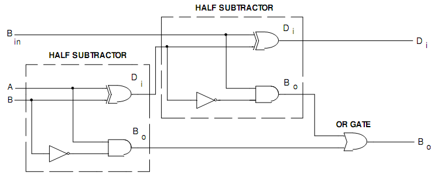

# **Full Subtractor Using Two Half Subtractors**

* **Overview**

A Full Subtractor can be constructed by connecting two Half Subtractors and one OR gate. The first Half Subtractor subtracts the **Subtrahend (B)** from the **Minuend (A)**, while the second Half Subtractor subtracts the **Borrow-in (Bin)** from the Difference produced by the first Half Subtractor. The borrow outputs from both Half Subtractors are combined using an OR gate to generate the final **Borrow-out (Bout)**.

---

* **Definition**

A Full Subtractor Using Two Half Subtractors is a combinational logic circuit that subtracts two one-bit binary inputs (**A** and **B**) along with a **Borrow-in (Bin)** by connecting two Half Subtractors and one OR gate, producing **Difference (D)** and **Borrow-out (Bout)**.

---

* **Purpose**
  - To subtract three binary bits.
  - To generate Difference and Borrow outputs.
  - To construct a Full Subtractor using basic building blocks.
  - To understand hierarchical digital circuit design.

---

* **Importance**
  - Demonstrates how complex circuits are built from simpler circuits.
  - Reduces design complexity using modular design.
  - Forms the basis for multi-bit binary subtractors.
  - Widely used in processors, ALUs, FPGA, and VLSI design.

---

* **Working Principle**
  - The first Half Subtractor subtracts **B** from **A**.
  - It produces:
    - Intermediate Difference (**D₁**)
    - Borrow (**B₁**)
  - The second Half Subtractor subtracts **Bin** from **D₁**.
  - It produces:
    - Final Difference (**D**)
    - Borrow (**B₂**)
  - The OR gate combines **B₁** and **B₂** to produce the final **Borrow-out (Bout)**.

---

* **Circuit Description**
  - Components Required:
    - Two Half Subtractors.
    - One OR Gate.
  - First Half Subtractor:
    - Inputs → A, B
    - Outputs → D₁, B₁
  - Second Half Subtractor:
    - Inputs → D₁, Bin
    - Outputs → D, B₂
  - OR Gate:
    - Inputs → B₁, B₂
    - Output → Bout

---

* **Circuit Diagram:**

---

* **Truth Table:**

| A | B | Bin | D | Bout |
|---|---|-----|---|------|
| 0 | 0 | 0 | 0 | 0 |
| 0 | 0 | 1 | 1 | 1 |
| 0 | 1 | 0 | 1 | 1 |
| 0 | 1 | 1 | 0 | 1 |
| 1 | 0 | 0 | 1 | 0 |
| 1 | 0 | 1 | 0 | 0 |
| 1 | 1 | 0 | 0 | 0 |
| 1 | 1 | 1 | 1 | 1 |

---

* **Boolean Expression**

**First Half Subtractor**

- **D₁ = A ⊕ B**
- **B₁ = A̅.B**

**Second Half Subtractor**

- **D = D₁ ⊕ Bin**
- **B₂ = D̅₁.Bin**

**Final Borrow**

- **Bout = B₁ + B₂**

Equivalent Expression:

- **D = A ⊕ B ⊕ Bin**
- **Bout = A̅B + A̅Bin + BBin**

---

* **Input and Output Description**
  - Inputs:- A, B, Bin [3 Inputs]
  - Outputs:-
    - Difference (D)
    - Borrow-out (Bout)

  - **A** is the Minuend.
  - **B** is the Subtrahend.
  - **Bin** is the Borrow received from the previous stage.
  - **D** is the final Difference output.
  - **Bout** is forwarded to the next Full Subtractor during multi-bit subtraction.

---

* **Working Example**
  - Consider:
    - A = 0
    - B = 1
    - Bin = 1

**Step 1:** First Half Subtractor

- D₁ = 0 ⊕ 1 = 1
- B₁ = 1 × 1 = 1

**Step 2:** Second Half Subtractor

- D = 1 ⊕ 1 = 0
- B₂ = 0 × 1 = 0

**Step 3:** OR Gate

- Bout = B₁ + B₂
- Bout = 1 + 0 = 1

Final Output:

- **Difference = 0**
- **Borrow-out = 1**

---

* **Applications**

  *The Full Subtractor Using Two Half Subtractors is used in:*

  - Ripple Borrow Subtractors.
  - Arithmetic Logic Units (ALUs).
  - Digital Computers.
  - Microprocessors.
  - FPGA Design.
  - RTL Design.
  - VLSI Systems.
  - Digital Arithmetic Circuits.

---

* **Advantages**
  - Simple modular design.
  - Easy to understand and implement.
  - Reuses Half Subtractor circuits.
  - Suitable for hierarchical circuit design.
  - Forms the basis of larger arithmetic circuits.

---

* **Limitations**
  - Requires more hardware than a Half Subtractor.
  - Ripple Borrow Subtractors built using this design have propagation delay.
  - Delay increases with the number of bits.

---

* **Real-World Example**
  - Computer Processors.
  - Calculator Circuits.
  - Arithmetic Logic Units (ALUs).
  - FPGA-Based Systems.
  - Digital Signal Processing Hardware.

---

* **Key Points**
  - Built using **Two Half Subtractors + One OR Gate**.
  - First Half Subtractor subtracts **B** from **A**.
  - Second Half Subtractor subtracts **Bin** from **D₁**.
  - OR gate generates the final Borrow-out.
  - Inputs → **A, B, Bin**
  - Outputs → **Difference (D), Borrow-out (Bout)**

---

* **Interview Questions**

**1. How is a Full Subtractor implemented using Half Subtractors?**

**Answer:**

A Full Subtractor is implemented using **two Half Subtractors and one OR gate**.

---

**2. Why are two Half Subtractors required?**

**Answer:**

The first Half Subtractor subtracts **B** from **A**, while the second Half Subtractor subtracts **Borrow-in (Bin)** from the intermediate Difference (**D₁**).

---

**3. What is the function of the OR gate?**

**Answer:**

The OR gate combines the borrow outputs (**B₁** and **B₂**) from the two Half Subtractors to generate the final Borrow-out (**Bout**).

---

**4. What are the intermediate outputs of the first Half Subtractor?**

**Answer:**

The first Half Subtractor produces:

- Intermediate Difference (**D₁**)
- Borrow (**B₁**)

---

**5. What is the Boolean expression for the final Borrow-out?**

**Answer:**

**Bout = B₁ + B₂**

or

**Bout = A̅B + A̅Bin + BBin**

---

**6. What are the advantages of implementing a Full Subtractor using Half Subtractors?**

**Answer:**

It provides a modular design, simplifies circuit implementation, and demonstrates hierarchical digital design.

---

**7. Mention four applications of a Full Subtractor Using Two Half Subtractors.**

**Answer:**

- Ripple Borrow Subtractors.
- Arithmetic Logic Units (ALUs).
- Computer Processors.
- FPGA Design.

---

**8. How many Half Subtractors and OR gates are required to implement one Full Subtractor?**

**Answer:**

One Full Subtractor requires **two Half Subtractors** and **one OR gate**.

---

* **Quick Revision**
  - Circuit Type → Combinational Logic
  - Components → Two Half Subtractors + One OR Gate
  - Inputs → A, B, Bin
  - Outputs → Difference (D), Borrow-out (Bout)
  - Intermediate Outputs → D₁, B₁, B₂
  - Final Borrow → **Bout = B₁ + B₂**

---

* **Summary**

A Full Subtractor Using Two Half Subtractors is a modular implementation of a Full Subtractor that uses two Half Subtractors and one OR gate. The first Half Subtractor subtracts **B** from **A**, while the second Half Subtractor subtracts the intermediate Difference with **Borrow-in (Bin)**. The borrow outputs are combined using an OR gate to produce the final Borrow-out. This design is widely used in arithmetic circuits, ALUs, processors, FPGA, and VLSI systems.

---

* **References**
  - M. Morris Mano – *Digital Design*.
  - Donald D. Givone – *Digital Principles and Design*.
  - R. P. Jain – *Modern Digital Electronics*.
  - Thomas L. Floyd – *Digital Fundamentals*.
  - Neso Academy – Digital Electronics.
  - GeeksforGeeks – Digital Logic.

---

* **Waveform / Timing Diagram:**

