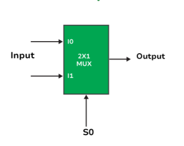

# **2 × 1 Multiplexer (MUX)**

* **Overview**

A 2 × 1 Multiplexer (MUX) is a fundamental combinational logic circuit used in digital electronics to select one of two input signals and transmit it to a single output. The selection is controlled by a single **Select (S)** input. Multiplexers are widely used in digital systems for data selection and routing.

---

* **Definition**

A **2 × 1 Multiplexer (MUX)** is a combinational logic circuit that selects one of the two input signals (**I₀** or **I₁**) based on the value of the **Select (S)** line and forwards the selected input to the output (**Y**).

---

* **Purpose**
  - To select one input from multiple inputs.
  - To transmit the selected input to the output.
  - To reduce the number of communication lines.
  - To perform efficient data routing in digital systems.

---

* **Importance**
  - It is one of the most widely used combinational logic circuits.
  - It simplifies digital circuit design.
  - It is used in processors, ALUs, and communication systems.
  - It forms the foundation for higher-order multiplexers.

---

* **Working Principle**
  - A 2 × 1 Multiplexer has two data inputs (**I₀** and **I₁**), one Select line (**S**), and one Output (**Y**).
  - When **S = 0**, input **I₀** is connected to the output.
  - When **S = 1**, input **I₁** is connected to the output.
  - Only one input is selected at a time.

---

* **Circuit Description**
  - A 2 × 1 Multiplexer consists of:
    - One NOT Gate.
    - Two AND Gates.
    - One OR Gate.
  - The NOT gate generates the complement of the Select input.
  - The AND gates enable one input at a time.
  - The OR gate combines the outputs of the AND gates to produce the final output.

---

* **Circuit Diagram:**

---

* **Truth Table:**

| S | I₀ | I₁ | Y |
|---|----|----|---|
| 0 | 0 | X | 0 |
| 0 | 1 | X | 1 |
| 1 | X | 0 | 0 |
| 1 | X | 1 | 1 |

**Note:** **X** represents a **Don't Care** condition because that input is not selected.

---

* **Boolean Expression**

**Y = S̅I₀ + SI₁**

---

* **Input and Output Description**
  - Inputs:-
    - I₀, I₁ [2 Data Inputs]
    - S [1 Select Input]
  - Output:-
    - Y [1 Output]

  - **I₀** is selected when **S = 0**.
  - **I₁** is selected when **S = 1**.
  - **S** determines which input appears at the output.
  - **Y** represents the selected input.

---

* **Working Example**
  - Consider:
    - I₀ = 1
    - I₁ = 0
    - S = 0

Output:

- Since **S = 0**, **I₀** is selected.

- **Y = 1**

Another Example:

- I₀ = 1
- I₁ = 0
- S = 1

Output:

- Since **S = 1**, **I₁** is selected.

- **Y = 0**

---

* **Applications**

  *The 2 × 1 Multiplexer is used in:*

  - Data Selection.
  - Data Routing.
  - Arithmetic Logic Units (ALUs).
  - Computer Processors.
  - Communication Systems.
  - FPGA Design.
  - RTL Design.
  - VLSI Systems.

---

* **Advantages**
  - Simple circuit design.
  - Reduces hardware complexity.
  - Efficient data selection.
  - High-speed switching.
  - Easy to expand into larger multiplexers.

---

* **Limitations**
  - Can select only one input at a time.
  - Limited to two inputs.
  - Larger systems require higher-order multiplexers.

---

* **Real-World Example**
  - CPU Data Bus Selection.
  - Memory Address Selection.
  - Communication Networks.
  - Digital Signal Processing Systems.
  - Embedded Systems.

---

* **Key Points**
  - A 2 × 1 Multiplexer is a combinational logic circuit.
  - It has **2 Data Inputs**, **1 Select Input**, and **1 Output**.
  - **S = 0 → I₀ is selected.**
  - **S = 1 → I₁ is selected.**
  - Boolean Expression:

    **Y = S̅I₀ + SI₁**

---

* **Interview Questions**

**1. What is a 2 × 1 Multiplexer?**

**Answer:**

A 2 × 1 Multiplexer is a combinational logic circuit that selects one of two input signals based on a Select line and forwards it to the output.

---

**2. How many inputs and outputs does a 2 × 1 Multiplexer have?**

**Answer:**

A 2 × 1 Multiplexer has **2 data inputs (I₀ and I₁)**, **1 select input (S)**, and **1 output (Y).**

---

**3. What is the Boolean expression of a 2 × 1 Multiplexer?**

**Answer:**

**Y = S̅I₀ + SI₁**

---

**4. What is the function of the Select line?**

**Answer:**

The Select line determines which input is connected to the output.

---

**5. Which logic gates are used to implement a 2 × 1 Multiplexer?**

**Answer:**

A 2 × 1 Multiplexer is implemented using **one NOT gate, two AND gates, and one OR gate**.

---

**6. What happens when S = 0?**

**Answer:**

When **S = 0**, the output is equal to **I₀**.

---

**7. What happens when S = 1?**

**Answer:**

When **S = 1**, the output is equal to **I₁**.

---

**8. Mention four applications of a 2 × 1 Multiplexer.**

**Answer:**

- Data Selection.
- ALUs.
- Communication Systems.
- Computer Processors.

---

* **Quick Revision**
  - Circuit Type → Combinational Logic
  - Data Inputs → I₀, I₁
  - Select Input → S
  - Output → Y
  - S = 0 → Output = I₀
  - S = 1 → Output = I₁
  - Boolean Expression → **Y = S̅I₀ + SI₁**

---

* **Summary**

A **2 × 1 Multiplexer** is a combinational logic circuit that selects one of two data inputs based on the value of a single Select line and forwards the selected input to the output. It is an essential building block in digital systems for data selection, routing, processors, ALUs, FPGA, RTL, and VLSI designs.

---

* **References**
  - M. Morris Mano – *Digital Design*.
  - Donald D. Givone – *Digital Principles and Design*.
  - R. P. Jain – *Modern Digital Electronics*.
  - Thomas L. Floyd – *Digital Fundamentals*.
  - Neso Academy – Digital Electronics.
  - GeeksforGeeks – Digital Logic.

---

* **Waveform / Timing Diagram:**

