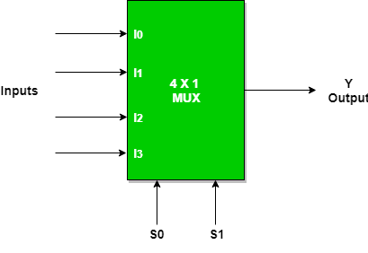

# **4 × 1 Multiplexer (MUX)**

* **Overview**

A 4 × 1 Multiplexer (MUX) is a combinational logic circuit used in digital electronics to select one of four input signals and transmit it to a single output. The selection is controlled by two **Select (S₁ and S₀)** input lines. Multiplexers are widely used in digital systems for data selection, routing, and communication.

---

* **Definition**

A **4 × 1 Multiplexer (MUX)** is a combinational logic circuit that selects one of the four input signals (**I₀**, **I₁**, **I₂**, or **I₃**) based on the values of the **Select lines (S₁ and S₀)** and forwards the selected input to the output (**Y**).

---

* **Purpose**
  - To select one input from four input signals.
  - To transmit the selected input to the output.
  - To reduce the number of communication lines.
  - To perform efficient data routing in digital systems.

---

* **Importance**
  - It simplifies digital circuit design.
  - It is widely used in processors, ALUs, and communication systems.
  - It forms the foundation for higher-order multiplexers.
  - It improves efficient data transfer in digital systems.

---

* **Working Principle**
  - A 4 × 1 Multiplexer has four data inputs (**I₀**, **I₁**, **I₂**, **I₃**), two Select lines (**S₁** and **S₀**), and one Output (**Y**).
  - The Select lines determine which input is connected to the output.
  - Only one input is selected at a time.

Selection:

- **S₁S₀ = 00 → I₀**
- **S₁S₀ = 01 → I₁**
- **S₁S₀ = 10 → I₂**
- **S₁S₀ = 11 → I₃**

---

* **Circuit Description**
  - A 4 × 1 Multiplexer consists of:
    - Two NOT Gates.
    - Four AND Gates.
    - One OR Gate.
  - The NOT gates generate the complements of the Select inputs.
  - The AND gates enable only one input based on the Select lines.
  - The OR gate combines the outputs of all AND gates to produce the final output.

---

* **Circuit Diagram:**

---

* **Truth Table:**

| S₁ | S₀ | Selected Input | Output (Y) |
|----|----|----------------|------------|
| 0 | 0 | I₀ | I₀ |
| 0 | 1 | I₁ | I₁ |
| 1 | 0 | I₂ | I₂ |
| 1 | 1 | I₃ | I₃ |

---

* **Boolean Expression**

**Y = S̅₁S̅₀I₀ + S̅₁S₀I₁ + S₁S̅₀I₂ + S₁S₀I₃**

---

* **Input and Output Description**
  - Inputs:-
    - I₀, I₁, I₂, I₃ [4 Data Inputs]
    - S₁, S₀ [2 Select Inputs]
  - Output:-
    - Y [1 Output]

  - **I₀** is selected when **S₁S₀ = 00**.
  - **I₁** is selected when **S₁S₀ = 01**.
  - **I₂** is selected when **S₁S₀ = 10**.
  - **I₃** is selected when **S₁S₀ = 11**.
  - **Y** represents the selected input.

---

* **Working Example**
  - Consider:
    - I₀ = 0
    - I₁ = 1
    - I₂ = 0
    - I₃ = 1
    - S₁ = 1
    - S₀ = 0

Output:

- Since **S₁S₀ = 10**, **I₂** is selected.

- **Y = 0**

Another Example:

- I₀ = 0
- I₁ = 1
- I₂ = 0
- I₃ = 1
- S₁ = 1
- S₀ = 1

Output:

- Since **S₁S₀ = 11**, **I₃** is selected.

- **Y = 1**

---

* **Applications**

  *The 4 × 1 Multiplexer is used in:*

  - Data Selection.
  - Data Routing.
  - Arithmetic Logic Units (ALUs).
  - Computer Processors.
  - Communication Systems.
  - FPGA Design.
  - RTL Design.
  - VLSI Systems.

---

* **Advantages**
  - Selects one of four input signals.
  - Reduces hardware complexity.
  - Efficient data routing.
  - High-speed switching.
  - Easy to expand into larger multiplexers.

---

* **Limitations**
  - Can select only one input at a time.
  - Requires additional Select lines as the number of inputs increases.
  - Larger multiplexers require more logic gates.

---

* **Real-World Example**
  - CPU Data Bus Selection.
  - Memory Address Selection.
  - Communication Networks.
  - Digital Signal Processing Systems.
  - Embedded Systems.

---

* **Key Points**
  - A 4 × 1 Multiplexer is a combinational logic circuit.
  - It has **4 Data Inputs**, **2 Select Inputs**, and **1 Output**.
  - **00 → I₀**
  - **01 → I₁**
  - **10 → I₂**
  - **11 → I₃**
  - Boolean Expression:

    **Y = S̅₁S̅₀I₀ + S̅₁S₀I₁ + S₁S̅₀I₂ + S₁S₀I₃**

---

* **Interview Questions**

**1. What is a 4 × 1 Multiplexer?**

**Answer:**

A 4 × 1 Multiplexer is a combinational logic circuit that selects one of four input signals based on two Select lines and forwards it to the output.

---

**2. How many inputs and outputs does a 4 × 1 Multiplexer have?**

**Answer:**

A 4 × 1 Multiplexer has **4 data inputs (I₀, I₁, I₂, I₃)**, **2 Select inputs (S₁, S₀)**, and **1 output (Y).**

---

**3. What is the Boolean expression of a 4 × 1 Multiplexer?**

**Answer:**

**Y = S̅₁S̅₀I₀ + S̅₁S₀I₁ + S₁S̅₀I₂ + S₁S₀I₃**

---

**4. What is the function of the Select lines?**

**Answer:**

The Select lines determine which one of the four inputs is connected to the output.

---

**5. Which logic gates are used to implement a 4 × 1 Multiplexer?**

**Answer:**

A 4 × 1 Multiplexer is implemented using **two NOT gates, four AND gates, and one OR gate**.

---

**6. Which input is selected when S₁S₀ = 10?**

**Answer:**

When **S₁S₀ = 10**, the selected input is **I₂**.

---

**7. Which input is selected when S₁S₀ = 11?**

**Answer:**

When **S₁S₀ = 11**, the selected input is **I₃**.

---

**8. Mention four applications of a 4 × 1 Multiplexer.**

**Answer:**

- Data Selection.
- ALUs.
- Communication Systems.
- Computer Processors.

---

* **Quick Revision**
  - Circuit Type → Combinational Logic
  - Data Inputs → I₀, I₁, I₂, I₃
  - Select Inputs → S₁, S₀
  - Output → Y
  - 00 → I₀
  - 01 → I₁
  - 10 → I₂
  - 11 → I₃
  - Boolean Expression → **Y = S̅₁S̅₀I₀ + S̅₁S₀I₁ + S₁S̅₀I₂ + S₁S₀I₃**

---

* **Summary**

A **4 × 1 Multiplexer** is a combinational logic circuit that selects one of four data inputs based on the values of two Select lines and forwards the selected input to the output. It is an essential building block in digital systems for data selection, routing, processors, ALUs, FPGA, RTL, and VLSI designs.

---

* **References**
  - M. Morris Mano – *Digital Design*.
  - Donald D. Givone – *Digital Principles and Design*.
  - R. P. Jain – *Modern Digital Electronics*.
  - Thomas L. Floyd – *Digital Fundamentals*.
  - Neso Academy – Digital Electronics.
  - GeeksforGeeks – Digital Logic.

---

* **Waveform / Timing Diagram:**

