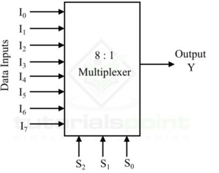

# **8 × 1 Multiplexer (MUX)**

* **Overview**

An 8 × 1 Multiplexer (MUX) is a combinational logic circuit used in digital electronics to select one of eight input signals and transmit it to a single output. The selection is controlled by three **Select (S₂, S₁, and S₀)** input lines. Multiplexers are widely used in digital systems for data selection, routing, and communication.

---

* **Definition**

An **8 × 1 Multiplexer (MUX)** is a combinational logic circuit that selects one of the eight input signals (**I₀** to **I₇**) based on the values of the **Select lines (S₂, S₁, and S₀)** and forwards the selected input to the output (**Y**).

---

* **Purpose**
  - To select one input from eight input signals.
  - To transmit the selected input to the output.
  - To reduce the number of communication lines.
  - To perform efficient data routing in digital systems.

---

* **Importance**
  - It simplifies digital circuit design.
  - It is widely used in processors, ALUs, and communication systems.
  - It forms the foundation for higher-order multiplexers.
  - It improves efficient data transfer in digital systems.

---

* **Working Principle**
  - An 8 × 1 Multiplexer has eight data inputs (**I₀** to **I₇**), three Select lines (**S₂**, **S₁**, and **S₀**), and one Output (**Y**).
  - The Select lines determine which input is connected to the output.
  - Only one input is selected at a time.

Selection:

- **S₂S₁S₀ = 000 → I₀**
- **S₂S₁S₀ = 001 → I₁**
- **S₂S₁S₀ = 010 → I₂**
- **S₂S₁S₀ = 011 → I₃**
- **S₂S₁S₀ = 100 → I₄**
- **S₂S₁S₀ = 101 → I₅**
- **S₂S₁S₀ = 110 → I₆**
- **S₂S₁S₀ = 111 → I₇**

---

* **Circuit Description**
  - An 8 × 1 Multiplexer consists of:
    - Three NOT Gates.
    - Eight AND Gates.
    - One OR Gate.
  - The NOT gates generate the complements of the Select inputs.
  - The AND gates enable only one input based on the Select lines.
  - The OR gate combines the outputs of all AND gates to produce the final output.

---

* **Circuit Diagram:**

---

* **Truth Table:**

| S₂ | S₁ | S₀ | Selected Input | Output (Y) |
|----|----|----|----------------|------------|
| 0 | 0 | 0 | I₀ | I₀ |
| 0 | 0 | 1 | I₁ | I₁ |
| 0 | 1 | 0 | I₂ | I₂ |
| 0 | 1 | 1 | I₃ | I₃ |
| 1 | 0 | 0 | I₄ | I₄ |
| 1 | 0 | 1 | I₅ | I₅ |
| 1 | 1 | 0 | I₆ | I₆ |
| 1 | 1 | 1 | I₇ | I₇ |

---

* **Boolean Expression**

**Y = S̅₂S̅₁S̅₀I₀ + S̅₂S̅₁S₀I₁ + S̅₂S₁S̅₀I₂ + S̅₂S₁S₀I₃ + S₂S̅₁S̅₀I₄ + S₂S̅₁S₀I₅ + S₂S₁S̅₀I₆ + S₂S₁S₀I₇**

---

* **Input and Output Description**
  - Inputs:-
    - I₀, I₁, I₂, I₃, I₄, I₅, I₆, I₇ [8 Data Inputs]
    - S₂, S₁, S₀ [3 Select Inputs]
  - Output:-
    - Y [1 Output]

  - **I₀** is selected when **S₂S₁S₀ = 000**.
  - **I₁** is selected when **S₂S₁S₀ = 001**.
  - **I₂** is selected when **S₂S₁S₀ = 010**.
  - **I₃** is selected when **S₂S₁S₀ = 011**.
  - **I₄** is selected when **S₂S₁S₀ = 100**.
  - **I₅** is selected when **S₂S₁S₀ = 101**.
  - **I₆** is selected when **S₂S₁S₀ = 110**.
  - **I₇** is selected when **S₂S₁S₀ = 111**.
  - **Y** represents the selected input.

---

* **Working Example**
  - Consider:
    - I₀ = 0
    - I₁ = 1
    - I₂ = 0
    - I₃ = 1
    - I₄ = 0
    - I₅ = 1
    - I₆ = 1
    - I₇ = 0
    - S₂ = 1
    - S₁ = 1
    - S₀ = 0

Output:

- Since **S₂S₁S₀ = 110**, **I₆** is selected.

- **Y = 1**

Another Example:

- S₂ = 0
- S₁ = 0
- S₀ = 1

Output:

- Since **S₂S₁S₀ = 001**, **I₁** is selected.

- **Y = I₁**

---

* **Applications**

  *The 8 × 1 Multiplexer is used in:*

  - Data Selection.
  - Data Routing.
  - Arithmetic Logic Units (ALUs).
  - Computer Processors.
  - Communication Systems.
  - FPGA Design.
  - RTL Design.
  - VLSI Systems.

---

* **Advantages**
  - Selects one of eight input signals.
  - Reduces hardware complexity.
  - Efficient data routing.
  - High-speed switching.
  - Easy to expand into larger multiplexers.

---

* **Limitations**
  - Can select only one input at a time.
  - Requires more Select lines as the number of inputs increases.
  - Larger multiplexers require more logic gates and hardware.

---

* **Real-World Example**
  - CPU Data Bus Selection.
  - Memory Address Selection.
  - Communication Networks.
  - Digital Signal Processing Systems.
  - Embedded Systems.

---

* **Key Points**
  - An 8 × 1 Multiplexer is a combinational logic circuit.
  - It has **8 Data Inputs**, **3 Select Inputs**, and **1 Output**.
  - **000 → I₀**
  - **001 → I₁**
  - **010 → I₂**
  - **011 → I₃**
  - **100 → I₄**
  - **101 → I₅**
  - **110 → I₆**
  - **111 → I₇**
  - Boolean Expression:

    **Y = S̅₂S̅₁S̅₀I₀ + S̅₂S̅₁S₀I₁ + S̅₂S₁S̅₀I₂ + S̅₂S₁S₀I₃ + S₂S̅₁S̅₀I₄ + S₂S̅₁S₀I₅ + S₂S₁S̅₀I₆ + S₂S₁S₀I₇**

---

* **Interview Questions**

**1. What is an 8 × 1 Multiplexer?**

**Answer:**

An 8 × 1 Multiplexer is a combinational logic circuit that selects one of eight input signals based on three Select lines and forwards it to the output.

---

**2. How many inputs and outputs does an 8 × 1 Multiplexer have?**

**Answer:**

An 8 × 1 Multiplexer has **8 data inputs (I₀–I₇)**, **3 Select inputs (S₂, S₁, S₀)**, and **1 output (Y).**

---

**3. What is the Boolean expression of an 8 × 1 Multiplexer?**

**Answer:**

**Y = S̅₂S̅₁S̅₀I₀ + S̅₂S̅₁S₀I₁ + S̅₂S₁S̅₀I₂ + S̅₂S₁S₀I₃ + S₂S̅₁S̅₀I₄ + S₂S̅₁S₀I₅ + S₂S₁S̅₀I₆ + S₂S₁S₀I₇**

---

**4. What is the function of the Select lines?**

**Answer:**

The Select lines determine which one of the eight inputs is connected to the output.

---

**5. Which logic gates are used to implement an 8 × 1 Multiplexer?**

**Answer:**

An 8 × 1 Multiplexer is implemented using **three NOT gates, eight AND gates, and one OR gate**.

---

**6. Which input is selected when S₂S₁S₀ = 101?**

**Answer:**

When **S₂S₁S₀ = 101**, the selected input is **I₅**.

---

**7. Which input is selected when S₂S₁S₀ = 111?**

**Answer:**

When **S₂S₁S₀ = 111**, the selected input is **I₇**.

---

**8. Mention four applications of an 8 × 1 Multiplexer.**

**Answer:**

- Data Selection.
- ALUs.
- Communication Systems.
- Computer Processors.

---

* **Quick Revision**
  - Circuit Type → Combinational Logic
  - Data Inputs → I₀–I₇
  - Select Inputs → S₂, S₁, S₀
  - Output → Y
  - 000 → I₀
  - 001 → I₁
  - 010 → I₂
  - 011 → I₃
  - 100 → I₄
  - 101 → I₅
  - 110 → I₆
  - 111 → I₇
  - Boolean Expression → **Y = S̅₂S̅₁S̅₀I₀ + S̅₂S̅₁S₀I₁ + S̅₂S₁S̅₀I₂ + S̅₂S₁S₀I₃ + S₂S̅₁S̅₀I₄ + S₂S̅₁S₀I₅ + S₂S₁S̅₀I₆ + S₂S₁S₀I₇**

---

* **Summary**

An **8 × 1 Multiplexer** is a combinational logic circuit that selects one of eight data inputs based on the values of three Select lines and forwards the selected input to the output. It is an essential building block in digital systems for data selection, routing, processors, ALUs, FPGA, RTL, and VLSI designs.

---

* **References**
  - M. Morris Mano – *Digital Design*.
  - Donald D. Givone – *Digital Principles and Design*.
  - R. P. Jain – *Modern Digital Electronics*.
  - Thomas L. Floyd – *Digital Fundamentals*.
  - Neso Academy – Digital Electronics.
  - GeeksforGeeks – Digital Logic.

---

* **Waveform / Timing Diagram:**

