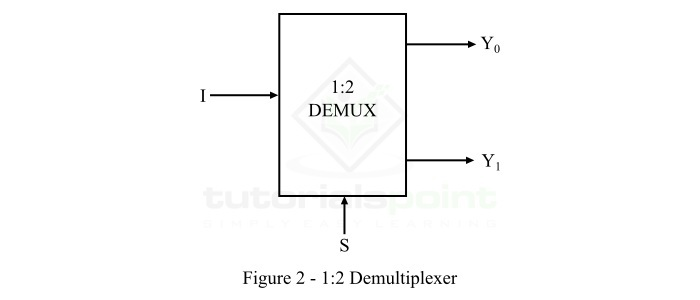

# **1 × 2 Demultiplexer (DEMUX)**

* **Overview**

A **1 × 2 Demultiplexer (DEMUX)** is a combinational logic circuit that routes one input signal to one of two output lines based on the value of the select line. It performs the opposite operation of a Multiplexer (MUX) and is commonly used in digital systems for data distribution.

---

* **Definition**

A **1 × 2 Demultiplexer (DEMUX)** is a digital combinational circuit that takes one input, one select line, and directs the input to one of two outputs depending on the select line value.

---

* **Purpose**
  - To distribute one input signal to one of multiple outputs.
  - To route data to different destinations.
  - To perform data distribution in digital circuits.
  - To implement controlled signal routing.

---

* **Importance**
  - Performs the reverse operation of a Multiplexer.
  - Reduces wiring complexity in digital systems.
  - Enables efficient signal routing.
  - Widely used in FPGA, ASIC, RTL, and VLSI designs.

---

* **Working Principle**
  - A **1 × 2 DEMUX** has:
    - One Data Input (**I**).
    - One Select Line (**S**).
    - Two Outputs (**Y0**, **Y1**).
  - The select line determines which output receives the input signal.
  - When **S = 0**, the input is routed to **Y0**.
  - When **S = 1**, the input is routed to **Y1**.
  - The unselected output remains LOW (0).

---

* **Circuit Description**
  - Components Required:
    - NOT Gate.
    - AND Gates.
  - A **1 × 2 DEMUX** consists of:
    - One Input (I).
    - One Select Line (S).
    - Two Outputs (Y0, Y1).
    - One NOT Gate.
    - Two AND Gates.

---

* **Circuit Diagram:**

---

* **Truth Table:**

| S | I | Y0 | Y1 |
|---|---|----|----|
| 0 | 0 | 0 | 0 |
| 0 | 1 | 1 | 0 |
| 1 | 0 | 0 | 0 |
| 1 | 1 | 0 | 1 |

---

* **Boolean Expression**

**Y0 = I · S̅**

**Y1 = I · S**

---

* **Input and Output Description**
  - Inputs:-
    - I (Data Input)
    - S (Select Line)
  - Outputs:-
    - Y0
    - Y1

  - **I** is the input signal to be routed.
  - **S** selects the output line.
  - **Y0** receives the input when **S = 0**.
  - **Y1** receives the input when **S = 1**.

---

* **Working Example**

Consider:

- I = **1**
- S = **0**

Output:

- Y0 = **1**
- Y1 = **0**

Another Example:

- I = **1**
- S = **1**

Output:

- Y0 = **0**
- Y1 = **1**

---

* **Applications**

  *The 1 × 2 Demultiplexer is used in:*

  - Data Distribution Systems.
  - Communication Systems.
  - Memory Address Decoding.
  - Signal Routing.
  - Digital Switching Circuits.
  - FPGA Design.
  - ASIC Design.
  - RTL Design.
  - VLSI Systems.

---

* **Advantages**
  - Simple circuit design.
  - Efficient data routing.
  - Reduces wiring complexity.
  - Fast operation.
  - Easy hardware implementation.

---

* **Limitations**
  - Can route data to only one output at a time.
  - Larger DEMUX circuits require more hardware.
  - Additional select lines are needed for more outputs.

---

* **Real-World Example**
  - Communication Networks.
  - Memory Selection Circuits.
  - Digital Audio Distribution.
  - FPGA-Based Systems.
  - Embedded Systems.

---

* **Key Points**
  - A **1 × 2 DEMUX** has one input, one select line, and two outputs.
  - It performs the opposite function of a Multiplexer.
  - The selected output receives the input signal.
  - Uses one NOT gate and two AND gates.
  - Widely used in FPGA, ASIC, RTL, and VLSI systems.

---

* **Interview Questions**

**1. What is a 1 × 2 Demultiplexer?**

**Answer:**

A 1 × 2 Demultiplexer is a combinational logic circuit that routes one input to one of two outputs based on the select line.

---

**2. How many inputs and outputs does a 1 × 2 DEMUX have?**

**Answer:**

It has **one data input**, **one select line**, and **two outputs**.

---

**3. What is the function of the select line in a DEMUX?**

**Answer:**

The select line determines which output receives the input signal.

---

**4. What are the Boolean expressions of a 1 × 2 DEMUX?**

**Answer:**

- **Y0 = I · S̅**
- **Y1 = I · S**

---

**5. What happens when S = 0?**

**Answer:**

The input is routed to **Y0**, and **Y1** remains LOW.

---

**6. What happens when S = 1?**

**Answer:**

The input is routed to **Y1**, and **Y0** remains LOW.

---

**7. What is the difference between a Multiplexer and a Demultiplexer?**

**Answer:**

A Multiplexer selects **one input and sends it to one output**, whereas a Demultiplexer takes **one input and routes it to one of multiple outputs**.

---

**8. Where is a 1 × 2 DEMUX commonly used?**

**Answer:**

It is commonly used in communication systems, memory decoding, FPGA, ASIC, RTL design, and VLSI systems.

---

* **Quick Revision**
  - Circuit Type → Combinational Logic
  - Data Input → 1
  - Select Line → 1
  - Outputs → 2
  - Boolean Expressions:
    - **Y0 = I · S̅**
    - **Y1 = I · S**
  - Opposite of Multiplexer

---

* **Summary**

A **1 × 2 Demultiplexer (DEMUX)** is a combinational logic circuit that routes one input signal to one of two outputs based on a select line. It is the opposite of a Multiplexer and is widely used for data distribution, communication systems, memory decoding, FPGA, ASIC, RTL, and VLSI applications.

---

* **References**
  - M. Morris Mano – *Digital Design*.
  - Stephen Brown & Zvonko Vranesic – *Fundamentals of Digital Logic with Verilog Design*.
  - Donald D. Givone – *Digital Principles and Design*.
  - Neso Academy – Multiplexer and Demultiplexer.
  - GeeksforGeeks – Demultiplexer.

---

* **Waveform / Timing Diagram:**

