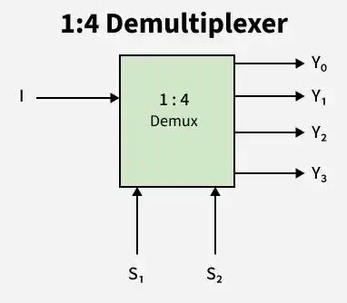

# **1 × 4 Demultiplexer (DEMUX)**

* **Overview**

A **1 × 4 Demultiplexer (DEMUX)** is a combinational logic circuit that routes one input signal to one of four output lines based on the values of two select lines. It performs the opposite operation of a Multiplexer (MUX) and is widely used in digital systems for data distribution and signal routing.

---

* **Definition**

A **1 × 4 Demultiplexer (DEMUX)** is a digital combinational circuit that takes one data input, two select lines, and directs the input to one of four outputs depending on the select line values.

---

* **Purpose**
  - To distribute one input signal to one of four outputs.
  - To route data efficiently in digital systems.
  - To perform controlled signal distribution.
  - To simplify digital circuit interconnections.

---

* **Importance**
  - Performs the reverse operation of a Multiplexer.
  - Enables efficient signal routing.
  - Reduces wiring complexity.
  - Widely used in FPGA, ASIC, RTL, and VLSI designs.

---

* **Working Principle**
  - A **1 × 4 DEMUX** has:
    - One Data Input (**I**).
    - Two Select Lines (**S1**, **S0**).
    - Four Outputs (**Y0**, **Y1**, **Y2**, **Y3**).
  - The combination of the select lines determines which output receives the input signal.
  - The selected output follows the input, while all other outputs remain LOW (0).

---

* **Circuit Description**
  - Components Required:
    - NOT Gates.
    - AND Gates.
  - A **1 × 4 DEMUX** consists of:
    - One Data Input (I).
    - Two Select Lines (S1, S0).
    - Four Outputs (Y0, Y1, Y2, Y3).
    - Two NOT Gates.
    - Four AND Gates.

---

* **Circuit Diagram:**

---

* **Truth Table:**

| S1 | S0 | I | Y0 | Y1 | Y2 | Y3 |
|----|----|---|----|----|----|----|
| 0 | 0 | 0 | 0 | 0 | 0 | 0 |
| 0 | 0 | 1 | 1 | 0 | 0 | 0 |
| 0 | 1 | 0 | 0 | 0 | 0 | 0 |
| 0 | 1 | 1 | 0 | 1 | 0 | 0 |
| 1 | 0 | 0 | 0 | 0 | 0 | 0 |
| 1 | 0 | 1 | 0 | 0 | 1 | 0 |
| 1 | 1 | 0 | 0 | 0 | 0 | 0 |
| 1 | 1 | 1 | 0 | 0 | 0 | 1 |

---

* **Boolean Expression**

**Y0 = I · S1̅ · S0̅**

**Y1 = I · S1̅ · S0**

**Y2 = I · S1 · S0̅**

**Y3 = I · S1 · S0**

---

* **Input and Output Description**
  - Inputs:-
    - I (Data Input)
    - S1 (Select Line 1)
    - S0 (Select Line 0)
  - Outputs:-
    - Y0
    - Y1
    - Y2
    - Y3

  - **I** is the input signal to be routed.
  - **S1** and **S0** determine the selected output.
  - Only one output receives the input signal at a time.
  - All unselected outputs remain LOW.

---

* **Working Example**

Consider:

- I = **1**
- S1 = **1**
- S0 = **0**

Output:

- Y2 = **1**
- Y0 = Y1 = Y3 = **0**

Another Example:

- I = **1**
- S1 = **0**
- S0 = **1**

Output:

- Y1 = **1**
- Y0 = Y2 = Y3 = **0**

---

* **Applications**

  *The 1 × 4 Demultiplexer is used in:*

  - Data Distribution Systems.
  - Communication Systems.
  - Memory Address Decoding.
  - Signal Routing.
  - Digital Switching Circuits.
  - FPGA Design.
  - ASIC Design.
  - RTL Design.
  - VLSI Systems.

---

* **Advantages**
  - Simple circuit implementation.
  - Efficient signal routing.
  - Reduces wiring complexity.
  - High-speed operation.
  - Easy hardware implementation.

---

* **Limitations**
  - Only one output can be selected at a time.
  - Larger DEMUX circuits require more hardware.
  - Additional select lines are required for more outputs.

---

* **Real-World Example**
  - Memory Selection Circuits.
  - Communication Networks.
  - Embedded Systems.
  - FPGA-Based Systems.
  - Digital Signal Distribution.

---

* **Key Points**
  - A **1 × 4 DEMUX** has one input, two select lines, and four outputs.
  - It performs the opposite function of a Multiplexer.
  - The selected output receives the input signal.
  - Uses two NOT gates and four AND gates.
  - Widely used in FPGA, ASIC, RTL, and VLSI systems.

---

* **Interview Questions**

**1. What is a 1 × 4 Demultiplexer?**

**Answer:**

A 1 × 4 Demultiplexer is a combinational logic circuit that routes one input to one of four outputs based on two select lines.

---

**2. How many select lines are required for a 1 × 4 DEMUX?**

**Answer:**

A **1 × 4 DEMUX requires two select lines**.

---

**3. How many outputs does a 1 × 4 DEMUX have?**

**Answer:**

It has **four outputs**.

---

**4. What are the Boolean expressions of a 1 × 4 DEMUX?**

**Answer:**

- **Y0 = I · S1̅ · S0̅**
- **Y1 = I · S1̅ · S0**
- **Y2 = I · S1 · S0̅**
- **Y3 = I · S1 · S0**

---

**5. What happens when S1 = 1 and S0 = 0?**

**Answer:**

The input is routed to **Y2**, while all other outputs remain LOW.

---

**6. What is the main function of a Demultiplexer?**

**Answer:**

Its main function is to route one input signal to one of several output lines based on the select lines.

---

**7. What is the difference between a Multiplexer and a Demultiplexer?**

**Answer:**

A Multiplexer selects **one of many inputs and sends it to one output**, whereas a Demultiplexer routes **one input to one of many outputs**.

---

**8. Where is a 1 × 4 DEMUX commonly used?**

**Answer:**

It is commonly used in communication systems, memory decoding, FPGA, ASIC, RTL design, and VLSI systems.

---

* **Quick Revision**
  - Circuit Type → Combinational Logic
  - Data Input → 1
  - Select Lines → 2
  - Outputs → 4
  - Boolean Expressions:
    - **Y0 = I · S1̅ · S0̅**
    - **Y1 = I · S1̅ · S0**
    - **Y2 = I · S1 · S0̅**
    - **Y3 = I · S1 · S0**
  - Opposite of Multiplexer

---

* **Summary**

A **1 × 4 Demultiplexer (DEMUX)** is a combinational logic circuit that routes one input signal to one of four outputs based on two select lines. It is the reverse of a Multiplexer and is widely used for signal routing, data distribution, memory decoding, FPGA, ASIC, RTL, and VLSI applications.

---

* **References**
  - M. Morris Mano – *Digital Design*.
  - Stephen Brown & Zvonko Vranesic – *Fundamentals of Digital Logic with Verilog Design*.
  - Donald D. Givone – *Digital Principles and Design*.
  - Neso Academy – Multiplexer and Demultiplexer.
  - GeeksforGeeks – Demultiplexer.

---

* **Waveform / Timing Diagram:**

