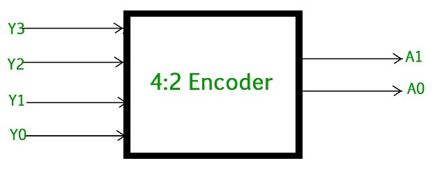

# **4 × 2 Encoder**

* **Overview**

A **4 × 2 Encoder** is a combinational logic circuit that converts one of four active input lines into a 2-bit binary code. For each valid input combination, the corresponding 2-bit binary code appears at the output.

---

* **Definition**

A **4 × 2 Encoder** is a digital combinational circuit with four input lines and two output lines that converts the active input into its corresponding binary representation.

---

* **Purpose**
  - To convert active input signals into binary codes.
  - To reduce the number of required output lines.
  - To represent one of multiple inputs using a smaller number of bits.
  - To simplify digital data transmission and processing.

---

* **Importance**
  - Reduces the number of output lines.
  - Provides efficient binary encoding.
  - Simplifies digital circuit design.
  - Forms the basic building block of larger encoder circuits.

---

* **Working Principle**
  - A **4 × 2 Encoder** has:
    - Four Input Lines (**D0**, **D1**, **D2**, **D3**).
    - Two Output Lines (**Y1**, **Y0**).
  - Only one input should be HIGH at a time.
  - The encoder identifies the active input.
  - It converts the active input into its corresponding 2-bit binary code.

---

* **Circuit Description**
  - Components Required:
    - OR Gates.
  - A **4 × 2 Encoder** can be implemented using:
    - Two OR Gates.
  - The OR gates generate the two output bits based on the active input.

---

* **Circuit Diagram:**

---

* **Truth Table:**

| D0 | D1 | D2 | D3 | Y1 | Y0 |
|----|----|----|----|----|----|
| 1 | 0 | 0 | 0 | 0 | 0 |
| 0 | 1 | 0 | 0 | 0 | 1 |
| 0 | 0 | 1 | 0 | 1 | 0 |
| 0 | 0 | 0 | 1 | 1 | 1 |

*(Only one input should be HIGH at a time for a basic encoder.)*

---

* **Boolean Expression**

**Y1 = D2 + D3**

**Y0 = D1 + D3**

---

* **Input and Output Description**
  - Inputs:-
    - D0, D1, D2, D3 [4 Inputs]
  - Outputs:-
    - Y1, Y0 [2 Outputs]

  - **D0** represents binary code **00**.
  - **D1** represents binary code **01**.
  - **D2** represents binary code **10**.
  - **D3** represents binary code **11**.
  - **Y1** and **Y0** provide the binary code corresponding to the active input.

---

* **Working Example**
  - Consider:

    - D0 = 0
    - D1 = 0
    - D2 = 1
    - D3 = 0

Output:

- Y1 = **1**
- Y0 = **0**

Therefore, the output is **10**, which represents **D2**.

Another Example:

- D0 = 0
- D1 = 0
- D2 = 0
- D3 = 1

Output:

- Y1 = **1**
- Y0 = **1**

Therefore, the output is **11**, which represents **D3**.

---

* **Applications**

  *The 4 × 2 Encoder is used in:*

  - Data Encoding Systems.
  - Digital Communication Systems.
  - Keyboard Encoding.
  - Interrupt Encoding.
  - Data Compression.
  - Digital Control Systems.
  - FPGA Design.
  - ASIC Design.
  - RTL Design.
  - VLSI Systems.

---

* **Advantages**
  - Reduces the number of output lines.
  - Simple circuit implementation.
  - Efficient binary representation.
  - Requires fewer hardware connections.
  - Easy to design and implement.

---

* **Limitations**
  - Only one input should be active at a time.
  - Multiple active inputs can produce an invalid or ambiguous output.
  - Basic encoders do not identify which input has priority.

---

* **Real-World Example**
  - Keyboard Encoder.
  - Interrupt Controller.
  - Digital Communication System.
  - Data Encoding Circuit.
  - Device Selection System.

---

* **Key Points**
  - A **4 × 2 Encoder** has 4 inputs and 2 outputs.
  - It converts one active input into a 2-bit binary code.
  - Only one input should be HIGH at a time.
  - It can be implemented using two OR gates.
  - It is the opposite operation of a Decoder.
  - Widely used in FPGA, ASIC, RTL, and VLSI systems.

---

* **Interview Questions**

**1. What is a 4 × 2 Encoder?**

**Answer:**

A 4 × 2 Encoder is a combinational logic circuit that converts one of four active input lines into a corresponding 2-bit binary output.

---

**2. How many inputs and outputs does a 4 × 2 Encoder have?**

**Answer:**

It has **4 input lines and 2 output lines**.

---

**3. What is the Boolean expression for Y1?**

**Answer:**

**Y1 = D2 + D3**

---

**4. What is the Boolean expression for Y0?**

**Answer:**

**Y0 = D1 + D3**

---

**5. What happens when D2 is HIGH?**

**Answer:**

When **D2 = 1** and all other inputs are 0, the output is **Y1Y0 = 10**.

---

**6. What happens when D3 is HIGH?**

**Answer:**

When **D3 = 1** and all other inputs are 0, the output is **Y1Y0 = 11**.

---

**7. What is the main limitation of a basic encoder?**

**Answer:**

A basic encoder cannot correctly handle multiple active inputs at the same time because the output can become ambiguous.

---

**8. How can the multiple-input problem be solved?**

**Answer:**

The problem can be solved by using a **Priority Encoder**, which assigns priority to one input when multiple inputs are active.

---

**9. What is the difference between an Encoder and a Decoder?**

**Answer:**

An Encoder converts **multiple input lines into fewer binary output lines**, while a Decoder converts **binary input lines into multiple output lines**.

---

* **Quick Revision**
  - Circuit Type → Combinational Logic
  - Inputs → 4
  - Outputs → 2
  - Possible Input Lines → 4
  - Output Code → 2-bit Binary
  - Basic Gates → OR Gates
  - Main Function → Binary Encoding
  - Opposite Operation → Decoder

---

* **Summary**

A **4 × 2 Encoder** is a combinational logic circuit that converts one of four active input signals into a corresponding 2-bit binary code. It reduces the number of output lines and provides an efficient way to represent input information. It is widely used in keyboard encoding, interrupt controllers, communication systems, FPGA, ASIC, RTL, and VLSI designs.

---

* **References**
  - M. Morris Mano – *Digital Design*.
  - Stephen Brown & Zvonko Vranesic – *Fundamentals of Digital Logic with Verilog Design*.
  - Donald D. Givone – *Digital Principles and Design*.
  - Neso Academy – Encoder.
  - GeeksforGeeks – Encoder.

---

* **Waveform / Timing Diagram:**

