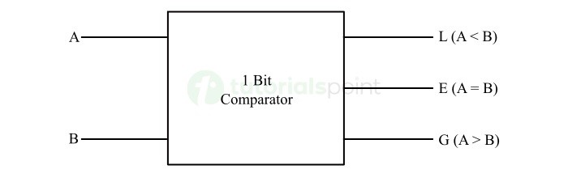

# **1-Bit Comparator**

* **Overview**

A **1-Bit Comparator** is a combinational logic circuit that compares two 1-bit binary inputs and determines whether the first input is greater than, less than, or equal to the second input.

---

* **Definition**

A **1-Bit Comparator** is a digital circuit that compares two single-bit binary numbers and produces three outputs indicating **A > B**, **A < B**, or **A = B**.

---

* **Purpose**
  - To compare two 1-bit binary numbers.
  - To determine the relationship between two input values.
  - To generate separate outputs for greater than, less than, and equal conditions.
  - To provide a basic building block for larger magnitude comparators.

---

* **Importance**
  - Forms the basic building block of multi-bit comparators.
  - Helps understand binary magnitude comparison.
  - Used in digital control and decision-making circuits.
  - Important for designing larger comparator circuits.

---

* **Working Principle**
  - A **1-Bit Comparator** has two inputs:
    - **A**
    - **B**
  - It produces three outputs:
    - **G** → A > B
    - **L** → A < B
    - **E** → A = B
  - Since each input can be either 0 or 1, there are four possible input combinations.
  - For every input combination, only one of the three outputs becomes HIGH.

---

* **Circuit Description**
  - A 1-Bit Comparator can be implemented using:
    - NOT Gate.
    - AND Gates.
    - XOR Gate.
    - OR Gates.
  - The comparison conditions are:
    - **A > B** when A = 1 and B = 0.
    - **A < B** when A = 0 and B = 1.
    - **A = B** when both inputs are equal.

---

* **Circuit Diagram:**

---

* **Truth Table:**

| A | B | A > B | A < B | A = B |
|---|---|-------|-------|-------|
| 0 | 0 | 0 | 0 | 1 |
| 0 | 1 | 0 | 1 | 0 |
| 1 | 0 | 1 | 0 | 0 |
| 1 | 1 | 0 | 0 | 1 |

---

* **Boolean Expression**

**G = A · B̅**

**L = A̅ · B**

**E = A̅ · B̅ + A · B**

The equality output can also be written using XNOR:

**E = A XNOR B**

---

* **Input and Output Description**
  - Inputs:-
    - A, B [2 Inputs]
  - Outputs:-
    - G, L, E [3 Outputs]

  - **G = 1** when A is greater than B.
  - **L = 1** when A is less than B.
  - **E = 1** when A is equal to B.

---

* **Working Example**
  - Consider:

    - A = 1
    - B = 0

Output:

- **G = 1**
- **L = 0**
- **E = 0**

Therefore:

**A > B**

Another Example:

- A = 0
- B = 1

Output:

- **G = 0**
- **L = 1**
- **E = 0**

Therefore:

**A < B**

---

* **Applications**

  *The 1-Bit Comparator is used in:*

  - Digital Comparators.
  - Arithmetic Logic Units.
  - Digital Control Systems.
  - Processor Control Units.
  - Address Comparison.
  - Data Comparison.
  - FPGA Design.
  - ASIC Design.
  - RTL Design.
  - VLSI Systems.

---

* **Advantages**
  - Simple combinational circuit.
  - Easy to implement.
  - Provides three comparison conditions.
  - Forms the basis of multi-bit comparators.
  - Requires relatively few logic gates.

---

* **Limitations**
  - Can compare only one-bit values.
  - Larger binary numbers require multiple comparator stages.
  - Additional logic is required for multi-bit comparison.

---

* **Real-World Example**
  - In a digital control system, a 1-Bit Comparator can determine whether a control signal is greater than, less than, or equal to a reference bit. Multiple comparator stages can then be combined to compare larger binary values.

---

* **Key Points**
  - A **1-Bit Comparator** compares two 1-bit binary inputs.
  - Inputs → **A and B**
  - Outputs → **A > B, A < B, A = B**
  - **G = A · B̅**
  - **L = A̅ · B**
  - **E = A̅ · B̅ + A · B**
  - Equality can be implemented using an **XNOR gate**.
  - It is a building block for multi-bit comparators.

---

* **Interview Questions**

**1. What is a 1-Bit Comparator?**

**Answer:**

A 1-Bit Comparator is a combinational logic circuit that compares two single-bit binary inputs and determines whether A is greater than, less than, or equal to B.

---

**2. How many inputs does a 1-Bit Comparator have?**

**Answer:**

It has **two inputs**, A and B.

---

**3. How many outputs does a 1-Bit Comparator have?**

**Answer:**

It has **three outputs** representing:

- A > B
- A < B
- A = B

---

**4. What is the Boolean expression for A > B?**

**Answer:**

**G = A · B̅**

---

**5. What is the Boolean expression for A < B?**

**Answer:**

**L = A̅ · B**

---

**6. What is the Boolean expression for A = B?**

**Answer:**

**E = A̅ · B̅ + A · B**

It can also be implemented using an XNOR gate:

**E = A XNOR B**

---

**7. When is the greater-than output HIGH?**

**Answer:**

The greater-than output is HIGH when **A = 1 and B = 0**.

---

**8. When is the less-than output HIGH?**

**Answer:**

The less-than output is HIGH when **A = 0 and B = 1**.

---

**9. When is the equality output HIGH?**

**Answer:**

The equality output is HIGH when both inputs are equal, meaning **A = B = 0** or **A = B = 1**.

---

**10. Can a 1-Bit Comparator compare multi-bit numbers?**

**Answer:**

No. A 1-Bit Comparator compares only two single-bit values. Multiple comparator stages or a multi-bit comparator are required to compare larger binary numbers.

---

* **Quick Revision**
  - Circuit Type → Combinational Logic
  - Inputs → 2
  - Outputs → 3
  - Comparisons → Greater, Less, Equal
  - Greater → **G = A · B̅**
  - Less → **L = A̅ · B**
  - Equal → **E = A XNOR B**
  - Main Function → Binary Comparison
  - Building Block → Multi-Bit Comparator

---

* **Summary**

A **1-Bit Comparator** is a combinational logic circuit that compares two single-bit binary inputs and generates three outputs indicating whether A is greater than B, less than B, or equal to B. It uses basic logic gates and serves as the fundamental building block for multi-bit magnitude comparators used in digital systems, processors, FPGA, ASIC, RTL, and VLSI designs.

---

* **References**
  - M. Morris Mano – *Digital Design*.
  - Stephen Brown & Zvonko Vranesic – *Fundamentals of Digital Logic with Verilog Design*.
  - Jan M. Rabaey – *Digital Integrated Circuits: A Design Perspective*.
  - Neil H. E. Weste & David Harris – *CMOS VLSI Design*.
  - Neso Academy – Digital Electronics.
