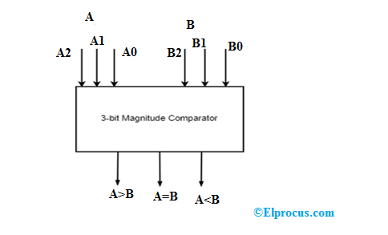

# **3-Bit Comparator**

* **Overview**

A **3-Bit Comparator** is a combinational logic circuit that compares two 3-bit binary numbers and determines whether the first number is greater than, less than, or equal to the second number.

---

* **Definition**

A **3-Bit Comparator** is a digital combinational circuit that compares two 3-bit binary numbers and produces three outputs indicating **A > B**, **A < B**, or **A = B**.

---

* **Purpose**
  - To compare two 3-bit binary numbers.
  - To determine the magnitude relationship between two binary values.
  - To generate greater-than, less-than, and equal outputs.
  - To provide a building block for larger multi-bit comparator circuits.

---

* **Importance**
  - Helps understand multi-bit binary comparison.
  - Forms the foundation for larger magnitude comparators.
  - Used in digital decision-making circuits.
  - Important for processor, control, FPGA, ASIC, and VLSI circuit design.

---

* **Working Principle**
  - A **3-Bit Comparator** compares two 3-bit numbers:
    - **A = A2A1A0**
    - **B = B2B1B0**
  - The **Most Significant Bits (MSBs)**, A2 and B2, are compared first.
  - If A2 and B2 are different, the MSB comparison determines the result.
  - If A2 and B2 are equal, A1 and B1 are compared.
  - If A1 and B1 are also equal, A0 and B0 are compared.
  - The circuit produces three outputs:
    - **G** → A > B
    - **L** → A < B
    - **E** → A = B

---

* **Circuit Description**
  - A 3-Bit Comparator can be implemented using:
    - XNOR Gates.
    - AND Gates.
    - OR Gates.
    - NOT Gates.
  - The comparison starts from the MSB and proceeds toward the LSB.
  - A lower-order bit affects the result only when all higher-order bits are equal.
  - Equality occurs only when all three corresponding bits are equal.

---

* **Circuit Diagram:**

---

* **Truth Table:**

| A2 | A1 | A0 | B2 | B1 | B0 | A > B | A < B | A = B |
|---|---|---|---|---|---|---|---|---|
| 0 | 0 | 0 | 0 | 0 | 0 | 0 | 0 | 1 |
| 0 | 0 | 0 | 0 | 0 | 1 | 0 | 1 | 0 |
| 0 | 0 | 0 | 0 | 1 | 0 | 0 | 1 | 0 |
| 0 | 0 | 0 | 0 | 1 | 1 | 0 | 1 | 0 |
| 0 | 0 | 0 | 1 | 0 | 0 | 0 | 1 | 0 |
| 0 | 0 | 0 | 1 | 0 | 1 | 0 | 1 | 0 |
| 0 | 0 | 0 | 1 | 1 | 0 | 0 | 1 | 0 |
| 0 | 0 | 0 | 1 | 1 | 1 | 0 | 1 | 0 |
| 0 | 0 | 1 | 0 | 0 | 0 | 1 | 0 | 0 |
| 0 | 0 | 1 | 0 | 0 | 1 | 0 | 1 | 0 |
| 0 | 0 | 1 | 0 | 1 | 0 | 0 | 1 | 0 |
| 0 | 0 | 1 | 0 | 1 | 1 | 0 | 1 | 0 |
| 0 | 0 | 1 | 1 | 0 | 0 | 0 | 1 | 0 |
| 0 | 0 | 1 | 1 | 0 | 1 | 0 | 1 | 0 |
| 0 | 0 | 1 | 1 | 1 | 0 | 0 | 1 | 0 |
| 0 | 0 | 1 | 1 | 1 | 1 | 0 | 1 | 0 |
| 0 | 1 | 0 | 0 | 0 | 0 | 1 | 0 | 0 |
| 0 | 1 | 0 | 0 | 0 | 1 | 1 | 0 | 0 |
| 0 | 1 | 0 | 0 | 1 | 0 | 0 | 1 | 0 |
| 0 | 1 | 0 | 0 | 1 | 1 | 0 | 1 | 0 |
| 0 | 1 | 0 | 1 | 0 | 0 | 0 | 1 | 0 |
| 0 | 1 | 0 | 1 | 0 | 1 | 0 | 1 | 0 |
| 0 | 1 | 0 | 1 | 1 | 0 | 0 | 1 | 0 |
| 0 | 1 | 0 | 1 | 1 | 1 | 0 | 1 | 0 |
| 0 | 1 | 1 | 0 | 0 | 0 | 1 | 0 | 0 |
| 0 | 1 | 1 | 0 | 0 | 1 | 1 | 0 | 0 |
| 0 | 1 | 1 | 0 | 1 | 0 | 0 | 1 | 0 |
| 0 | 1 | 1 | 0 | 1 | 1 | 0 | 1 | 0 |
| 0 | 1 | 1 | 1 | 0 | 0 | 0 | 1 | 0 |
| 0 | 1 | 1 | 1 | 0 | 1 | 0 | 1 | 0 |
| 0 | 1 | 1 | 1 | 1 | 0 | 0 | 1 | 0 |
| 0 | 1 | 1 | 1 | 1 | 1 | 0 | 1 | 0 |
| 1 | 0 | 0 | 0 | 0 | 0 | 1 | 0 | 0 |
| 1 | 0 | 0 | 0 | 0 | 1 | 1 | 0 | 0 |
| 1 | 0 | 0 | 0 | 1 | 0 | 1 | 0 | 0 |
| 1 | 0 | 0 | 0 | 1 | 1 | 1 | 0 | 0 |
| 1 | 0 | 0 | 1 | 0 | 0 | 0 | 0 | 1 |
| 1 | 0 | 0 | 1 | 0 | 1 | 0 | 1 | 0 |
| 1 | 0 | 0 | 1 | 1 | 0 | 0 | 1 | 0 |
| 1 | 0 | 0 | 1 | 1 | 1 | 0 | 1 | 0 |
| 1 | 0 | 1 | 0 | 0 | 0 | 1 | 0 | 0 |
| 1 | 0 | 1 | 0 | 0 | 1 | 1 | 0 | 0 |
| 1 | 0 | 1 | 0 | 1 | 0 | 1 | 0 | 0 |
| 1 | 0 | 1 | 0 | 1 | 1 | 1 | 0 | 0 |
| 1 | 0 | 1 | 1 | 0 | 0 | 0 | 0 | 1 |
| 1 | 0 | 1 | 1 | 0 | 1 | 0 | 1 | 0 |
| 1 | 0 | 1 | 1 | 1 | 0 | 0 | 1 | 0 |
| 1 | 0 | 1 | 1 | 1 | 1 | 0 | 1 | 0 |
| 1 | 1 | 0 | 0 | 0 | 0 | 1 | 0 | 0 |
| 1 | 1 | 0 | 0 | 0 | 1 | 1 | 0 | 0 |
| 1 | 1 | 0 | 0 | 1 | 0 | 1 | 0 | 0 |
| 1 | 1 | 0 | 0 | 1 | 1 | 1 | 0 | 0 |
| 1 | 1 | 0 | 1 | 0 | 0 | 0 | 0 | 1 |
| 1 | 1 | 0 | 1 | 0 | 1 | 0 | 1 | 0 |
| 1 | 1 | 0 | 1 | 1 | 0 | 0 | 1 | 0 |
| 1 | 1 | 0 | 1 | 1 | 1 | 0 | 1 | 0 |
| 1 | 1 | 1 | 0 | 0 | 0 | 1 | 0 | 0 |
| 1 | 1 | 1 | 0 | 0 | 1 | 1 | 0 | 0 |
| 1 | 1 | 1 | 0 | 1 | 0 | 1 | 0 | 0 |
| 1 | 1 | 1 | 0 | 1 | 1 | 1 | 0 | 0 |
| 1 | 1 | 1 | 1 | 0 | 0 | 1 | 0 | 0 |
| 1 | 1 | 1 | 1 | 0 | 1 | 1 | 0 | 0 |
| 1 | 1 | 1 | 1 | 1 | 0 | 1 | 0 | 0 |
| 1 | 1 | 1 | 1 | 1 | 1 | 0 | 0 | 1 |

---

* **Boolean Expression**

Let:

**E2 = A2 XNOR B2**

**E1 = A1 XNOR B1**

**E0 = A0 XNOR B0**

The greater-than output is:

**G = A2.B2̅ + E2.A1.B1̅ + E2.E1.A0.B0̅**

The less-than output is:

**L = A2̅.B2 + E2.A1̅.B1 + E2.E1.A0̅.B0**

The equality output is:

**E = E2.E1.E0**

Therefore:

**E = (A2 XNOR B2).(A1 XNOR B1).(A0 XNOR B0)**

---

* **Input and Output Description**
  - Inputs:-
    - A2, A1, A0 [3 Inputs for Number A]
    - B2, B1, B0 [3 Inputs for Number B]
  - Outputs:-
    - G, L, E [3 Outputs]

  - **A2** and **B2** are the Most Significant Bits.
  - **A0** and **B0** are the Least Significant Bits.
  - **G = 1** when A is greater than B.
  - **L = 1** when A is less than B.
  - **E = 1** when A is equal to B.

---

* **Working Example**
  - Consider:

    - A = 101
    - B = 011

  Decimal values:

    - A = 5
    - B = 3

  The MSBs are:

    - A2 = 1
    - B2 = 0

  Since A2 > B2:

    - **G = 1**
    - **L = 0**
    - **E = 0**

Therefore:

**A > B**

Another Example:

- A = 101
- B = 101

Since all corresponding bits are equal:

- **G = 0**
- **L = 0**
- **E = 1**

Therefore:

**A = B**

---

* **Applications**

  *The 3-Bit Comparator is used in:*

  - Digital Comparators.
  - Arithmetic Logic Units.
  - Processor Control Units.
  - Address Comparison.
  - Data Comparison.
  - Digital Control Systems.
  - FPGA Design.
  - ASIC Design.
  - RTL Design.
  - VLSI Systems.

---

* **Advantages**
  - Can compare two 3-bit binary numbers.
  - Provides three comparison conditions.
  - Simple combinational logic implementation.
  - Can be extended to larger bit-width comparators.
  - Useful for understanding multi-bit magnitude comparison.

---

* **Limitations**
  - Can compare only two 3-bit binary numbers.
  - Larger numbers require additional comparison logic.
  - Circuit complexity increases as the number of bits increases.
  - More logic stages can increase propagation delay.

---

* **Real-World Example**
  - In a digital control system, a 3-bit comparator can compare a 3-bit sensor value with a 3-bit reference value. The resulting greater-than, less-than, or equal signal can be used to control another part of the system.

---

* **Key Points**
  - A **3-Bit Comparator** compares two 3-bit binary numbers.
  - Inputs → **A2A1A0** and **B2B1B0**.
  - Outputs → **A > B, A < B, A = B**.
  - The **MSB is compared first**.
  - Lower-order bits are considered only when higher-order bits are equal.
  - XNOR gates are commonly used for equality detection.
  - It can be extended to construct larger multi-bit comparators.

---

* **Interview Questions**

**1. What is a 3-Bit Comparator?**

**Answer:**

A 3-Bit Comparator is a combinational logic circuit that compares two 3-bit binary numbers and determines whether A is greater than, less than, or equal to B.

---

**2. How many inputs does a 3-Bit Comparator have?**

**Answer:**

It has **six input signals**, three for each binary number:

- A2, A1, A0
- B2, B1, B0

---

**3. How many outputs does a 3-Bit Comparator have?**

**Answer:**

It has **three outputs**:

- A > B
- A < B
- A = B

---

**4. Which bit is compared first in a 3-Bit Comparator?**

**Answer:**

The **Most Significant Bit (MSB)** is compared first because it has the highest binary weight.

---

**5. What happens when the MSBs are equal?**

**Answer:**

When A2 and B2 are equal, the comparator checks A1 and B1. If those are also equal, it finally compares A0 and B0.

---

**6. What is the equality expression for a 3-Bit Comparator?**

**Answer:**

**E = (A2 XNOR B2).(A1 XNOR B1).(A0 XNOR B0)**

---

**7. When is A greater than B?**

**Answer:**

A is greater than B when the first unequal bit from the MSB side has A = 1 and B = 0.

---

**8. When is A less than B?**

**Answer:**

A is less than B when the first unequal bit from the MSB side has A = 0 and B = 1.

---

**9. Why are XNOR gates used in a comparator?**

**Answer:**

XNOR gates are used to determine whether corresponding bits are equal, which is required for equality detection and for determining whether lower-order bits need to be compared.

---

**10. Can a 3-Bit Comparator compare larger binary numbers?**

**Answer:**

A 3-Bit Comparator directly compares only two 3-bit numbers, but the same comparison principle can be extended to design comparators for larger bit widths.

---

* **Quick Revision**
  - Circuit Type → Combinational Logic
  - Numbers Compared → 3-Bit vs 3-Bit
  - Inputs → 6
  - Outputs → 3
  - Comparison → Greater, Less, Equal
  - First Comparison → MSB
  - Equality → XNOR
  - Main Function → Binary Magnitude Comparison
  - Building Block → Multi-Bit Comparator

---

* **Summary**

A **3-Bit Comparator** is a combinational logic circuit that compares two 3-bit binary numbers and generates three outputs indicating whether A is greater than B, less than B, or equal to B. The comparison starts from the most significant bit and proceeds toward the least significant bit only when the higher-order bits are equal. This principle is used to construct larger magnitude comparators in digital systems, processors, FPGA, ASIC, RTL, and VLSI designs.

---

* **References**
  - M. Morris Mano – *Digital Design*.
  - Stephen Brown & Zvonko Vranesic – *Fundamentals of Digital Logic with Verilog Design*.
  - Jan M. Rabaey – *Digital Integrated Circuits: A Design Perspective*.
  - Neil H. E. Weste & David Harris – *CMOS VLSI Design*.
  - Neso Academy – Digital Electronics.
