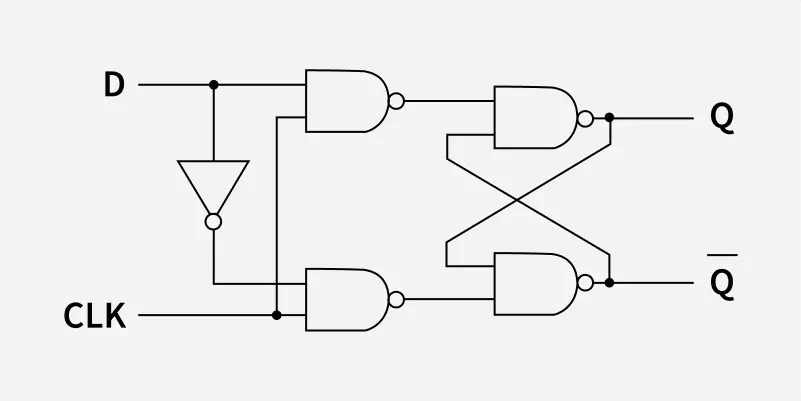

# **D Flip-Flop**

## **Overview**

A **D Flip-Flop (Data Flip-Flop)** is an edge-triggered sequential logic circuit used to store one bit of binary information. It captures the value present at the D input at the active clock edge and holds that value until the next active clock edge.

## **Definition**

A **D Flip-Flop** is a 1-bit storage element in which the next output state **Q(next)** becomes equal to the input **D** at the active clock edge.

## **Why is it needed?**

* To store one bit of data.
* To build registers.
* To build shift registers.
* To design counters.
* To synchronize digital signals.
* To implement pipeline registers.
* To store FSM states.
* To design synchronous sequential circuits.
* To provide reliable edge-controlled data storage.

## **Working Principle**

A D Flip-Flop operates according to the active edge of the clock.

For a **positive-edge-triggered D Flip-Flop**:

**CLK: 0 → 1**

At the rising edge:

**Q(next) = D**

For a **negative-edge-triggered D Flip-Flop**:

**CLK: 1 → 0**

At the falling edge:

**Q(next) = D**

Between active clock edges, the output maintains its previous value.

Therefore:

**Active Clock Edge → D is sampled → Q is updated**

* **Circuit Diagram:**

## **Truth Table**

For a positive-edge-triggered D Flip-Flop:

| Clock | D | Q(next) | Operation |
|:---:|:---:|:---:|---|
| ↑ | 0 | 0 | Store 0 |
| ↑ | 1 | 1 | Store 1 |
| No active edge | X | Q | Hold |

**↑ = Rising Edge**

**X = Don't Care**

For a negative-edge-triggered D Flip-Flop:

**↓ = Falling Edge**

## **Boolean Expression**

The characteristic equation of a D Flip-Flop is:

**Q(next) = D**

This means that at the active clock edge, the next state of Q is directly determined by D.

## **Input & Output Description**

| Signal | Type | Description |
|---|---|---|
| D | Input | Data input |
| CLK | Input | Clock signal |
| Q | Output | Stored data |
| Q' | Output | Complement of Q |

For a Flip-Flop with reset and set:

| Signal | Type | Description |
|---|---|---|
| RESET | Input | Forces Q to 0 |
| SET | Input | Forces Q to 1 |

## **Working Example**

Assume a positive-edge-triggered D Flip-Flop.

Initially:

**Q = 0**

First:

**D = 1**

At the rising edge of CLK:

**Q = 1**

Now D changes to:

**D = 0**

But there is no active clock edge.

Therefore:

**Q remains 1**

At the next rising edge:

**Q = 0**

Therefore:

**D changes alone → Q does not immediately change**

**Active clock edge → Q captures D**

## **Applications**

* Registers.
* Shift Registers.
* Counters.
* Frequency Dividers.
* Pipeline Registers.
* FSM State Registers.
* Data Storage.
* Synchronizers.
* Processor Registers.
* Memory Structures.
* FPGA Designs.
* ASIC Designs.
* VLSI Systems.
* RTL Designs.

## **Advantages**

* Simple data-storage operation.
* Stores one bit of information.
* No invalid input condition like an SR Flip-Flop.
* Easy to use in synchronous digital systems.
* Suitable for register design.
* Widely available in standard-cell libraries.
* Easy to model in RTL.
* Provides predictable edge-controlled operation.

## **Limitations**

* Requires a clock signal.
* Has setup-time requirements.
* Has hold-time requirements.
* Has propagation delay.
* Clock skew can affect timing.
* Clock jitter can affect reliable operation.
* Large numbers of Flip-Flops increase clock-tree power and area.
* Incorrect timing can cause metastability.

## **Real-World Example**

An **8-bit register** can be constructed using eight D Flip-Flops.

D7 ──→ [D FF] ──→ Q7  
D6 ──→ [D FF] ──→ Q6  
D5 ──→ [D FF] ──→ Q5  
D4 ──→ [D FF] ──→ Q4  
D3 ──→ [D FF] ──→ Q3  
D2 ──→ [D FF] ──→ Q2  
D1 ──→ [D FF] ──→ Q1  
D0 ──→ [D FF] ──→ Q0  
             ↑  
         Common CLK

Therefore:

**8 D Flip-Flops → 8-bit Register**

Similarly:

**32 D Flip-Flops → 32-bit Register**

D Flip-Flops are widely used inside processors, FPGA designs, ASICs, communication systems, and other synchronous digital systems.

## **Key Points**

* D Flip-Flop is a **1-bit storage element**.
* D stands for **Data**.
* It is **edge-sensitive**.
* **Q(next) = D**.
* Positive-edge-triggered Flip-Flop responds to **0 → 1**.
* Negative-edge-triggered Flip-Flop responds to **1 → 0**.
* Data is sampled at the active clock edge.
* Q holds its value between active clock edges.
* Setup time and hold time are important timing parameters.
* D Flip-Flops are fundamental building blocks of registers.
* They are widely used in RTL and VLSI design.
* A D Flip-Flop can be constructed using two D latches.
* A D Flip-Flop is different from a D latch because the Flip-Flop is edge-sensitive.

## **Interview Questions**

**1. What is a D Flip-Flop?**

**Answer:**

A D Flip-Flop is an edge-triggered sequential circuit that stores one bit of data and transfers the D input to Q at the active clock edge.

**2. What does D stand for?**

**Answer:**

D stands for **Data**.

**3. What is the characteristic equation of a D Flip-Flop?**

**Answer:**

**Q(next) = D**

**4. What happens when D = 1 at the active clock edge?**

**Answer:**

The output becomes:

**Q = 1**

**5. What happens when D = 0 at the active clock edge?**

**Answer:**

The output becomes:

**Q = 0**

**6. What happens when D changes between clock edges?**

**Answer:**

Q does not immediately change. It remains at its previous value until the next active clock edge.

**7. What is the difference between a D latch and a D Flip-Flop?**

**Answer:**

A D latch is **level-sensitive**, while a D Flip-Flop is **edge-sensitive**.

**8. What is setup time?**

**Answer:**

Setup time is the minimum time for which the D input must remain stable before the active clock edge.

**9. What is hold time?**

**Answer:**

Hold time is the minimum time for which the D input must remain stable after the active clock edge.

**10. Why are D Flip-Flops used in registers?**

**Answer:**

Because each D Flip-Flop can store one bit and can synchronously capture data at the clock edge.

**11. How many D Flip-Flops are required for an 8-bit register?**

**Answer:**

**8 D Flip-Flops.**

**12. What is the difference between positive-edge and negative-edge-triggered D Flip-Flops?**

**Answer:**

A positive-edge-triggered D Flip-Flop captures data on the **rising edge**, while a negative-edge-triggered D Flip-Flop captures data on the **falling edge**.

## **Quick Revision**

**Main Topic → Sequential Logic**

**Subtopic → D Flip-Flop**

**Storage → 1 Bit**

**Data Input → D**

**Clock Input → CLK**

**Outputs → Q and Q'**

**Type → Edge-Sensitive**

**Rising Edge → 0 → 1**

**Falling Edge → 1 → 0**

**Characteristic Equation → Q(next) = D**

**Main Application → Registers**

**Important Timing → Setup Time, Hold Time, Propagation Delay**

**D Latch → Level Sensitive**

**D Flip-Flop → Edge Sensitive**

## **Summary**

A **D Flip-Flop** is an edge-triggered 1-bit storage element. It samples the D input at the active clock edge and transfers that value to Q. The output remains stable until the next active clock edge. D Flip-Flops are fundamental building blocks used in **registers, counters, shift registers, FSMs, processors, FPGA designs, ASICs, RTL systems, and VLSI circuits**.

## **References**

* M. Morris Mano – *Digital Design*.
* Thomas L. Floyd – *Digital Fundamentals*.
* Ronald J. Tocci – *Digital Systems: Principles and Applications*.
* Stephen Brown & Zvonko Vranesic – *Fundamentals of Digital Logic with Verilog Design*.
* Neso Academy – Digital Electronics.
