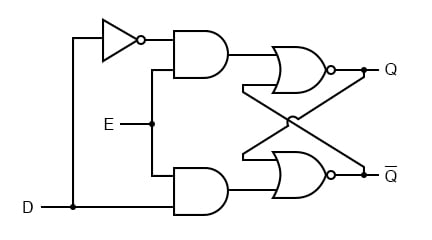

# **D Latch**

## **Overview**

A **D Latch (Data Latch)** is a level-sensitive sequential logic circuit used to store one bit of binary information. It has a data input **D** and an enable input **EN**. When EN is active, the output follows the input. When EN is inactive, the latch holds its previous value.

## **Definition**

A **D Latch** is a 1-bit storage element in which the output **Q** follows the input **D** when the Enable signal is active and retains the previous value when Enable is inactive.

## **Why is it needed?**

* To store one bit of data.
* To temporarily hold digital information.
* To implement level-sensitive sequential logic.
* To construct registers and storage structures.
* To understand the operation of flip-flops.
* To provide controlled data storage.
* To build basic memory elements.

## **Working Principle**

A D Latch operates according to the Enable signal.

When:

**EN = 1**

The latch is enabled and the output follows the input:

**Q(next) = D**

When:

**EN = 0**

The latch is disabled and holds its previous value:

**Q(next) = Q**

Therefore:

**EN = 1 → Transparent**

**EN = 0 → Hold**

* **Circuit Diagram:**

## **Truth Table**

| EN | D | Q(next) | Operation |
|:---:|:---:|:---:|---|
| 0 | X | Q | Hold |
| 1 | 0 | 0 | Store 0 |
| 1 | 1 | 1 | Store 1 |

**X = Don't Care**

## **Boolean Expression**

The characteristic equation of a D Latch is:

**Q(next) = EN·D + EN'·Q**

When:

**EN = 1**

**Q(next) = D**

When:

**EN = 0**

**Q(next) = Q**

## **Input & Output Description**

| Signal | Type | Description |
|---|---|---|
| D | Input | Data input |
| EN | Input | Enable input |
| Q | Output | Stored data |
| Q' | Output | Complement of Q |

## **Working Example**

Assume initially:

**Q = 0**

When:

**EN = 1**

and:

**D = 1**

then:

**Q = 1**

If D changes to:

**D = 0**

while:

**EN = 1**

then:

**Q = 0**

Now:

**EN = 0**

If D changes to:

**D = 1**

the output remains:

**Q = 0**

Therefore:

**EN = 0 → D changes do not affect Q**

## **Applications**

* Temporary Data Storage.
* Level-Sensitive Sequential Logic.
* Registers.
* Storage Elements.
* Control Circuits.
* Timing Circuits.
* Memory Structures.
* CMOS Digital Circuits.
* ASIC Design.
* VLSI Design.
* Data Buffering.
* Control and Timing Systems.

## **Advantages**

* Simple storage element.
* Stores one bit of information.
* Easy to implement.
* Eliminates the invalid SR input condition.
* Useful for level-sensitive designs.
* Can be efficiently implemented using CMOS.
* Requires only a single data input.

## **Limitations**

* It is level-sensitive.
* Data can propagate while the latch is enabled.
* Timing analysis can be more complicated than edge-triggered designs.
* Improper latch usage can create unintended timing paths.
* Transparent operation can cause unwanted data propagation.
* Setup and hold timing requirements must be considered.

## **Real-World Example**

A D Latch can be used to temporarily store a control or data bit.

When:

**EN = 1**

the input data is allowed to pass to the storage element.

If:

**D = 1**

then:

**Q = 1**

When:

**EN = 0**

the latch closes and retains:

**Q = 1**

even if D changes.

Therefore, the latch can hold the last captured data until the Enable signal becomes active again.

## **Key Points**

* D Latch is a **1-bit storage element**.
* D stands for **Data**.
* Main inputs are **D and EN**.
* Main outputs are **Q and Q'**.
* It is **level-sensitive**.
* **EN = 1 → Q follows D**.
* **EN = 0 → Q holds previous value**.
* It eliminates the invalid SR condition.
* It can be constructed using an SR latch.
* CMOS D Latches can use transmission gates and feedback inverters.
* D Latch and D Flip-Flop are different.
* **Latch = Level-sensitive**
* **Flip-Flop = Edge-sensitive**
* The characteristic equation is **Q(next) = EN·D + EN'·Q**.

## **Interview Questions**

**1. What is a D Latch?**

**Answer:**

A D Latch is a level-sensitive sequential circuit that stores one bit of data.

**2. What does D stand for?**

**Answer:**

D stands for **Data**.

**3. What happens when EN = 1?**

**Answer:**

The latch becomes transparent and:

**Q = D**

**4. What happens when EN = 0?**

**Answer:**

The latch holds its previous value:

**Q(next) = Q**

**5. Is a D Latch level-sensitive or edge-sensitive?**

**Answer:**

A D Latch is **level-sensitive**.

**6. What is the difference between a D Latch and a D Flip-Flop?**

**Answer:**

A D Latch responds during an active level of its Enable signal, while a D Flip-Flop responds only at a specific clock edge.

**7. Why is a D Latch preferred over an SR Latch for data storage?**

**Answer:**

It uses a single data input and eliminates the invalid SR input condition.

**8. What is transparency in a D Latch?**

**Answer:**

Transparency means that when EN is active, changes in D can directly appear at Q.

**9. What is the characteristic equation of a D Latch?**

**Answer:**

**Q(next) = EN·D + EN'·Q**

**10. Can a D Latch be implemented using CMOS?**

**Answer:**

Yes. CMOS D Latches can be implemented using transmission gates, CMOS inverters, and feedback paths.

## **Quick Revision**

**Main Topic → Sequential Logic**

**Subtopic → D Latch**

**Storage → 1 Bit**

**Data Input → D**

**Enable Input → EN**

**Outputs → Q and Q'**

**EN = 1 → Q = D**

**EN = 0 → Hold**

**Type → Level-Sensitive**

**D Latch → Level Sensitive**

**D Flip-Flop → Edge Sensitive**

**Main Application → Data Storage**

**CMOS Implementation → Transmission Gate + Feedback**

**Characteristic Equation → Q(next) = EN·D + EN'·Q**

## **Summary**

A **D Latch** is a level-sensitive 1-bit storage element. When **EN is HIGH**, it is transparent and the output follows the input. When **EN is LOW**, it holds the previously stored value. The D Latch is an important building block for understanding **sequential logic, flip-flops, registers, CMOS storage elements, timing, and RTL design**.

## **References**

* M. Morris Mano – *Digital Design*.
* Thomas L. Floyd – *Digital Fundamentals*.
* Ronald J. Tocci – *Digital Systems: Principles and Applications*.
* Stephen Brown & Zvonko Vranesic – *Fundamentals of Digital Logic with Verilog Design*.
* Neso Academy – Digital Electronics.
