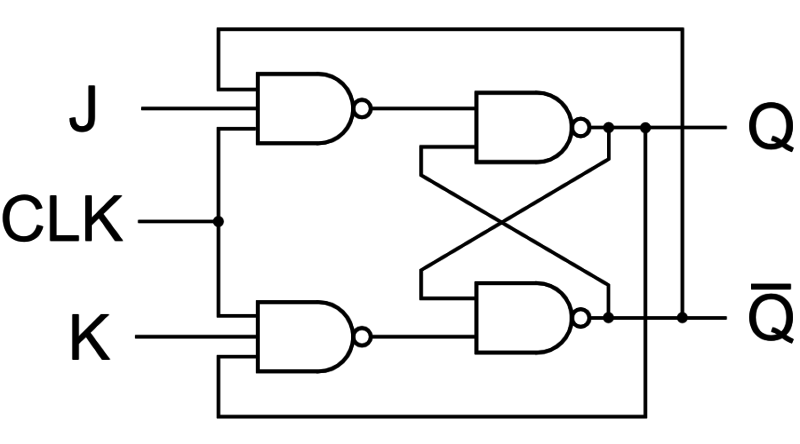

# **JK Flip-Flop**

## **Overview**

A **JK Flip-Flop** is an edge-triggered sequential logic circuit used to store one bit of binary information. It is an improved version of the SR Flip-Flop because it eliminates the invalid input condition. Depending on the J and K inputs, it can hold, set, reset, or toggle its output.

## **Definition**

A **JK Flip-Flop** is a 1-bit edge-triggered storage element with two control inputs, **J** and **K**, where the output can hold, set, reset, or toggle according to the input combination at the active clock edge.

## **Why is it needed?**

* To store one bit of binary information.
* To eliminate the invalid condition of the SR Flip-Flop.
* To perform set and reset operations.
* To perform toggle operations.
* To design counters.
* To design frequency dividers.
* To implement sequential logic circuits.
* To build state machines and control circuits.

## **Working Principle**

The operation of a JK Flip-Flop depends on the values of **J** and **K** at the active clock edge.

**J = 0, K = 0 → Hold**

The output remains unchanged.

**J = 0, K = 1 → Reset**

The output becomes:

**Q(next) = 0**

**J = 1, K = 0 → Set**

The output becomes:

**Q(next) = 1**

**J = 1, K = 1 → Toggle**

The output changes to its complement:

**Q(next) = Q'**

Therefore:

**00 → Hold**

**01 → Reset**

**10 → Set**

**11 → Toggle**

* **Circuit Diagram:**

## **Truth Table**

| J | K | Q(next) | Operation |
|:---:|:---:|:---:|---|
| 0 | 0 | Q | Hold |
| 0 | 1 | 0 | Reset |
| 1 | 0 | 1 | Set |
| 1 | 1 | Q' | Toggle |

The JK Flip-Flop performs all four basic operations:

**Hold, Reset, Set, Toggle**

## **Boolean Expression**

The characteristic equation of a JK Flip-Flop is:

**Q(next) = JQ' + K'Q**

This equation represents the next-state behavior of the JK Flip-Flop.

For:

**J = 0, K = 0**

**Q(next) = Q**

For:

**J = 0, K = 1**

**Q(next) = 0**

For:

**J = 1, K = 0**

**Q(next) = 1**

For:

**J = 1, K = 1**

**Q(next) = Q'**

## **Input & Output Description**

| Signal | Type | Description |
|---|---|---|
| J | Input | Set/control input |
| K | Input | Reset/control input |
| CLK | Input | Clock signal |
| Q | Output | Normal output |
| Q' | Output | Complementary output |

A practical JK Flip-Flop may also include:

| Signal | Type | Description |
|---|---|---|
| PRESET | Input | Forces Q to 1 |
| RESET | Input | Forces Q to 0 |

## **Working Example**

Assume the initial state is:

**Q = 0**

### **Case 1: J = 0, K = 0**

At the active clock edge:

**Q(next) = Q = 0**

The Flip-Flop holds its state.

### **Case 2: J = 0, K = 1**

At the active clock edge:

**Q(next) = 0**

The Flip-Flop resets.

### **Case 3: J = 1, K = 0**

At the active clock edge:

**Q(next) = 1**

The Flip-Flop sets.

### **Case 4: J = 1, K = 1**

At the active clock edge:

**Q(next) = Q'**

If:

**Q = 0**

then:

**Q(next) = 1**

At the next active clock edge:

**Q(next) = 0**

Therefore, the output toggles between 0 and 1.

## **Applications**

* Counters.
* Frequency Dividers.
* Toggle Circuits.
* Sequential Logic.
* Control Circuits.
* State Machines.
* Registers.
* Digital Control Systems.
* Timing Circuits.
* ASIC Design.
* FPGA Design.
* VLSI Systems.

## **Advantages**

* Eliminates the invalid state of the SR Flip-Flop.
* Supports hold, set, reset, and toggle operations.
* Useful for counter design.
* Can be used as a toggle Flip-Flop.
* Suitable for sequential logic.
* Provides flexible control over the output.

## **Limitations**

* More complex than a D Flip-Flop.
* Requires additional logic for implementation.
* Can suffer from race-around conditions in level-triggered implementations.
* Generally requires more hardware than a simple D Flip-Flop.
* D Flip-Flops are often preferred for modern synchronous RTL designs.

## **Real-World Example**

A JK Flip-Flop can be used as a **frequency divider**.

Set:

**J = 1**

**K = 1**

The Flip-Flop toggles its output at every active clock edge.

If the input clock frequency is:

**f**

then the output frequency becomes:

**f/2**

Therefore, a JK Flip-Flop configured in toggle mode can be used as a **divide-by-2 frequency divider**.

Multiple JK Flip-Flops can be cascaded to create binary counters and larger frequency dividers.

## **Key Points**

* JK Flip-Flop is a **1-bit storage element**.
* It has two main inputs: **J and K**.
* It is **edge-triggered** in its common implementation.
* **J = 0, K = 0 → Hold**.
* **J = 0, K = 1 → Reset**.
* **J = 1, K = 0 → Set**.
* **J = 1, K = 1 → Toggle**.
* It eliminates the invalid condition of the SR Flip-Flop.
* Its characteristic equation is **Q(next) = JQ' + K'Q**.
* It can be used as a T Flip-Flop by connecting:
  
  **J = K = T**
* It can be used as a frequency divider.
* It is commonly associated with counter design.

## **Interview Questions**

**1. What is a JK Flip-Flop?**

**Answer:**

A JK Flip-Flop is an edge-triggered sequential circuit that stores one bit and provides hold, set, reset, and toggle operations.

**2. What are the inputs of a JK Flip-Flop?**

**Answer:**

The main inputs are **J, K, and CLK**.

**3. What happens when J = 0 and K = 0?**

**Answer:**

The Flip-Flop holds its previous state.

**Q(next) = Q**

**4. What happens when J = 0 and K = 1?**

**Answer:**

The Flip-Flop resets:

**Q(next) = 0**

**5. What happens when J = 1 and K = 0?**

**Answer:**

The Flip-Flop sets:

**Q(next) = 1**

**6. What happens when J = 1 and K = 1?**

**Answer:**

The Flip-Flop toggles:

**Q(next) = Q'**

**7. Why is JK Flip-Flop better than SR Flip-Flop?**

**Answer:**

The JK Flip-Flop eliminates the invalid input condition that occurs in the SR Flip-Flop.

**8. What is the characteristic equation of a JK Flip-Flop?**

**Answer:**

**Q(next) = JQ' + K'Q**

**9. How can a JK Flip-Flop be converted into a T Flip-Flop?**

**Answer:**

Connect the J and K inputs together:

**J = K = T**

**10. How can a JK Flip-Flop be used as a frequency divider?**

**Answer:**

Connect:

**J = K = 1**

The output toggles at every active clock edge, producing a frequency of:

**f/2**

**11. What is the race-around condition?**

**Answer:**

In a level-triggered JK Flip-Flop, when **J = K = 1**, the output may toggle repeatedly during the active clock level if the clock pulse is too long. This is called the **race-around condition**.

**12. How can the race-around condition be avoided?**

**Answer:**

It can be avoided using:

* Edge-triggered Flip-Flops.
* Master-slave JK Flip-Flops.
* Properly controlled clock pulse width.

## **Quick Revision**

**Main Topic → Sequential Logic**

**Subtopic → JK Flip-Flop**

**Storage → 1 Bit**

**Inputs → J, K, CLK**

**Outputs → Q, Q'**

**00 → Hold**

**01 → Reset**

**10 → Set**

**11 → Toggle**

**Characteristic Equation → Q(next) = JQ' + K'Q**

**J = K = 1 → Toggle**

**J = K = T → T Flip-Flop**

**Main Application → Counters**

**Toggle Mode → Frequency Division**

**Main Advantage → No Invalid SR Condition**

**Important Problem → Race-Around Condition**

## **Summary**

A **JK Flip-Flop** is an edge-triggered 1-bit storage element that provides **hold, reset, set, and toggle** operations. It improves upon the SR Flip-Flop by eliminating its invalid input condition. The most important condition is **J = K = 1**, where the output toggles at every active clock edge. JK Flip-Flops are particularly useful in **counters, frequency dividers, sequential circuits, and VLSI systems**.

## **References**

* M. Morris Mano – *Digital Design*.
* Thomas L. Floyd – *Digital Fundamentals*.
* Ronald J. Tocci – *Digital Systems: Principles and Applications*.
* Stephen Brown & Zvonko Vranesic – *Fundamentals of Digital Logic with Verilog Design*.
* Neso Academy – Digital Electronics.
