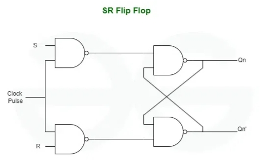

# **SR Flip-Flop**

* **What Problem Does It Solve?**
  - An SR Flip-Flop (Set-Reset Flip-Flop) is a digital sequential circuit.
  - It stores one bit of binary data (0 or 1).
  - It changes its output only when a clock pulse is applied.
  - It provides controlled and synchronized data storage.

---

* **Why is it used?**

  *An SR Flip-Flop is used because:*

  - It stores one bit of binary information.
  - It changes state only on the clock signal.
  - It provides synchronized operation in digital systems.
  - It is the basic building block of sequential circuits.
  - It is simple, reliable, and easy to implement.

---

* **Where is it used?**

  *An SR Flip-Flop is widely used in:*

  - Registers.
  - Memory circuits.
  - Counters.
  - CPUs (Processors).
  - Digital control systems.
  - Digital VLSI and RTL design.
  - FPGA and ASIC designs.
  - Sequential logic circuits.

---

* **Circuit Diagram:**

---

* **Function of Inputs and Outputs**

  - S = Set input.
  - R = Reset input.
  - CLK = Clock input.
  - Q = Normal output.
  - Q̅ = Complement output.

---

* **Truth Table**

| CLK | S | R | Q(next) | Q̅(next) | 
|:---:|:-:|:-:|:-------:|:--------:
| 0 | X | X | Previous | Previous | 
| 1 | 0 | 0 | Previous | Previous | 
| 1 | 0 | 1 | 0 | 1 | Reset |
| 1 | 1 | 0 | 1 | 0 | Set |
| 1 | 1 | 1 | Invalid | Invalid |

> **Note:** **X = Don't Care**

---

* **Characteristic Table**

| S | R | Q(next) |
|:-:|:-:|:--------:|
| 0 | 0 | Q |
| 0 | 1 | 0 |
| 1 | 0 | 1 |
| 1 | 1 | Invalid |

---

* **Characteristic Equation**

- **Q(next) = S + R̅Q**

---

* **Working**

- **CLK = 0** → Output does not change.
- **CLK = 1, S = 1, R = 0** → Set (Q = 1).
- **CLK = 1, S = 0, R = 1** → Reset (Q = 0).
- **CLK = 1, S = 0, R = 0** → Hold previous state.
- **CLK = 1, S = 1, R = 1** → Invalid condition.

---

* **Advantages**

- Stores one bit of data.
- Clock-controlled operation.
- Simple circuit design.
- Fast and reliable.
- Used as the basis for other flip-flops.

---

* **Disadvantages**

- Has an invalid input condition (S = R = 1).
- Not suitable where invalid states must be avoided.
- Usually replaced by JK or D Flip-Flops in complex designs.

---

