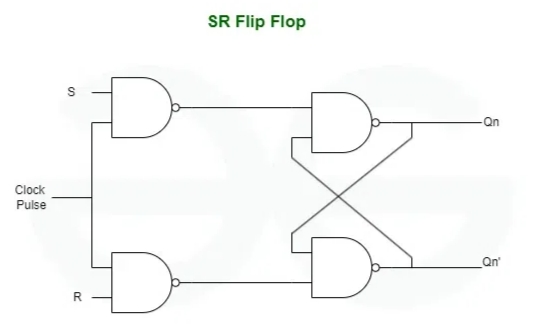

# **SR Flip-Flop**

## **Overview**

An **SR Flip-Flop (Set-Reset Flip-Flop)** is a sequential logic circuit used to store one bit of binary information. It has two main control inputs, **S (Set)** and **R (Reset)**, and changes its output according to the input combination at the active clock edge.

## **Definition**

An **SR Flip-Flop** is a 1-bit edge-triggered storage element in which the output can be **set to 1, reset to 0, or held at its previous state** according to the Set and Reset inputs.

## **Why is it needed?**

* To store one bit of binary information.
* To perform set and reset operations.
* To construct basic memory elements.
* To understand the operation of other Flip-Flops.
* To design sequential logic circuits.
* To implement control and storage circuits.
* To provide a basic building block for digital memory.

## **Working Principle**

The operation of an SR Flip-Flop depends on the **S** and **R** inputs at the active clock edge.

**S = 0, R = 0 → Hold**

The output remains unchanged.

**S = 0, R = 1 → Reset**

The output becomes:

**Q(next) = 0**

**S = 1, R = 0 → Set**

The output becomes:

**Q(next) = 1**

**S = 1, R = 1 → Invalid**

This input combination is not allowed in the basic SR Flip-Flop because it can produce an undefined or unpredictable state.

Therefore:

**00 → Hold**

**01 → Reset**

**10 → Set**

**11 → Invalid**

* **Circuit Diagram:**

## **Truth Table**

| S | R | Q(next) | Operation |
|:---:|:---:|:---:|---|
| 0 | 0 | Q | Hold |
| 0 | 1 | 0 | Reset |
| 1 | 0 | 1 | Set |
| 1 | 1 | X | Invalid |

**X = Invalid / Undefined**

The exact active levels depend on whether the SR Flip-Flop is implemented using active-high or active-low logic.

## **Boolean Expression**

For the active-high SR Flip-Flop, the characteristic equation for the valid input combinations is:

**Q(next) = S + R'Q**

This equation is valid when:

**S·R = 0**

The condition:

**S = 1, R = 1**

must be avoided because it represents the invalid condition.

## **Input & Output Description**

| Signal | Type | Description |
|---|---|---|
| S | Input | Set input |
| R | Input | Reset input |
| CLK | Input | Clock signal |
| Q | Output | Normal output |
| Q' | Output | Complementary output |

For a clocked SR Flip-Flop, the inputs are evaluated at the active clock edge.

## **Working Example**

Assume initially:

**Q = 0**

### **Case 1: S = 0, R = 0**

At the active clock edge:

**Q(next) = Q**

Therefore:

**Q = 0**

The Flip-Flop holds its previous state.

### **Case 2: S = 1, R = 0**

At the active clock edge:

**Q(next) = 1**

The Flip-Flop is set.

### **Case 3: S = 0, R = 1**

At the active clock edge:

**Q(next) = 0**

The Flip-Flop is reset.

### **Case 4: S = 1, R = 1**

Both Set and Reset are activated simultaneously.

This is the invalid condition for the basic active-high SR Flip-Flop.

Therefore:

**S = 1, R = 1 → Invalid**

## **Applications**

* Basic Memory Elements.
* Sequential Logic.
* Control Circuits.
* Set/Reset Control.
* Data Storage.
* Switch Debouncing.
* State Storage.
* Timing Circuits.
* Digital Control Systems.
* ASIC Design.
* VLSI Design.
* Educational Digital Logic Circuits.

## **Advantages**

* Simple structure.
* Easy to understand and implement.
* Provides direct Set and Reset control.
* Stores one bit of information.
* Forms the basis for understanding other Flip-Flops.
* Useful in basic sequential circuits.

## **Limitations**

* Has an invalid input condition.
* The Set and Reset inputs must not be activated simultaneously in the basic active-high implementation.
* Less flexible than JK and D Flip-Flops.
* Requires careful handling of Set and Reset signals.
* Not commonly preferred for general-purpose synchronous data storage.

## **Real-World Example**

An SR Flip-Flop can be used in a **control circuit** where one signal turns an operation ON and another signal turns it OFF.

For example:

**S = 1 → Turn ON**

**R = 1 → Turn OFF**

When both inputs are inactive:

**S = 0, R = 0**

the previous state is maintained.

This makes the SR storage concept useful for simple control and memory functions.

## **Key Points**

* SR Flip-Flop stands for **Set-Reset Flip-Flop**.
* It stores **1 bit** of information.
* Main inputs are **S and R**.
* Main outputs are **Q and Q'**.
* **S = 0, R = 0 → Hold**.
* **S = 0, R = 1 → Reset**.
* **S = 1, R = 0 → Set**.
* **S = 1, R = 1 → Invalid** for the basic active-high implementation.
* It is a fundamental sequential logic element.
* It is used to understand the operation of JK, D, and T Flip-Flops.
* The invalid condition is the major limitation of the basic SR Flip-Flop.
* SR Flip-Flops can be implemented using cross-coupled logic gates.
* The implementation can use NAND or NOR gates depending on the active logic levels.

## **Interview Questions**

**1. What is an SR Flip-Flop?**

**Answer:**

An SR Flip-Flop is a 1-bit sequential storage element with Set and Reset inputs used to control the stored output state.

**2. What does SR stand for?**

**Answer:**

SR stands for **Set-Reset**.

**3. What happens when S = 0 and R = 0?**

**Answer:**

The Flip-Flop holds its previous state.

**Q(next) = Q**

**4. What happens when S = 1 and R = 0?**

**Answer:**

The Flip-Flop is set:

**Q(next) = 1**

**5. What happens when S = 0 and R = 1?**

**Answer:**

The Flip-Flop is reset:

**Q(next) = 0**

**6. What happens when S = 1 and R = 1?**

**Answer:**

For the basic active-high SR Flip-Flop, this is the **invalid condition**.

**7. Why is S = 1 and R = 1 invalid?**

**Answer:**

Because Set and Reset are activated simultaneously, which can lead to an undefined or unpredictable stored state.

**8. What is the main disadvantage of an SR Flip-Flop?**

**Answer:**

Its main disadvantage is the invalid input condition.

**9. How is the invalid condition avoided in a JK Flip-Flop?**

**Answer:**

The JK Flip-Flop modifies the feedback structure so that the equivalent condition **J = K = 1** produces a toggle operation instead of an invalid state.

**10. What is the difference between an SR and JK Flip-Flop?**

**Answer:**

An SR Flip-Flop has an invalid input combination, while a JK Flip-Flop uses the corresponding input combination to toggle the output.

**11. What is the main function of the S input?**

**Answer:**

The S input sets the output:

**Q = 1**

**12. What is the main function of the R input?**

**Answer:**

The R input resets the output:

**Q = 0**

## **Quick Revision**

**Main Topic → Sequential Logic**

**Subtopic → SR Flip-Flop**

**Storage → 1 Bit**

**Inputs → S, R, CLK**

**Outputs → Q, Q'**

**00 → Hold**

**01 → Reset**

**10 → Set**

**11 → Invalid**

**S → Set**

**R → Reset**

**Main Problem → Invalid Condition**

**Main Application → Basic Storage and Control**

**SR → Set-Reset**

**JK Flip-Flop → Eliminates SR Invalid Condition**

## **Summary**

An **SR Flip-Flop** is a basic 1-bit sequential storage element with **Set and Reset** inputs. It can hold, set, or reset its output depending on the input combination. The major limitation of the basic active-high SR Flip-Flop is the **S = 1, R = 1 invalid condition**. Understanding the SR Flip-Flop provides the foundation for learning **JK, D, and T Flip-Flops and other sequential logic circuits**.

## **References**

* M. Morris Mano – *Digital Design*.
* Thomas L. Floyd – *Digital Fundamentals*.
* Ronald J. Tocci – *Digital Systems: Principles and Applications*.
* Stephen Brown & Zvonko Vranesic – *Fundamentals of Digital Logic with Verilog Design*.
* Neso Academy – Digital Electronics.
