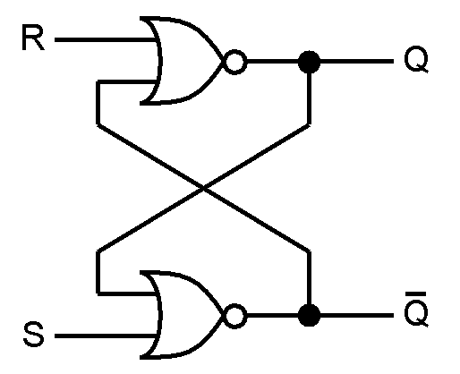

# **SR Latch**

* **What Problem Does It Solve?**
  - An SR Latch (Set-Reset Latch) is a digital sequential circuit.
  - It stores one bit of binary data (0 or 1).
  - It has memory, meaning it can remember its previous state.
  - The output changes only when the inputs change.

---

* **Why is it used?**

  *An SR Latch is used because:*

  - It stores one bit of information.
  - It provides temporary data storage.
  - It is the basic building block of flip-flops.
  - It is simple and fast.
  - It is used in memory and control circuits.

---

* **Where is it used?**

  *An SR Latch is widely used in:*

  - Memory circuits.
  - Registers.
  - Flip-Flops.
  - CPUs (Processors).
  - Digital control systems.
  - Digital VLSI and RTL design.
  - FPGA and ASIC designs.
  - Sequential logic circuits.

---

* **Types of SR Latch**

1. **NOR SR Latch (Active HIGH)**
2. **NAND SR Latch (Active LOW)**

---

## **1. NOR SR Latch (Active HIGH)**

### **Circuit Diagram**

---

### **Function of Inputs and Outputs**

- S = Set input.
- R = Reset input.
- Q = Normal output.
- Q̅ = Complement output.

---

### **Truth Table**

| S | R | Q(next) | Q̅(next) | Operation |
|:-:|:-:|:-------:|:--------:|-----------|
| 0 | 0 | Previous | Previous | Hold |
| 0 | 1 | 0 | 1 | Reset |
| 1 | 0 | 1 | 0 | Set |
| 1 | 1 | Invalid | Invalid | Not Allowed |

---

### **Boolean Expression**

- **Q = S + Q̅**
- **Q̅ = R + Q**

---

### **Working**

- **S = 1, R = 0 → Set (Q = 1)**
- **S = 0, R = 1 → Reset (Q = 0)**
- **S = 0, R = 0 → Hold previous state**
- **S = 1, R = 1 → Invalid condition**

---

## **2. NAND SR Latch (Active LOW)**

### **Circuit Diagram**

---

### **Function of Inputs and Outputs**

- S̅ = Active LOW Set input.
- R̅ = Active LOW Reset input.
- Q = Normal output.
- Q̅ = Complement output.

---

### **Truth Table**

| S̅ | R̅ | Q(next) | Q̅(next) | Operation |
|:--:|:--:|:-------:|:--------:|-----------|
| 1 | 1 | Previous | Previous | Hold |
| 0 | 1 | 1 | 0 | Set |
| 1 | 0 | 0 | 1 | Reset |
| 0 | 0 | Invalid | Invalid | Not Allowed |

---

### **Boolean Expression**

- **Q = (S̅ · Q̅)'**
- **Q̅ = (R̅ · Q)'**

---

### **Working**

- **S̅ = 0, R̅ = 1 → Set (Q = 1)**
- **S̅ = 1, R̅ = 0 → Reset (Q = 0)**
- **S̅ = 1, R̅ = 1 → Hold previous state**
- **S̅ = 0, R̅ = 0 → Invalid condition**

---

## **Difference Between NOR and NAND SR Latch**

| NOR SR Latch | NAND SR Latch |
|---------------|----------------|
| Active HIGH inputs | Active LOW inputs |
| Set when S = 1 | Set when S̅ = 0 |
| Reset when R = 1 | Reset when R̅ = 0 |
| Hold when S = R = 0 | Hold when S̅ = R̅ = 1 |
| Invalid when S = R = 1 | Invalid when S̅ = R̅ = 0 |

---

