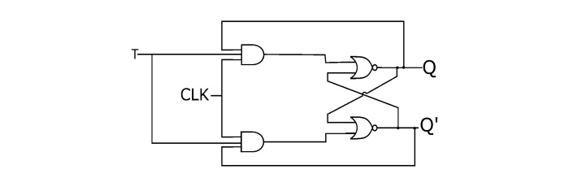

# **T Flip-Flop**

## **Overview**

A **T Flip-Flop (Toggle Flip-Flop)** is an edge-triggered sequential logic circuit used to store one bit of binary information. It has a single input **T (Toggle)** and changes its output state according to the value of T at the active clock edge. It is commonly used in counters and frequency-divider circuits.

## **Definition**

A **T Flip-Flop** is a 1-bit edge-triggered storage element in which the output holds its previous state when **T = 0** and toggles to its complement when **T = 1** at the active clock edge.

## **Why is it needed?**

* To toggle the output state.
* To design binary counters.
* To design frequency dividers.
* To store one bit of information.
* To simplify sequential circuit design.
* To implement counting operations.
* To generate periodic digital signals.
* To construct synchronous and asynchronous counters.

## **Working Principle**

The operation of a T Flip-Flop depends on the T input at the active clock edge.

**T = 0 → Hold**

The output remains unchanged:

**Q(next) = Q**

**T = 1 → Toggle**

The output changes to its complement:

**Q(next) = Q'**

Therefore:

**T = 0 → No Change**

**T = 1 → Toggle**

* **Circuit Diagram:**

## **Truth Table**

| T | Q(next) | Operation |
|:---:|:---:|---|
| 0 | Q | Hold |
| 1 | Q' | Toggle |

The T Flip-Flop has only two possible operations:

**0 → Hold**

**1 → Toggle**

## **Boolean Expression**

The characteristic equation of a T Flip-Flop is:

**Q(next) = T ⊕ Q**

Expanding the XOR operation:

**Q(next) = T'Q + TQ'**

When:

**T = 0**

**Q(next) = Q**

When:

**T = 1**

**Q(next) = Q'**

## **Input & Output Description**

| Signal | Type | Description |
|---|---|---|
| T | Input | Toggle control input |
| CLK | Input | Clock signal |
| Q | Output | Normal output |
| Q' | Output | Complementary output |

A practical T Flip-Flop may also include:

| Signal | Type | Description |
|---|---|---|
| PRESET | Input | Forces Q to 1 |
| RESET | Input | Forces Q to 0 |

## **Working Example**

Assume the initial state is:

**Q = 0**

### **Case 1: T = 0**

At the active clock edge:

**Q(next) = Q**

Therefore:

**Q remains 0**

### **Case 2: T = 1**

At the next active clock edge:

**Q(next) = Q'**

Therefore:

**Q changes from 0 to 1**

At the following active clock edge, if:

**T = 1**

then:

**Q changes from 1 to 0**

The output continues to toggle between 0 and 1 at every active clock edge while T remains HIGH.

## **Applications**

* Binary Counters.
* Frequency Dividers.
* Toggle Circuits.
* Digital Clocks.
* Event Counters.
* Sequential Logic.
* Timing Circuits.
* Frequency Generation.
* State Machines.
* Control Circuits.
* FPGA Designs.
* ASIC Designs.
* VLSI Systems.

## **Advantages**

* Simple toggle operation.
* Requires only one main input.
* Useful for counter design.
* Efficient for frequency division.
* Easy to understand and implement.
* Reduces control complexity in toggle-based circuits.
* Can be derived from JK and D Flip-Flops.

## **Limitations**

* Primarily designed for toggle-based operations.
* Less flexible than a D Flip-Flop for general-purpose data storage.
* Requires a clock signal.
* Has setup and hold-time requirements.
* Propagation delay limits maximum operating frequency.
* Large counter structures can introduce timing issues.

## **Real-World Example**

A T Flip-Flop can be used as a **divide-by-2 frequency divider**.

Set:

**T = 1**

The Flip-Flop toggles at every active clock edge.

If the input clock frequency is:

**f**

then the output frequency becomes:

**f/2**

For example, if:

**CLK = 100 MHz**

then:

**Q = 50 MHz**

Multiple T Flip-Flops can be cascaded to create binary counters.

For example:

**1 T Flip-Flop → Divide by 2**

**2 T Flip-Flops → Divide by 4**

**3 T Flip-Flops → Divide by 8**

**4 T Flip-Flops → Divide by 16**

## **Key Points**

* T Flip-Flop stands for **Toggle Flip-Flop**.
* It stores **1 bit** of information.
* It has one main input: **T**.
* It is **edge-triggered**.
* **T = 0 → Hold**.
* **T = 1 → Toggle**.
* Characteristic equation:
  
  **Q(next) = T ⊕ Q**
* It can be constructed from a JK Flip-Flop.
* It can be constructed from a D Flip-Flop.
* It is widely used in counters.
* It can be used as a divide-by-2 frequency divider.
* Multiple T Flip-Flops can create binary frequency dividers and counters.
* It is particularly useful when repeated state toggling is required.

## **Interview Questions**

**1. What is a T Flip-Flop?**

**Answer:**

A T Flip-Flop is an edge-triggered sequential circuit that holds its state when T = 0 and toggles its output when T = 1.

**2. What does T stand for?**

**Answer:**

T stands for **Toggle**.

**3. What happens when T = 0?**

**Answer:**

The Flip-Flop holds its previous state:

**Q(next) = Q**

**4. What happens when T = 1?**

**Answer:**

The Flip-Flop toggles:

**Q(next) = Q'**

**5. What is the characteristic equation of a T Flip-Flop?**

**Answer:**

**Q(next) = T ⊕ Q**

**6. How can a JK Flip-Flop be converted into a T Flip-Flop?**

**Answer:**

Connect the J and K inputs together:

**J = K = T**

**7. How can a D Flip-Flop be converted into a T Flip-Flop?**

**Answer:**

Connect:

**D = T ⊕ Q**

Then the D Flip-Flop behaves as a T Flip-Flop.

**8. How can a T Flip-Flop be used as a frequency divider?**

**Answer:**

Set:

**T = 1**

The output toggles at every active clock edge, producing:

**f(output) = f(clock) / 2**

**9. How many T Flip-Flops are required for a divide-by-16 counter?**

**Answer:**

Four T Flip-Flops are required because:

**2⁴ = 16**

**10. Why are T Flip-Flops commonly used in counters?**

**Answer:**

Because the toggle operation allows the output state to change systematically at every clock edge, making them suitable for binary counting.

**11. What is the difference between a T Flip-Flop and a D Flip-Flop?**

**Answer:**

A D Flip-Flop transfers the D input to Q, while a T Flip-Flop either holds or toggles its output depending on T.

**12. What happens if T remains HIGH?**

**Answer:**

The output toggles at every active clock edge.

## **Quick Revision**

**Main Topic → Sequential Logic**

**Subtopic → T Flip-Flop**

**Storage → 1 Bit**

**Input → T**

**Clock → CLK**

**Outputs → Q, Q'**

**T = 0 → Hold**

**T = 1 → Toggle**

**Characteristic Equation → Q(next) = T ⊕ Q**

**Main Application → Counters**

**Frequency Division → Divide by 2**

**J = K = T → JK converted to T**

**D = T ⊕ Q → D converted to T**

**1 T Flip-Flop → Divide by 2**

**2 T Flip-Flops → Divide by 4**

**3 T Flip-Flops → Divide by 8**

**4 T Flip-Flops → Divide by 16**

## **Summary**

A **T Flip-Flop** is an edge-triggered 1-bit storage element designed primarily for toggle operations. When **T = 0**, it holds its previous state, and when **T = 1**, it toggles its output at every active clock edge. Because of this simple toggle behavior, T Flip-Flops are widely used in **binary counters, frequency dividers, timing circuits, digital clocks, FPGA designs, ASICs, and VLSI systems**.

## **References**

* M. Morris Mano – *Digital Design*.
* Thomas L. Floyd – *Digital Fundamentals*.
* Ronald J. Tocci – *Digital Systems: Principles and Applications*.
* Stephen Brown & Zvonko Vranesic – *Fundamentals of Digital Logic with Verilog Design*.
* Neso Academy – Digital Electronics.
