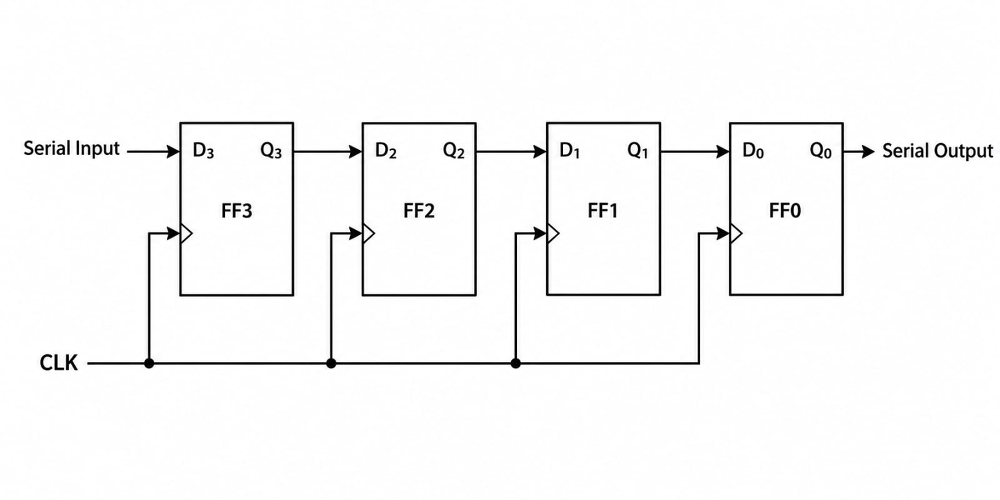
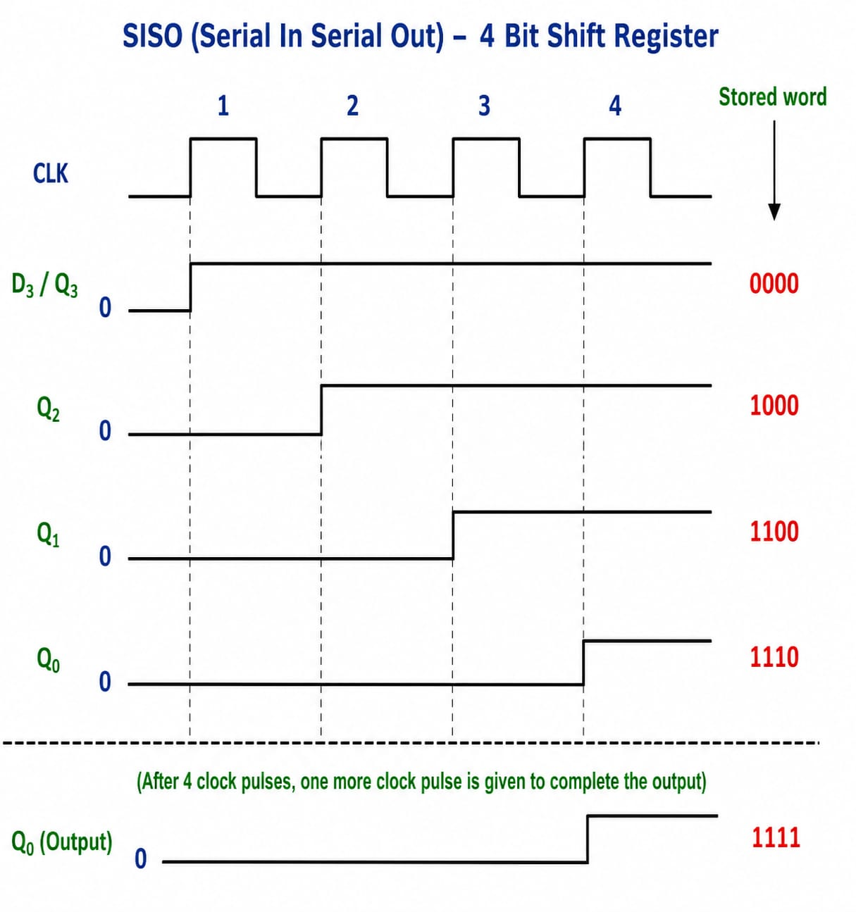

# **SISO (Serial-In Serial-Out) Shift Register**

* **What Problem Does It Solve?**
  - A SISO (Serial-In Serial-Out) Shift Register is a digital sequential circuit.
  - It stores binary data and shifts it one bit at a time.
  - Data enters the register serially (one bit at a time).
  - Data also leaves the register serially (one bit at a time).

---

* **Why is it used?**

  *A SISO Shift Register is used because:*

  - It stores serial data temporarily.
  - It transfers data one bit at a time.
  - It delays digital data by a specific number of clock pulses.
  - It simplifies serial data communication.
  - It is easy to design and implement.

---

* **Where is it used?**

  *A SISO Shift Register is widely used in:*

  - Serial communication systems.
  - Digital communication circuits.
  - Data delay circuits.
  - CPUs (Processors).
  - Digital VLSI and RTL design.
  - FPGA and ASIC designs.
  - Embedded systems.
  - Digital control systems.

---

* **Block Diagram:**

---

* **Function of Inputs and Outputs**

  - **Serial Input (SI)** = Data enters one bit at a time.
  - **CLK** = Clock signal used to shift the data.
  - **Q0, Q1, Q2, Q3** = Outputs of each flip-flop.
  - **Serial Output (SO)** = Data leaves one bit at a time from the last flip-flop.

---

* **Working**

- A SISO Shift Register is made using multiple **D Flip-Flops** connected in series.
- Data is entered **one bit at a time** through the Serial Input (SI).
- On every clock pulse, the data shifts to the next flip-flop.
- After passing through all flip-flops, the data appears at the **Serial Output (SO)**.
- The number of clock pulses required equals the number of flip-flops.

---

* **Example (4-Bit SISO Shift Register)**

Suppose the serial data is **1 → 0 → 1 → 1**.

| Clock Pulse | Q3 | Q2 | Q1 | Q0 |
|:-----------:|:--:|:--:|:--:|:--:|
| Initial | 0 | 0 | 0 | 0 |
| 1 | 1 | 0 | 0 | 0 |
| 2 | 1 | 1 | 0 | 0 |
| 3 | 1 | 1 | 1 | 0 |
| 4 | 1 | 1 | 1 | 1 |

After the **4th clock pulse**, the first input bit reaches the **Serial Output (SO)**.

---

* **Clock Pulse:**

---

* **Advantages**

- Simple circuit design.
- Requires fewer connections.
- Suitable for serial communication.
- Reliable and easy to implement.
- Efficient for transferring serial data.

---

* **Disadvantages**

- Data transfer is slower than parallel transfer.
- Requires multiple clock pulses.
- Stores data temporarily only.

---

* **Easy Way to Remember**

- **Serial-In** → Data enters **one bit at a time**.
- **Serial-Out** → Data leaves **one bit at a time**.
- One clock pulse shifts the data by **one position**.
- Made using **D Flip-Flops** connected in series.

