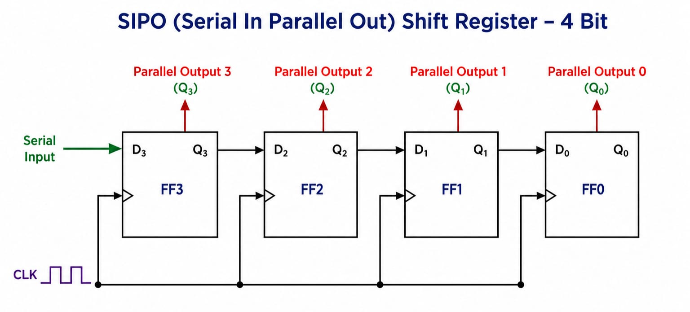
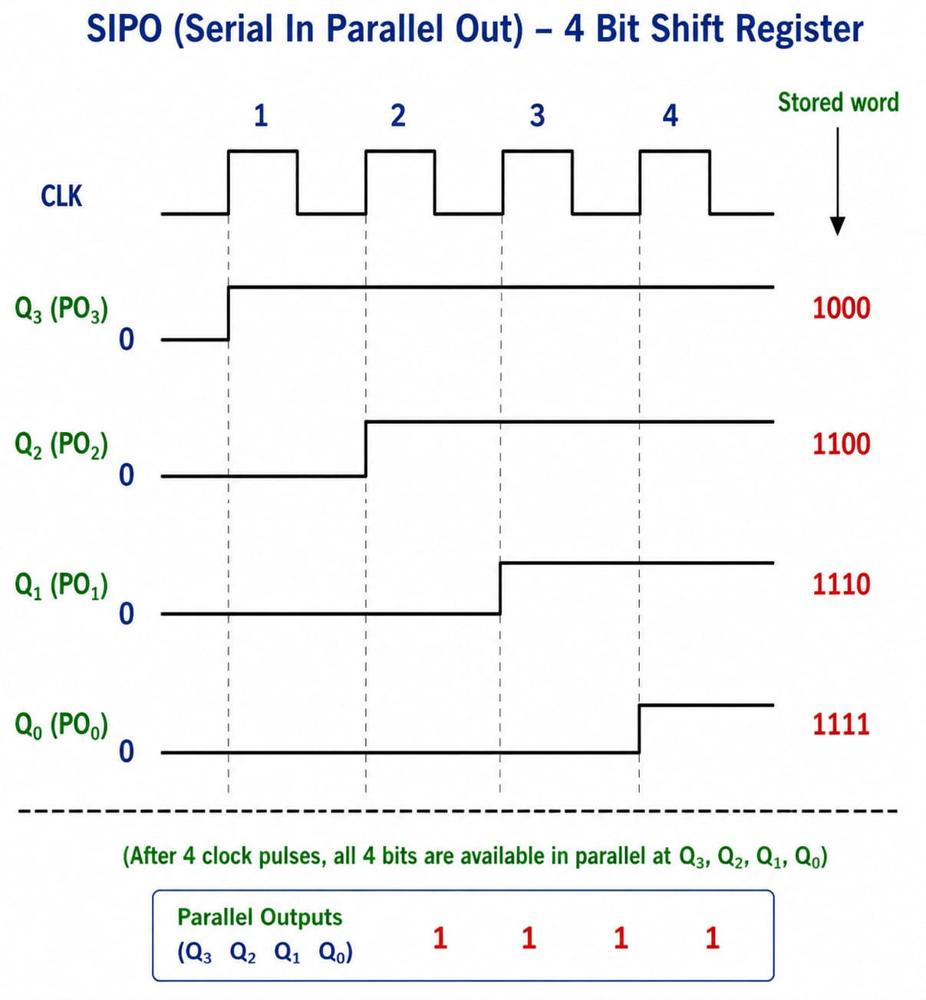

# **SIPO (Serial-In Parallel-Out) Shift Register**

* **What Problem Does It Solve?**
  - A SIPO (Serial-In Parallel-Out) Shift Register is a digital sequential circuit.
  - It accepts data one bit at a time through a serial input.
  - After all bits are stored, it provides all the bits simultaneously through parallel outputs.
  - It converts serial data into parallel data.

---

* **Why is it used?**

  *A SIPO Shift Register is used because:*

  - It converts serial data into parallel data.
  - It stores binary data temporarily.
  - It improves data transfer between serial and parallel devices.
  - It simplifies communication between digital circuits.
  - It is easy to implement using D Flip-Flops.

---

* **Where is it used?**

  *A SIPO Shift Register is widely used in:*

  - Serial communication systems.
  - Microprocessors and microcontrollers.
  - Data receiving circuits.
  - Digital communication systems.
  - Digital VLSI and RTL design.
  - FPGA and ASIC designs.
  - Embedded systems.
  - Display and LED control circuits.

---

* **Circuit Diagram:**

---

* **Function of Inputs and Outputs**

  - **SI (Serial Input)** = Data enters one bit at a time.
  - **CLK** = Clock signal used to shift the data.
  - **Q0, Q1, Q2, Q3** = Parallel outputs.
  - Each output stores one bit after the required clock pulses.

---

* **Working**

- A SIPO Shift Register is made using multiple **D Flip-Flops** connected in series.
- Data enters through the **Serial Input (SI)** one bit at a time.
- On every clock pulse, the data shifts to the next flip-flop.
- After all bits are entered, the data is available simultaneously at **Q0, Q1, Q2, and Q3**.
- Thus, serial input data is converted into parallel output data.

---

* **Example (4-Bit SIPO Shift Register)**

Suppose the serial data is **1 → 0 → 1 → 1**.

| Clock Pulse | Q3 | Q2 | Q1 | Q0 |
|:-----------:|:--:|:--:|:--:|:--:|
| Initial | 0 | 0 | 0 | 0 |
| 1 | 1 | 0 | 0 | 0 |
| 2 | 1 | 1 | 0 | 0 |
| 3 | 0 | 1 | 1 | 0 |
| 4 | 1 | 0 | 1 | 1 |

After the **4th clock pulse**, the outputs become:

| Q3 | Q2 | Q1 | Q0 |
|:--:|:--:|:--:|:--:|
| 1 | 0 | 1 | 1 |

---

---

* **Advantages**

- Converts serial data into parallel data.
- Simple and reliable design.
- Easy to implement.
- Reduces the number of input wires.
- Widely used in digital communication systems.

---

* **Disadvantages**

- Requires multiple clock pulses to load data.
- Slower than direct parallel loading.
- Stores data temporarily only.

---

* **Easy Way to Remember**

- **Serial-In** → Data enters **one bit at a time**.
- **Parallel-Out** → All bits are available **at the same time**.
- One clock pulse shifts the data by **one position**.
- Made using **D Flip-Flops** connected in series.

