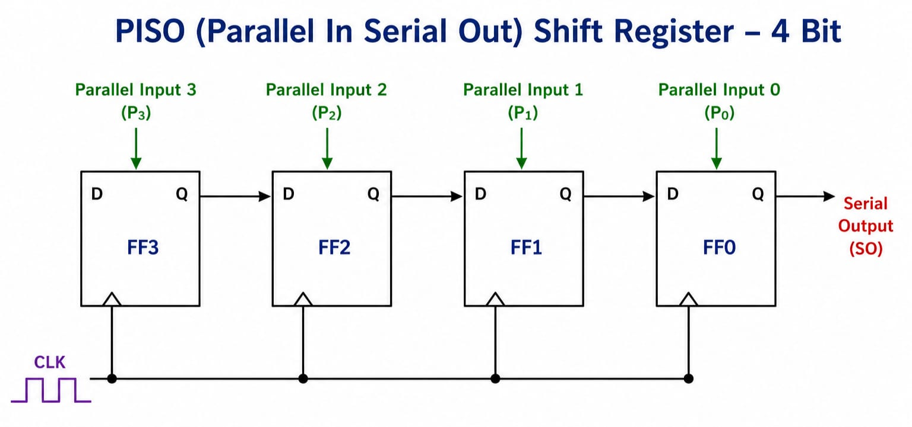
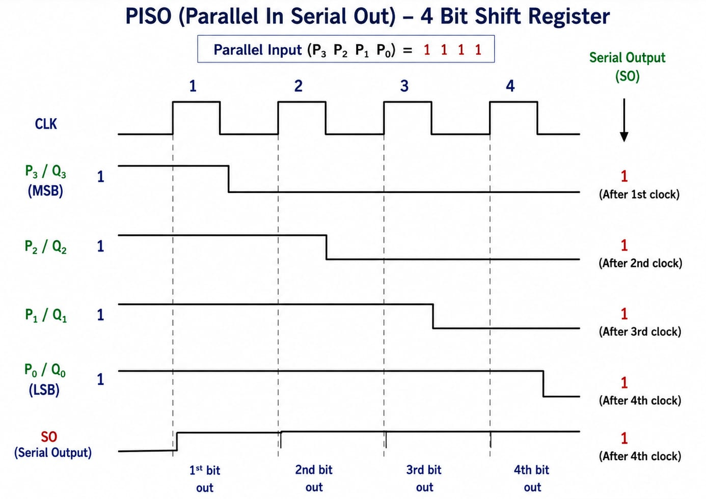

# **Parallel-In Serial-Out (PISO) Register**

* **Overview**

A Parallel-In Serial-Out (PISO) Register is a type of Shift Register in which multiple binary bits are loaded into the Register simultaneously through parallel inputs and then shifted out one bit at a time through a serial output. It is commonly used for converting parallel data into serial data.

---

* **Definition**

A Parallel-In Serial-Out (PISO) Register is a sequential logic circuit that accepts multiple bits of binary data simultaneously through parallel inputs and produces the stored data sequentially through a serial output.

---

* **Purpose**
  - To convert parallel data into serial data.
  - To load multiple bits simultaneously.
  - To transmit binary data serially.
  - To reduce the number of communication lines.
  - To transfer parallel data through a single serial data line.
  - To provide temporary data storage.
  - To interface parallel digital systems with serial communication systems.

---

* **Importance**
  - PISO Registers are important for parallel-to-serial data conversion.
  - They allow multiple bits to be transmitted using a single data line.
  - They are widely used in digital communication systems.
  - They are useful for interfacing parallel systems with serial devices.
  - They are commonly used in FPGA, ASIC, RTL, and VLSI designs.
  - They reduce the number of physical connections required for data transmission.

---

* **Working Principle**
  - A PISO Register consists of multiple Flip-Flops connected in a shift-register structure.
  - Parallel data is loaded into all Flip-Flops simultaneously.
  - A control signal is generally used to select the **Load** operation.
  - After loading, the data is shifted one bit at a time using the clock.
  - The data leaves the Register through a single Serial Output (SO).
  - Therefore, PISO performs **Parallel-to-Serial conversion**.

For a 4-bit PISO Register:

**Parallel Inputs → FF3, FF2, FF1, FF0 → SO**

The complete 4-bit data is loaded at once and then shifted out serially.

---

* **Circuit Description**
  - A PISO Register is commonly constructed using D Flip-Flops with additional input-selection logic.
  - Parallel inputs are connected to the Flip-Flops through multiplexing or load-control logic.
  - When **LOAD** is active, parallel data is stored simultaneously.
  - When **SHIFT** is active, the stored data shifts toward the serial output.
  - All Flip-Flops share a common clock.
  - The output of the final Flip-Flop provides the serial data.

---

* **Circuit Diagram:**

---

* **Truth Table:**

For a 4-bit PISO Register:

| LOAD | CLK | Operation |
|---|---|---|
| 1 | ↑ | Parallel Load |
| 0 | ↑ | Shift |
| 0 | No Edge | Hold |
| 1 | No Edge | Hold |

**↑ = Active Clock Edge**

During **LOAD = 1**, all parallel input bits are stored simultaneously.

During **LOAD = 0**, the stored data is shifted toward the serial output.

---

* **Boolean Expression**

For a 4-bit PISO Register with parallel inputs **P3, P2, P1, P0**:

During parallel loading:

**Q3(next) = P3**

**Q2(next) = P2**

**Q1(next) = P1**

**Q0(next) = P0**

During shifting:

**Q3(next) = Q2**

**Q2(next) = Q1**

**Q1(next) = Q0**

**Q0(next) = SI**

The serial output is:

**SO = Q3**

Therefore, the stored parallel data is shifted out one bit at a time.

---

* **Input and Output Description**
  - Inputs:-
    - Parallel Inputs: **P3, P2, P1, P0**
    - Serial Input: **SI**
    - Load Control: **LOAD**
    - Clock: **CLK**

  - Output:-
    - Serial Output: **SO**

  - **P3–P0** are the parallel data inputs.
  - **LOAD** controls the parallel loading operation.
  - **SI** can provide new serial data during shifting.
  - **CLK** controls the loading and shifting operations.
  - **SO** provides the stored data serially.

---

* **Working Example**
  - Consider a 4-bit PISO Register.
  - Apply parallel data:

**P3 P2 P1 P0 = 1011**

  - Set:

**LOAD = 1**

  - At the active clock edge, the data is loaded simultaneously:

**Q3 Q2 Q1 Q0 = 1011**

  - Now set:

**LOAD = 0**

  - The Register enters shift mode.

### **First Shift**

**SO = 1**

Remaining data:

**0110**

### **Second Shift**

**SO = 0**

Remaining data:

**1100**

### **Third Shift**

**SO = 1**

Remaining data:

**1000**

### **Fourth Shift**

**SO = 1**

Remaining data:

**0000**

Therefore, the parallel data:

**1011**

is converted into serial data:

**1 → 0 → 1 → 1**

---

* **Applications**

  *The PISO Register is used in:*

  - Parallel-to-Serial Conversion.
  - Serial Communication.
  - Data Transmission.
  - SPI Communication.
  - Microprocessor Interfaces.
  - Digital Communication Systems.
  - Data Transfer Circuits.
  - FPGA Design.
  - RTL Design.
  - ASIC Design.
  - VLSI Systems.
  - Display Controllers.
  - Communication Interfaces.

---

* **Advantages**
  - Converts parallel data into serial data.
  - Allows multiple bits to be transmitted through a single data line.
  - Reduces the number of required communication lines.
  - Parallel data can be loaded simultaneously.
  - Simple and efficient data-transfer structure.
  - Easy to implement using Flip-Flops and multiplexing logic.
  - Useful for serial communication systems.
  - Suitable for FPGA, ASIC, RTL, and VLSI designs.

---

* **Limitations**
  - Multiple clock cycles are required to transmit all stored bits serially.
  - Requires additional control logic for loading and shifting.
  - Data transmission is slower than direct parallel transmission for the same clock frequency.
  - Requires synchronization between the transmitter and receiver.
  - Larger PISO Registers require more hardware resources.
  - Serial output introduces transfer latency.

---

* **Real-World Example**
  - SPI Communication.
  - Serial Communication Interfaces.
  - Microcontroller Data Transmission.
  - Display Controllers.
  - FPGA-Based Communication.
  - Digital Data Transmission Systems.
  - VLSI Interface Circuits.

For example, an **8-bit PISO Register** can load:

**10110110**

simultaneously and then transmit the eight bits one at a time through a single serial output line.

This reduces the number of physical data lines required for communication.

---

* **Key Points**
  - PISO stands for **Parallel-In Serial-Out**.
  - It is a type of Shift Register.
  - Data enters in parallel.
  - Data leaves serially.
  - It performs **Parallel-to-Serial conversion**.
  - Parallel data can be loaded simultaneously.
  - Data is shifted out one bit at a time.
  - It commonly uses D Flip-Flops with load/shift control logic.
  - A 4-bit PISO Register requires **4 Flip-Flops**.
  - An 8-bit PISO Register requires **8 Flip-Flops**.
  - It reduces the number of communication lines.
  - It is widely used in digital communication and VLSI systems.

---

* **Interview Questions**

**1. What is a PISO Register?**

**Answer:**

PISO stands for **Parallel-In Serial-Out**. It is a Shift Register that accepts data in parallel and produces the stored data serially.

---

**2. What is the main function of a PISO Register?**

**Answer:**

The main function of a PISO Register is to perform **Parallel-to-Serial data conversion**.

---

**3. How is data loaded into a PISO Register?**

**Answer:**

Data is loaded simultaneously through the parallel input lines.

---

**4. How is data obtained from a PISO Register?**

**Answer:**

The stored data is shifted out one bit at a time through the serial output.

---

**5. What is the purpose of the LOAD control?**

**Answer:**

The LOAD control determines when parallel input data should be loaded into the Register.

---

**6. How many Flip-Flops are required for a 4-bit PISO Register?**

**Answer:**

A 4-bit PISO Register requires **4 Flip-Flops**.

---

**7. How many clock pulses are normally required to shift out 8 bits?**

**Answer:**

Normally, **8 clock pulses** are required to shift out all 8 bits.

---

**8. What is the difference between SIPO and PISO?**

**Answer:**

SIPO accepts serial data and produces parallel output, whereas PISO accepts parallel data and produces serial output.

---

**9. Why is PISO used in communication systems?**

**Answer:**

PISO allows multiple bits of parallel data to be transmitted through a single serial communication line, reducing the number of required data connections.

---

**10. What is the basic building block of a PISO Register?**

**Answer:**

D Flip-Flops along with load/shift control logic are commonly used to construct a PISO Register.

---

**11. What happens when LOAD is active?**

**Answer:**

The parallel input data is loaded simultaneously into the Flip-Flops.

---

**12. What happens when LOAD is inactive?**

**Answer:**

The Register enters shift mode, and the stored data is shifted out serially at every active clock edge.

---

* **Quick Revision**
  - Circuit Type → Sequential Logic
  - Register Type → Shift Register
  - Full Form → Parallel-In Serial-Out
  - Inputs → Parallel Data
  - Output → Serial Output
  - Basic Element → D Flip-Flop
  - Data Input → Parallel
  - Data Output → Serial
  - Main Function → Parallel-to-Serial Conversion
  - Control → LOAD / SHIFT
  - Clock → Required
  - 4-Bit PISO → 4 Flip-Flops
  - 8-Bit PISO → 8 Flip-Flops
  - Main Applications → Data Transmission, Communication Interfaces, Serial Conversion

---

* **Summary**

A Parallel-In Serial-Out (PISO) Register is a sequential logic circuit used to convert parallel data into serial data. Multiple bits are loaded simultaneously into the Register through parallel inputs, and the stored data is then shifted out one bit at a time through a serial output. PISO Registers are widely used in **serial communication, SPI interfaces, microprocessor systems, FPGA designs, RTL systems, ASICs, and VLSI circuits**.

---

* **References**
  - M. Morris Mano – *Digital Design*.
  - Donald D. Givone – *Digital Principles and Design*.
  - R. P. Jain – *Modern Digital Electronics*.
  - Thomas L. Floyd – *Digital Fundamentals*.
  - Stephen Brown & Zvonko Vranesic – *Fundamentals of Digital Logic with Verilog Design*.
  - Neso Academy – Digital Electronics.

---

* **Waveform / Timing Diagram:**

