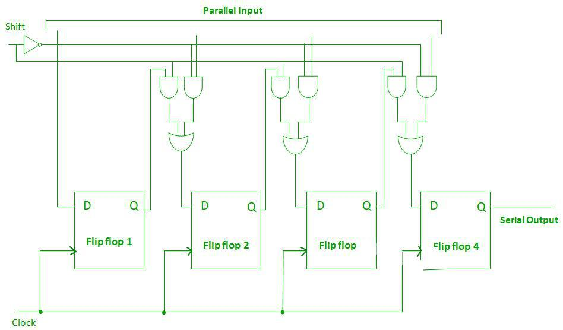

# **PISO (Parallel-In Serial-Out) Shift Register**

* **What Problem Does It Solve?**
  - A PISO (Parallel-In Serial-Out) Shift Register is a digital sequential circuit.
  - It accepts multiple bits of data simultaneously through parallel inputs.
  - It shifts the stored data out one bit at a time through a serial output.
  - It converts parallel data into serial data.

---

* **Why is it used?**

  *A PISO Shift Register is used because:*

  - It converts parallel data into serial data.
  - It reduces the number of data transmission lines.
  - It stores binary data temporarily.
  - It improves serial communication.
  - It is simple and efficient for digital systems.

---

* **Where is it used?**

  *A PISO Shift Register is widely used in:*

  - Serial communication systems.
  - Microprocessors and microcontrollers.
  - Data transmission circuits.
  - Digital communication systems.
  - Digital VLSI and RTL design.
  - FPGA and ASIC designs.
  - Embedded systems.
  - Computer interfaces.

---

* **Circuit Diagram:**

---

* **Function of Inputs and Outputs**

  - **D0, D1, D2, D3** = Parallel data inputs.
  - **CLK** = Clock signal.
  - **Load (L)** = Loads the parallel data into the register.
  - **SO (Serial Output)** = Data leaves one bit at a time.
  - **Q0, Q1, Q2, Q3** = Outputs of the flip-flops.

---

* **Working**

- A PISO Shift Register is made using multiple **D Flip-Flops**.
- When the **Load** signal is active, all input bits are loaded simultaneously.
- On each clock pulse, the stored data shifts toward the **Serial Output (SO)**.
- One bit is transmitted during each clock pulse.
- Thus, parallel input data is converted into serial output data.

---

* **Example (4-Bit PISO Shift Register)**

Suppose the parallel input is:

**D3 D2 D1 D0 = 1 0 1 1**

After loading:

| Parallel Input | D3 | D2 | D1 | D0 |
|:--------------:|:--:|:--:|:--:|:--:|
| Loaded Data | 1 | 1 | 1 | 1 |

After each clock pulse, the serial output is:

| Clock Pulse | Serial Output (SO) |
|:-----------:|:------------------:|
| 1 | 1 |
| 2 | 1s |
| 3 | 1 |
| 4 | 1 |

---

---

* **Advantages**

- Converts parallel data into serial data.
- Reduces the number of communication wires.
- Simple and reliable design.
- Easy to implement.
- Suitable for serial communication.

---

* **Disadvantages**

- Serial output is slower than parallel output.
- Requires multiple clock pulses.
- Stores data temporarily only.

---

* **Easy Way to Remember**

- **Parallel-In** → All bits enter **at the same time**.
- **Serial-Out** → Data leaves **one bit at a time**.
- One clock pulse shifts **one bit** to the output.
- Made using **D Flip-Flops** connected together.

