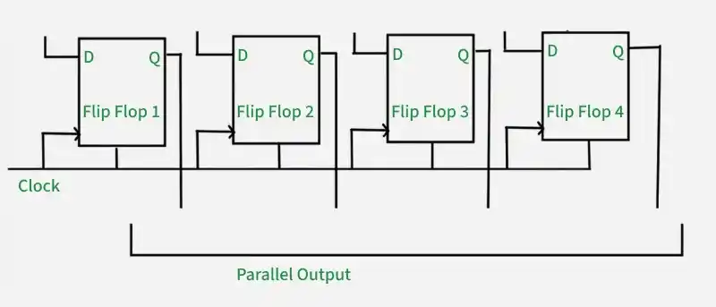

# **PIPO (Parallel-In Parallel-Out) Shift Register**

* **What Problem Does It Solve?**
  - A PIPO (Parallel-In Parallel-Out) Shift Register is a digital sequential circuit.
  - It accepts multiple bits of data simultaneously through parallel inputs.
  - It stores the data and provides all bits simultaneously through parallel outputs.
  - It is mainly used for temporary data storage and high-speed data transfer.

---

* **Why is it used?**

  *A PIPO Shift Register is used because:*

  - It stores multiple bits of binary data.
  - It transfers all bits at the same time.
  - It provides fast data loading and retrieval.
  - It improves the speed of digital systems.
  - It is simple and reliable.

---

* **Where is it used?**

  *A PIPO Shift Register is widely used in:*

  - CPUs (Processors).
  - Memory systems.
  - Data buffering circuits.
  - Digital communication systems.
  - Digital VLSI and RTL design.
  - FPGA and ASIC designs.
  - Embedded systems.
  - High-speed data transfer circuits.

---

* **Circuit Diagram:**

---

* **Function of Inputs and Outputs**

  - **D0, D1, D2, D3** = Parallel data inputs.
  - **CLK** = Clock signal.
  - **Q0, Q1, Q2, Q3** = Parallel data outputs.
  - **CLR** = Clear input (optional).
  - **EN** = Enable input (optional).

---

* **Working**

- A PIPO Shift Register is made using multiple **D Flip-Flops**.
- All input bits are applied simultaneously to the flip-flops.
- On the active clock edge, all bits are stored at the same time.
- The stored data appears simultaneously at the parallel outputs.
- No shifting operation is performed; the data is simply loaded and read in parallel.

---

* **Example (4-Bit PIPO Shift Register)**

Suppose the parallel input is:

**D3 D2 D1 D0 = 1 0 1 1**

After the clock pulse:

| D3 | D2 | D1 | D0 | Q3 | Q2 | Q1 | Q0 |
|:--:|:--:|:--:|:--:|:--:|:--:|:--:|:--:|
| 1 | 1 | 1 | 1 | 1 | 1 | 1 | 1 |

All four bits appear at the outputs **simultaneously**.

---

* **Advantages**

- High-speed data transfer.
- Stores multiple bits at once.
- Simple and reliable design.
- Easy to implement using D Flip-Flops.
- Suitable for parallel data processing.

---

* **Disadvantages**

- Requires more input and output lines.
- Not suitable for serial communication.
- Stores data temporarily only.

---

* **Easy Way to Remember**

- **Parallel-In** → All bits enter **at the same time**.
- **Parallel-Out** → All bits leave **at the same time**.
- No shifting of data occurs.
- Made using **D Flip-Flops** connected with a common clock.

