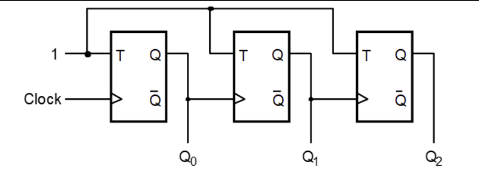

# **3-Bit Asynchronous Down Counter**

* **What is a 3-Bit Asynchronous Down Counter?**

  - A 3-Bit Asynchronous Down Counter is a digital sequential circuit.
  - It is also called a **3-Bit Ripple Down Counter**.
  - It is built using **three T Flip-Flops** or **three JK Flip-Flops** with **J = K = 1**.
  - It counts binary numbers in **descending order**.
  - It counts from **111 (7)** to **000 (0)**.
  - It generates **8 unique binary states (2³ = 8)**.
  - It is called **asynchronous** because only the first flip-flop receives the external clock signal.
  - The remaining flip-flops are triggered by the output of the previous flip-flop.

---

* **What Problem Does It Solve?**

  - A 3-Bit Asynchronous Down Counter is a digital sequential circuit.
  - It automatically counts clock pulses in reverse order.
  - It generates binary numbers in descending order.
  - It counts from **111 (7)** to **000 (0)**.
  - It helps perform countdown operations.
  - It divides the input clock frequency.

---

* **Why is it used?**

  *A 3-Bit Asynchronous Down Counter is used because:*

  - It counts clock pulses in descending order.
  - It performs countdown operations automatically.
  - It divides the input clock frequency.
  - It requires fewer logic gates.
  - It is simple to design and implement.
  - It is suitable for low-speed digital applications.

---

* **Where is it used?**

  *A 3-Bit Asynchronous Down Counter is widely used in:*

  - Countdown timers.
  - Digital clocks.
  - Event countdown circuits.
  - Frequency divider circuits.
  - CPUs (Processors).
  - Digital VLSI and RTL design.
  - FPGA and ASIC designs.
  - Embedded systems.
  - Digital control systems.

---

* **Block Diagram**



---

* **Function of Inputs and Outputs**

  - **CLK** = External clock input.
  - **T** = Toggle input (Always Logic 1).
  - **CLR** = Reset input used to clear the counter (Optional).
  - **Q0** = Least Significant Bit (LSB).
  - **Q1** = Middle output bit.
  - **Q2** = Most Significant Bit (MSB).

---

* **Timing Diagram**


---

* **Counting Sequence**

| Clock Pulse | Q2 | Q1 | Q0 | Decimal |
|:-----------:|:--:|:--:|:--:|:------:|
| 0 | 1 | 1 | 1 | 7 |
| 1 | 1 | 1 | 0 | 6 |
| 2 | 1 | 0 | 1 | 5 |
| 3 | 1 | 0 | 0 | 4 |
| 4 | 0 | 1 | 1 | 3 |
| 5 | 0 | 1 | 0 | 2 |
| 6 | 0 | 0 | 1 | 1 |
| 7 | 0 | 0 | 0 | 0 |
| 8 | 1 | 1 | 1 | Restart |

---

* **Working**

  - Initially, the counter starts from **111**.
  - The external clock pulse is applied only to the first flip-flop.
  - Every clock pulse toggles the first flip-flop.
  - The output of the first flip-flop acts as the clock input for the second flip-flop.
  - The output of the second flip-flop acts as the clock input for the third flip-flop.
  - The counter counts in the sequence:

```
111 → 110 → 101 → 100 → 011 → 010 → 001 → 000
```

  - After reaching **000**, the counter automatically returns to **111**.
  - The counting process repeats for every clock pulse.
  - Since the clock signal propagates from one flip-flop to another, it is called a **Ripple Counter**.

---

* **Advantages**

  - Simple circuit design.
  - Requires fewer logic gates.
  - Low hardware cost.
  - Easy to understand and implement.
  - Suitable for countdown and frequency divider applications.
  - Reliable for low-speed digital systems.

---

* **Disadvantages**

  - Has propagation delay.
  - Slower than synchronous counters.
  - Output bits do not change simultaneously.
  - Not suitable for high-speed applications.

---

* **Easy Way to Remember**

  - Uses **3 Flip-Flops**.
  - Counts from **7 to 0**.
  - Total states = **8 (2³)**.
  - Counts in descending order.
  - Only the first flip-flop receives the external clock.
  - Also called a **3-Bit Ripple Down Counter**.

---

* **One-Line Definition (Interview)**

> A **3-Bit Asynchronous Down Counter** is a sequential logic circuit made of three flip-flops that counts from **111 to 000** in descending binary order, where only the first flip-flop receives the external clock signal.
