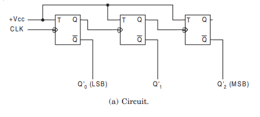

# **3-Bit Asynchronous Up/Down Counter**

* **What is a 3-Bit Asynchronous Up/Down Counter?**

  - A 3-Bit Asynchronous Up/Down Counter is a digital sequential circuit.
  - It is also called a **3-Bit Ripple Up/Down Counter**.
  - It is built using **three T Flip-Flops** or **three JK Flip-Flops** with **J = K = 1**.
  - It can count binary numbers in both **ascending** and **descending** order.
  - It counts from **000 (0)** to **111 (7)** in **Up Mode**.
  - It counts from **111 (7)** to **000 (0)** in **Down Mode**.
  - It generates **8 unique binary states (2³ = 8)**.
  - It is called **asynchronous** because only the first flip-flop receives the external clock signal.
  - The counting direction is selected using an **Up/Down (U/D)** control input.

---

* **What Problem Does It Solve?**

  - A 3-Bit Asynchronous Up/Down Counter is a digital sequential circuit.
  - It automatically counts clock pulses in both forward and reverse directions.
  - It eliminates the need for separate Up and Down counters.
  - It helps perform counting and countdown operations.
  - It divides the input clock frequency.

---

* **Why is it used?**

  *A 3-Bit Asynchronous Up/Down Counter is used because:*

  - It can count in both ascending and descending order.
  - It reduces hardware by combining two functions into one circuit.
  - It counts clock pulses automatically.
  - It divides the input clock frequency.
  - It is simple to design and implement.
  - It is suitable for low-speed digital applications.

---

* **Where is it used?**

  *A 3-Bit Asynchronous Up/Down Counter is widely used in:*

  - Digital clocks.
  - Digital timers.
  - Event counting circuits.
  - Frequency divider circuits.
  - Digital control systems.
  - CPUs (Processors).
  - Digital VLSI and RTL design.
  - FPGA and ASIC designs.
  - Embedded systems.
  - Industrial automation systems.

---

* **Block Diagram**

---

* **Function of Inputs and Outputs**

  - **CLK** = External clock input.
  - **U/D** = Selects the counting direction (**1 = Up**, **0 = Down**).
  - **T** = Toggle input (Always Logic 1).
  - **CLR** = Reset input used to clear the counter (Optional).
  - **Q0** = Least Significant Bit (LSB).
  - **Q1** = Middle output bit.
  - **Q2** = Most Significant Bit (MSB).

---

* **Timing Diagram**

---

* **Truth table**

| M | Q | Q̅ | Y |
|:-----------:|:--:|:--:|:--:|
| 0 | 0 | 0 | 0 |
| 0 | 0 | 1 | 0 |
| 0 | 1 | 0 | 1 |
| 0 | 1 | 1 | 1 |
| 1 | 0 | 0 | 0 |
| 1 | 0 | 1 | 1 |
| 1 | 1 | 0 | 0 |
| 1 | 1 | 1 | 1 | 

---

* **Working**

  - Initially, the counter can start from **000** (Up Mode) or **111** (Down Mode).
  - The external clock pulse is applied only to the first flip-flop.
  - The **U/D** control input selects the counting direction.
  - When **U/D = 1**, the counter counts upward from **000** to **111**.
  - When **U/D = 0**, the counter counts downward from **111** to **000**.
  - The output of each flip-flop acts as the clock input for the next flip-flop.
  - The counting sequences are:

---

* **Advantages**

  - Can count in both directions.
  - Reduces hardware by using one circuit for two operations.
  - Simple circuit design.
  - Low hardware cost.
  - Easy to implement.
  - Suitable for frequency divider applications.

---

* **Disadvantages**

  - Has propagation delay.
  - Slower than synchronous counters.
  - Output bits do not change simultaneously.
  - Not suitable for high-speed applications.
