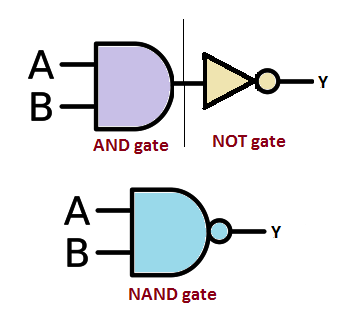

# **NAND Gate**

* **What Problem Does It Solve?**
  - The NAND gate checks if all inputs are TRUE.
  - If both inputs are TRUE output becomes FALSE.
  - If any one input is FALSE output becomes TRUE.
  
* **What is the Circuit?**
  - It is an electronic circuit that performs NAND operation.
---

* **Where Is It Used?**
  
  *The NAND gate will be used in:*
  
  - Memory circuit
  - Computer And Digital Circuit.
  - Traffic Signal Control System.
    
---

* **Circuit Diagram:**

---

* **Function of Inputs and Outputs:**
  -Inputs:- A,B  [2 inputs]
  -Output:- Y  [1 output]

  -when both inputs A = 0 , B = 0 output wii be y = 1.
  
  -when both inputs A = 1 , B = 1 output wii be y = 0.

  -when both inputs A = 1 , B = 0 output wii be y = 1.

---

* **Truth Table:**

| A | B | Y |
|---|---|---|
| 0 | 0 | 1 |
| 0 | 1 | 1 |
| 1 | 0 | 1 |
| 1 | 1 | 0 |

* **Boolean Equation:**
  The Boolean equation of the NAND gate is:
  
**Y = (A.B)'**

---
* **Waveform / Timing Diagram:**

  

