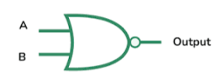

# **NOR Gate**

* **What Problem Does It Solve?**
  - The NOR gate checks if all inputs are FALSE.
  - If both inputs are FALSE the output will be TRUE.
  - If any one input is TRUE the output will be FALSE.

* **What is the Circuit?**
  - It is an electronic circuit that performs NOR operation
---

* **Where Is It Used?**
  
  *The NOR gate will be used in:*

  - Computer And Digital Circuit.
  - Memory circuit
  - Digital electronics.
---

* **Circuit Diagram:**

---

* **Function of Inputs and Outputs:**
  -Inputs:- A,B  [2 inputs]
  -Output:- Y  [1 output]

---

* **Truth Table:**

| A | B | Y |
|---|---|---|
| 0 | 0 | 1 |
| 0 | 1 | 0 |
| 1 | 0 | 0 |
| 1 | 1 | 0 |

* **Boolean Equation:**
  The Boolean equation of the NOR gate is:
  
**Y = (A+B)'**

---
* **Waveform / Timing Diagram:**

  

