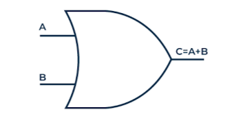

# **OR Gate**

* **What Problem Does It Solve?**
  - The OR gate checks atleast one input is TRUE.
  - If the one input is TRUE then the output will be TRUE.
  - If there is both input are TRUE output will be TRUE. 
  
* **What is the Circuit?**
  - It is an electronic circuit that performs OR operation.
---

* **Where Is It Used?**
  
  *The OR gate will be used in:*
  
  - Security System.
  - Alarm System.
  - Computer And Digital Circuit.
  - Traffic Signal Control System.
  - Emergency controll system.
---

* **Block Diagram:**

---

* **Function of Inputs and Outputs:**
  -Inputs:- A,B  [2 inputs]
  -Output:- Y  [1 output]

  - when both inputs A = 0 , B = 0 output wii be y = 0.
  
  - when both inputs A = 1 , B = 1 output wii be y = 1.

  - when both inputs A = 1 , B = 0 output wii be y = 1.

---

* **Truth Table:**

| A | B | Y |
|---|---|---|
| 0 | 0 | 0 |
| 0 | 1 | 1 |
| 1 | 0 | 1 |
| 1 | 1 | 1 |

* **Boolean Equation:**
  The Boolean equation of the AND gate is:
  
**Y = A+B**

---
* **Waveform / Timing Diagram:**

  

