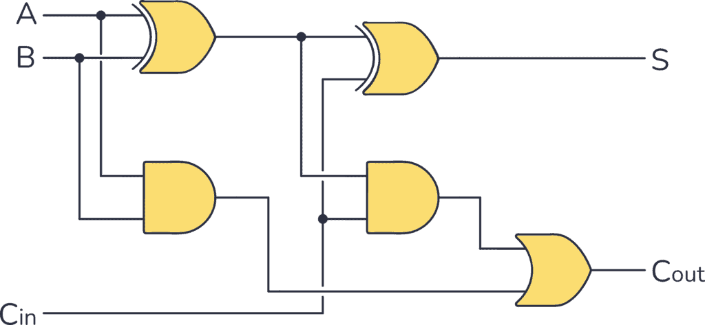

# **4-Bit Ripple Carry Adder**

* **What Problem Does It Solve**
   - A 4-Bit Ripple Carry Adder is a digital combinational circuit.
   - It adds two 4-bit binary numbers along with an optional carry input (Cin).
   - It produces a 4-bit Sum and a final Carry-out (Cout).
   - It is built by connecting four Full Adders in series.

---

* **Why is it used**
  
  *A 4-Bit Ripple Carry Adder is used because:*
  
    - It performs multi-bit binary addition.
    - It is simple and easy to design.
    - It is used as the basic adder in many digital systems.
    - It passes the carry from one Full Adder to the next.
    - It is widely used in arithmetic circuits and processors.

---

* **Where is it used**
  
  *A 4-Bit Ripple Carry Adder is widely used in:*
  
    - CPUs (Processors).
    - ALU (Arithmetic Logic Unit).
    - Digital calculators.
    - Microcontrollers.
    - Digital VLSI and RTL design.
    - FPGA and ASIC designs.
    - Arithmetic circuits.
    - Digital signal processing systems.

---

  * **Circuit Diagram:**

---

* **Working**
  
  - The first Full Adder adds A0, B0, and Cin to produce Sum0 and Carry1.
  - The second Full Adder adds A1, B1, and Carry1 to produce Sum1 and Carry2.
  - The third Full Adder adds A2, B2, and Carry2 to produce Sum2 and Carry3.
  - The fourth Full Adder adds A3, B3, and Carry3 to produce Sum3 and the final Carry Out (Cout).
  - The carry moves (ripples) from one Full Adder to the next, which is why it is called a Ripple Carry Adder.

---

* **Function of Inputs and Outputs**
  
  - A3–A0 = First 4-bit binary input.
  - B3–B0 = Second 4-bit binary input.
  - Cin = Initial carry input.
  - Sum3–Sum0 = 4-bit addition result.
  - Cout = Final carry output.

---

* **Truth Table**

| A | B | Cin | Sum | Cout |
|---|---|-----|-----|------|
|0000| 0000| 0| 0000| 0|
|0011| 0010| 0| 0101| 0|
|0101| 0011| 0| 1000| 0|
|1111| 0001| 0| 0000| 1|

---

* **Boolean Expression**

---

* **Waveform / Timing Diagram:**

  
